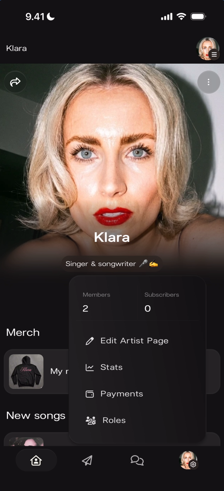
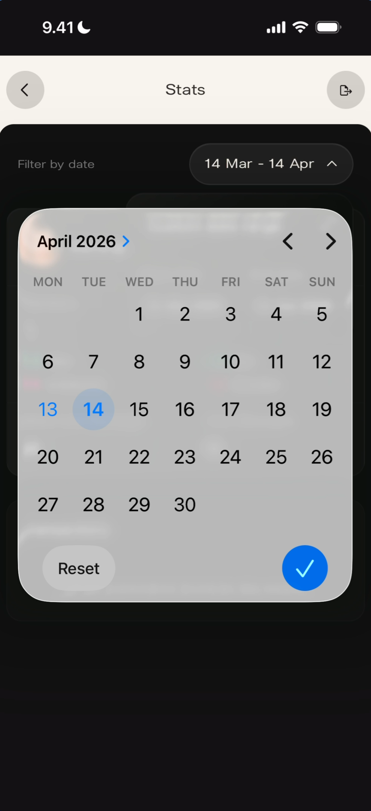
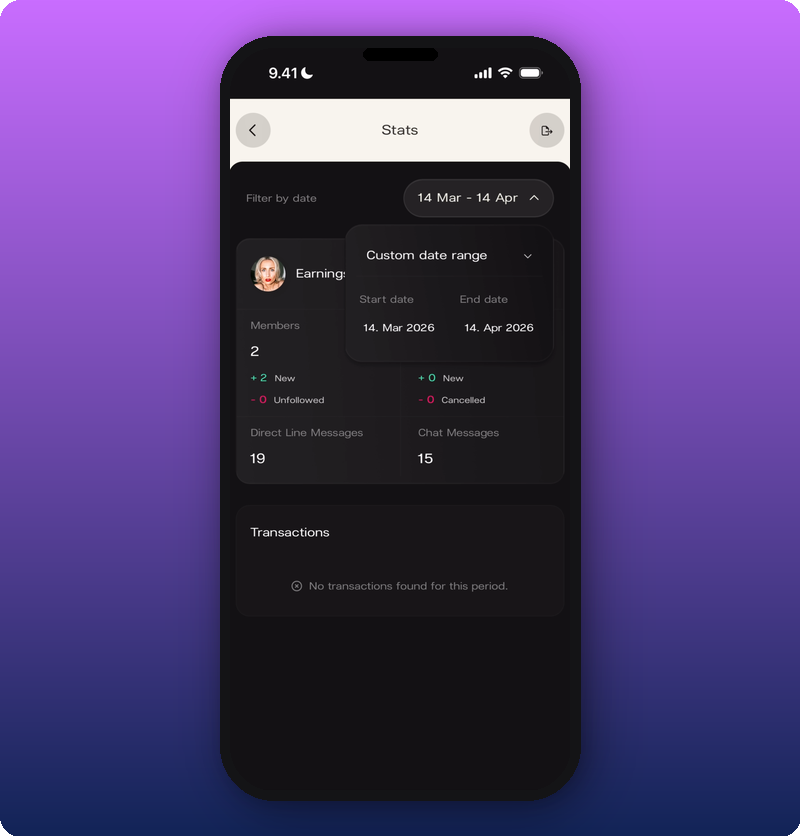
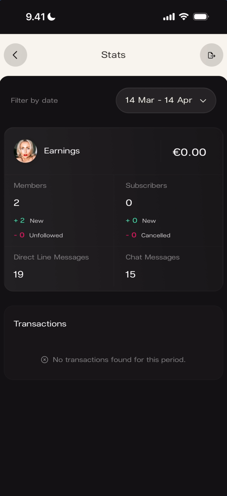
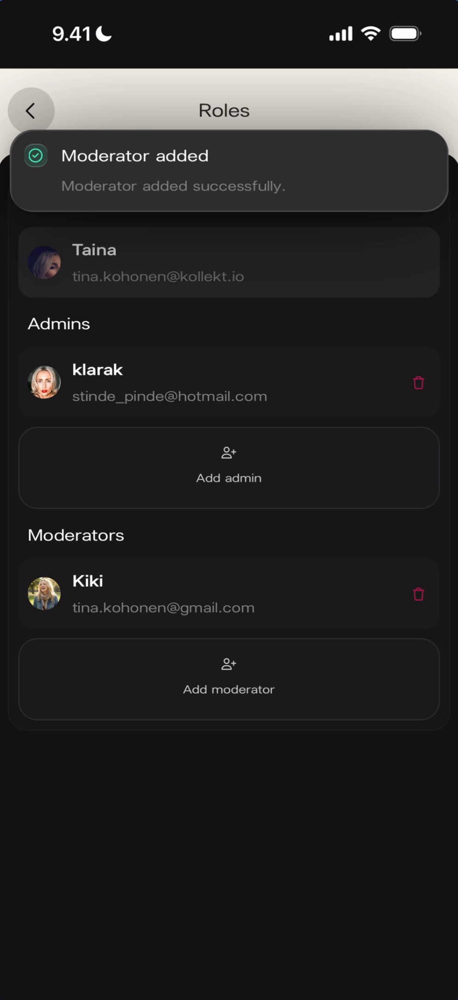
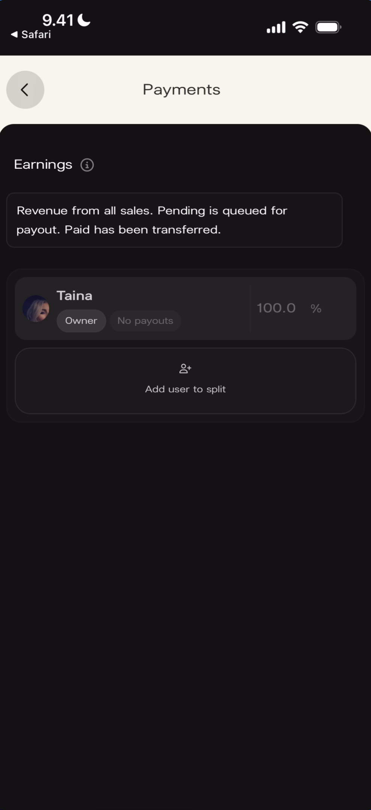
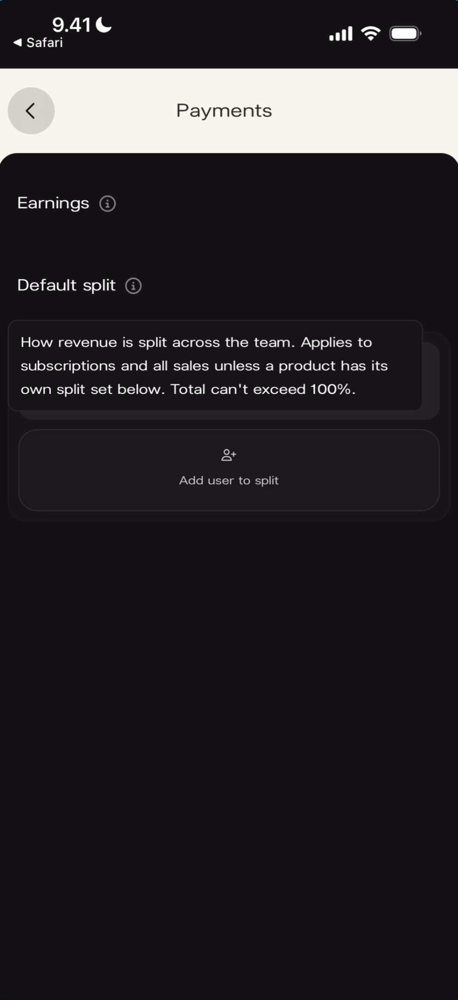
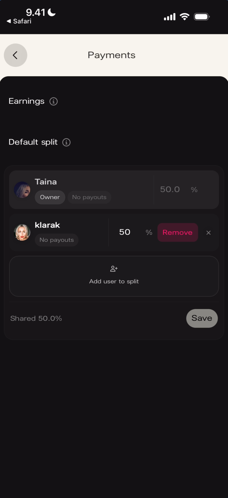
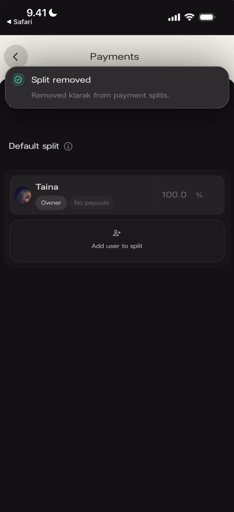

# Admin Panel

The admin panel gives artists and their team full control over stats, team roles, and payment splits. Access it from the profile icon in the bottom navigation — only visible to you and your team, never to fans.

## Admin Menu

The admin menu appears when you tap the **profile/gear icon** in the bottom-right corner of the navigation bar. It opens as a popover over the artist Home page.

**What you'll see:** The artist Home page is visible behind a popover menu. The popover shows "Members" and "Subscribers" counts (2 and 0) at the top. Below: four menu items with icons — **Edit Artist Page** (pencil icon), **Stats** (chart icon), **Payments** (dollar icon), and **Roles** (people icon). The artist profile photo, name "Klara", and subtitle "Singer & songwriter 🎤 ☁️" are visible in the background.

## Stats

The Stats screen shows your earnings, community growth, messaging activity, and transaction history for any date range.

### Stats Overview

**What you'll see:** Top bar: back arrow (left), "Stats" title (center), share/export icon (right). Below: "Filter by date" label with a date range pill reading "14 Mar – 14 Apr ∨". The stats card shows: **Earnings** with the artist avatar and "€0.00". Two columns: **Members** (2, with "+ 2 New" and "- 0 Unfollowed") and **Subscribers** (0, with "+ 0 New" and "- 0 Cancelled"). Below: **Direct Line Messages** (19) and **Chat Messages** (15) side by side. At the bottom: **Transactions** section with "No transactions found for this period."

### Date Picker

Tapping the date range pill opens a calendar picker to select a custom date range.

**What you'll see:** The calendar overlay shows "April 2026 >" with left/right navigation arrows. A full month grid (MON–SUN) with the 13th circled in blue (selected start date) and 14th highlighted with a lighter blue circle (selected end date / today). Bottom of the calendar: **Reset** button (left) and a **blue checkmark** confirm button (right).

### Custom Date Range

After selecting dates, the stats card updates to reflect the chosen period. Tapping the date pill again shows the exact start and end dates.

**What you'll see:** The date pill reads "14 Mar – 14 Apr ∨" and a dropdown below it shows "Custom date range ∨" with **Start date** (14. Mar 2026) and **End date** (14. Apr 2026). The stats card below shows the same metrics: Earnings, Members (2, +2 New, -0 Unfollowed), Subscribers (0), Direct Line Messages (19), Chat Messages (15), and Transactions with "No transactions found for this period."

## Roles

The Roles screen manages who has access to the admin panel and what permissions they have. There are three role tiers: **Owner**, **Admins**, and **Moderators**.

### Roles Overview

**What you'll see:** Top bar: back arrow and "Roles" title. Three sections listed vertically. **Owner**: "Taina" with avatar and email (tina.kohonen@kollekt.io). **Admins**: "klarak" with avatar, email (stinde_pinde@hotmail.com), and a red delete icon. Below: an "Add admin" button with a people icon. **Moderators**: empty section with an "Add moderator" button with a people icon.

### Adding a Moderator

Tap **Add moderator** to open a search field. Type a name or username to find a community member, then tap their result to add them.

**What you'll see:** The Roles screen with the Moderators section active. A search field with "Q Kiki" typed and a clear (x) button. Below the search field: a result showing "Kiki" with avatar and email (tina.kohonen@gmail.com). The keyboard is open. Owner ("Taina") and Admins ("klarak" with delete icon and "Add admin" button) are visible above.

**What you'll see:** A green success banner at the top: **"Moderator added"** with subtitle "Moderator added successfully." Below: the Roles list showing Owner ("Taina"), Admins ("klarak" with delete icon, "Add admin" button), and Moderators ("Kiki" with avatar, email tina.kohonen@gmail.com, and a red delete icon). An "Add moderator" button appears below Kiki.

### Removing a Moderator

Swipe left on a moderator's row (or tap the delete icon) to reveal a **Remove** button.

**What you'll see:** The Roles screen showing Owner ("Taina"), Admins ("klarak"), and Moderators. "Kiki"'s row is swiped left, revealing a red **"Remove"** button and an **x** close button on the right side. The "Add moderator" button is visible below.

**What you'll see:** A green success banner at the top: **"Moderator removed"** with subtitle "Moderator removed successfully." The Roles list shows Owner ("Taina"), Admins ("klarak" with delete icon, "Add admin" button), and Moderators ("Kiki" with delete icon and "Add moderator" button below).

## Payments

The Payments screen manages how revenue is split between team members. Only the **page owner** can access and edit payment splits.

### Non-Owner View

If you're not the page owner, you'll see a locked screen with a warning message.

**What you'll see:** Top bar: back arrow and "Payments" title. A single card with a yellow **warning triangle icon** and the text: **"Payments are managed by the page owner."** The rest of the screen is empty.

### Earnings & Default Split (Owner View)

The owner sees two info sections explaining how payments work: **Earnings** and **Default split**.

**What you'll see:** Top bar: "< Safari" back link (left) and "Payments" title. **Earnings** section header with an (i) info icon. An expanded info card reads: "Revenue from all sales. Pending is queued for payout. Paid has been transferred." Below: "Taina" with avatar, **Owner** badge, "No payouts" label, and **100.0 %**. An "Add user to split" button with a people icon appears below.

**What you'll see:** "Payments" title at top. **Earnings** section with (i) icon. **Default split** section with (i) icon expanded, showing: "How revenue is split across the team. Applies to subscriptions and all sales unless a product has its own split set below. Total can't exceed 100%." Below: an "Add user to split" button.

### Adding a Payment Split

Tap **Add user to split** to add a team member and set their revenue percentage.

**What you'll see:** **Earnings** and **Default split** headers visible. The split list shows "Taina" (Owner, No payouts, 50.0 %) and "@klarak" with a text field showing "50" being entered, a checkmark confirm button, and an x cancel button. Below: "Shared 50.0%" summary text and a **Save** button. The numeric keyboard is open.

**What you'll see:** "Payments" title at top. **Default split** section showing "Taina" (Owner, No payouts, 50.0 %) and "klarak" (No payouts, 50 %) with a red **"Remove"** button and x close button visible on klarak's row. Below: "Add user to split" button, "Shared 50.0%" summary, and **Save** button.

**What you'll see:** A green success banner: **"Split added"** with subtitle "Added klarak as payment recipient." Below: **Default split** section showing "Taina" (Owner, No payouts, 50.0 %) and "klarak" (No payouts, 50 %) with a red delete icon. "Add user to split" button, "Shared 50.0%" summary, and **Save** button below.

### Removing a Payment Split

Swipe left on a team member's row (or tap the delete icon) to reveal the Remove button.

**What you'll see:** A green success banner: **"Split removed"** with subtitle "Removed klarak from payment splits." Below: **Default split** section showing only "Taina" (Owner, No payouts, **100.0 %**). The "Add user to split" button appears below. The percentage automatically returns to 100% for the remaining owner.

## Known Limitations

- The admin menu (Edit Artist Page, Stats, Payments, Roles) is only visible to the owner and team members — fans never see it.
- Only the page owner can access the Payments screen. Admins and moderators see the locked "Payments are managed by the page owner" message.
- The exact permissions difference between Admin and Moderator roles is not fully shown in the source material — both can access the admin panel, but only the owner manages payment splits.
- The Transactions section in Stats shows individual payment records, but no transaction data was present in the screenshots to document the exact format.
- The share/export icon in the Stats top bar was visible but its functionality was not demonstrated.

## Related Features

- [Community Chat](/for-artists/chat/community-chat) — Moderators promoted via the Roles screen can help moderate Chat
- [Sending Direct Line Messages](/for-artists/direct-line/sending-messages) — Direct Line message count appears in Stats
- [Sharing Your Kollekt Page](/for-artists/sharing/sharing-your-page) — Share links accessible from the same navigation level as Admin