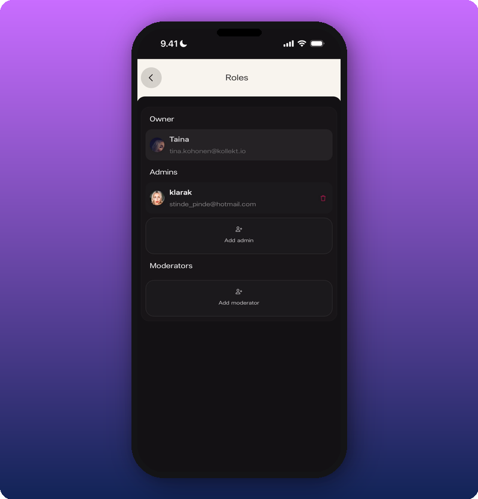

The Roles screen manages who has access to your admin panel and what permissions they have. Three tiers: **Owner** (one, unchangeable), **Admins** (team members with admin access), **Moderators** (help run Chat). Access it from your Artist page: ⋮ → **Roles**.

## Roles overview

**What you'll see:** Three sections vertically.

- **Owner** — single row with avatar, name, and email.
- **Admins** — list of current admins, each with a red delete icon. Below: **Add admin** button.
- **Moderators** — list of current moderators (empty to start). Below: **Add moderator** button.

## Add a moderator

Tap **Add moderator** to open a search field. Type a name or username, then tap a result to add.

**What you'll see:** A green **Moderator added** banner with "Moderator added successfully."

## Remove a moderator

Swipe left on a moderator's row (or tap the delete icon) to reveal **Remove**. A green **Moderator removed** banner confirms.

## Admins vs moderators

- **Admins** have access to the admin panel (Stats, Roles — not Payments).
- **Moderators** help run Chat: timeout, promote, remove members. See [Moderate your chat](/for-artists/chat/moderate-your-chat).
- Only the **Owner** can edit **Payments** (revenue splits and subscription price).

## Known limitations

- The exact permissions difference between Admin and Moderator beyond the above is not fully documented.
- Whether a user can hold multiple roles at once is not shown.

## Related

- [Moderate your chat](/for-artists/chat/moderate-your-chat)
- [Add team members and split revenue](/for-artists/admin/team-members-and-revenue-splits)
- [See your stats and revenue](/for-artists/subscriptions/see-your-stats-and-revenue)
