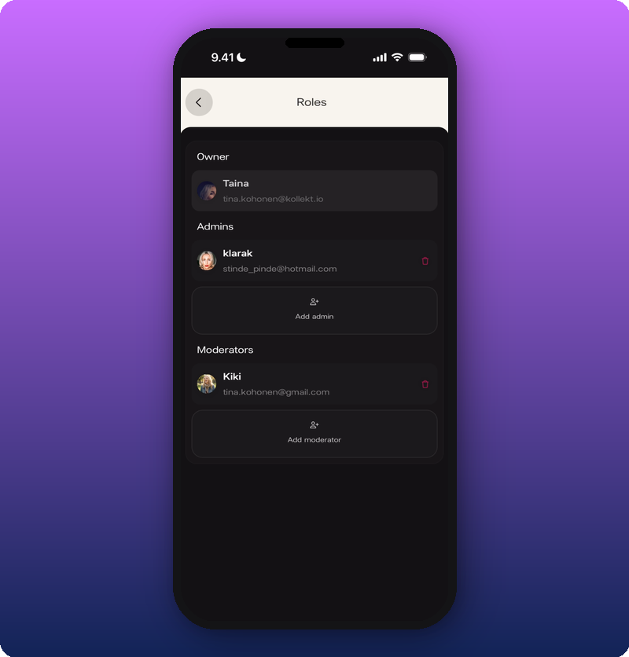
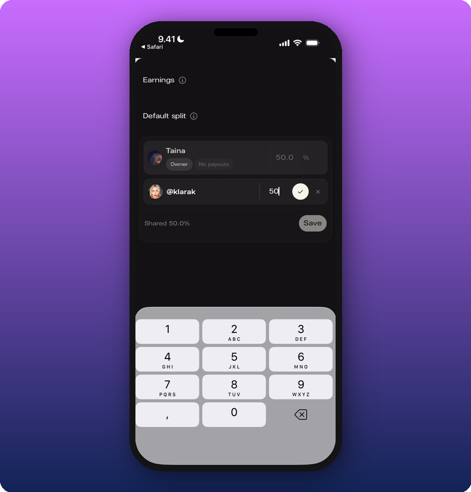
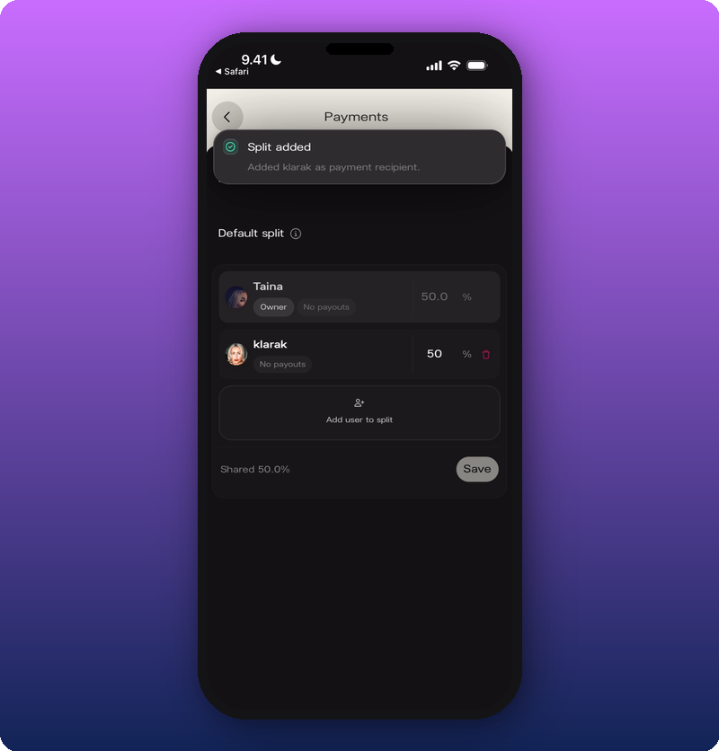

The Payments screen manages how revenue is split between team members. Only the **page owner** can access and edit payment splits. Access it from your Artist page: ⋮ → **Payments**.

## Non-owner view

If you're not the page owner, you'll see a locked screen with a warning message.

**What you'll see:** A card with a yellow **warning triangle** and the text **"Payments are managed by the page owner."**

## Earnings and default split (owner view)

The owner sees two sections: **Earnings** (revenue from all sales, split into pending and paid) and **Default split** (how revenue divides across the team). Tap the info icon on either section for a tooltip explaining how the numbers work — Pending is queued for payout, Paid has been transferred, and Default split applies to all sales unless a product has its own split set. Total can't exceed 100%.

## Add someone to the split

Tap **Add user to split** to add a team member and set their percentage.

**What you'll see:** The user row shows a text field for the percentage, a **checkmark** to confirm, and an **×** to cancel. Below: **Shared [percentage]%** summary and a **Save** button.

**What you'll see:** A green **Split added** banner with "Added [username] as payment recipient."

## Remove someone from the split

Swipe left on a team member's row (or tap the delete icon) to reveal **Remove**. The percentage returns to 100% for the remaining owner.

## Known limitations

- Only the page owner sees Payments — admins and moderators see the locked message.
- Per-product splits are referenced in the tooltip but not demonstrated here.

## Related

- [Manage admins and roles](/for-artists/admin/manage-admins-and-roles)
- [Connect your payout account](/for-artists/subscriptions/connect-your-payout-account)
- [How subscriptions and earnings work](/for-artists/subscriptions/how-subscriptions-and-earnings-work)
