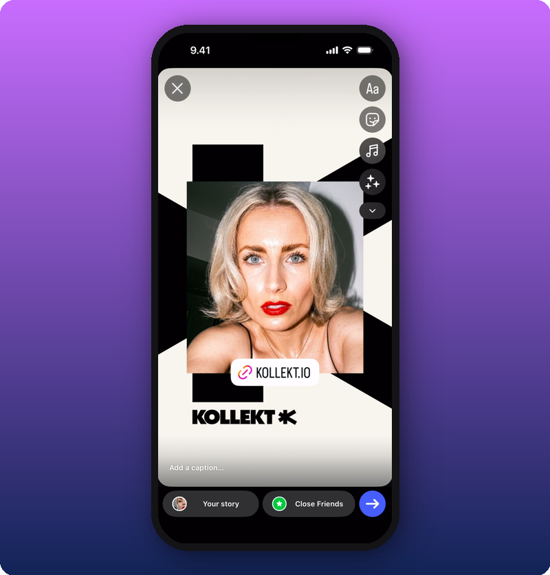

Your Instagram Story is the fastest way to put your Kollekt link in front of your followers. Takes about 30 seconds. Works on both iOS and Android.

## What to know first

- **Kollekt generates a branded Story card for you.** Cream background, your artist photo, the KOLLEKT logo. Designed to match a visual style your fans will recognize.
- **You can use your own image instead** if you want a specific look. The link sticker works with any Story background.
- **The link stays live for 24 hours** (standard Story lifespan). Post when your followers are most active.

## The steps

### 1. Copy the link first

In the Kollekt app, open the Share Sheet on your Home screen and tap **Copy link**. The URL needs to be on your clipboard because Instagram doesn't always carry it over automatically.

### 2. Tap Share story

From the same Share Sheet, tap **Share story**. Instagram opens with your Kollekt Card already placed as the Story background.

### 3. Add the Link sticker

Tap the **sticker icon** in the Instagram toolbar, select the **Link** sticker, and paste the Kollekt URL from your clipboard.

<Tip>
On some iOS devices the link disappears from your clipboard when switching to Instagram. If that happens, go back to Kollekt, tap **Copy link** again, and paste.
</Tip>

### 4. Post the Story

Drag the link sticker where it fits best on the card, then tap **Your Story** to post.

## Signs it's working

Check your Kollekt stats the next day. You'll see a spike in new members. Every one of them actively tapped the sticker, which is the cleanest engagement filter Instagram can give you.

## Tips

- **Post Stories when you actually have something to say.** "Hey, I'm on Kollekt now" is fine once. After that, use the Story to promote something specific ("new track in the Direct Line," "subscriber-only post," "answering questions in Chat today").
- **The first time you share Kollekt to Stories, add a Story caption.** Two lines is enough: what Kollekt is + why you're inviting your fans there. See [Announce Kollekt to your fans](/for-artists/bring-fans-in/announce-to-your-fans) for sample captions.

## Related

- [Share your Kollekt link](/for-artists/sharing/sharing-your-page) — the in-app Share button mechanic
- [Add Kollekt to your Instagram bio](/for-artists/bring-fans-in/instagram-bio) — permanent placement, pairs well with Stories
- [Announce Kollekt to your fans](/for-artists/bring-fans-in/announce-to-your-fans) — the launch playbook with script examples
