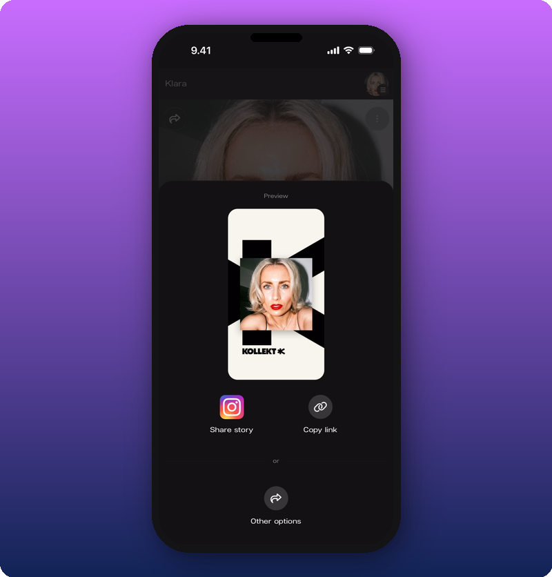

Your Instagram Story is the fastest way to put your Kollekt link in front of your followers. Takes about 30 seconds. Works on both iOS and Android.

## What to know first

- **Kollekt generates a branded Story card for you.** Cream background, black text, your artist photo, the KOLLEKT logo. Designed to match a visual style your fans will recognize.
- **You can use your own image instead** if you want a specific look. The link sticker works with any Story background.
- **The link stays live for 24 hours** (standard Story lifespan). Post when your followers are most active.

## The steps

### 1. Open your Kollekt Share sheet

In the Kollekt app, tap **Share** in the top-left of your Artist page. You'll see the preview of your Story card along with options to copy the link or open in other apps.

### 2. Open the card in Instagram

Tap the Instagram icon in the Share sheet. Your phone switches to Instagram Stories with the Kollekt card already loaded as your background.

### 3. Add the link sticker

Tap the sticker icon at the top of the composer. Choose **Link**. Type or paste `app.kollekt.io/yourname`. Tap **Done**.

### 4. Position and post

Drag the link sticker where it fits best on the card. Tap **Your Story** to post.

## Signs it's working

Check your Kollekt stats the next day. You'll see the spike in new members. Every one of them tapped your link, which is the cleanest engagement filter Instagram can give you.

## Related

- [Share your Kollekt link](/for-artists/sharing/sharing-your-page) — other places to put the link
- [Add Kollekt to your Spotify profile](/for-artists/bring-fans-in/add-to-spotify-profile)
- [Edit your Artist page](/for-artists/home/editing-the-artist-page) — make sure the page is ready before you share
