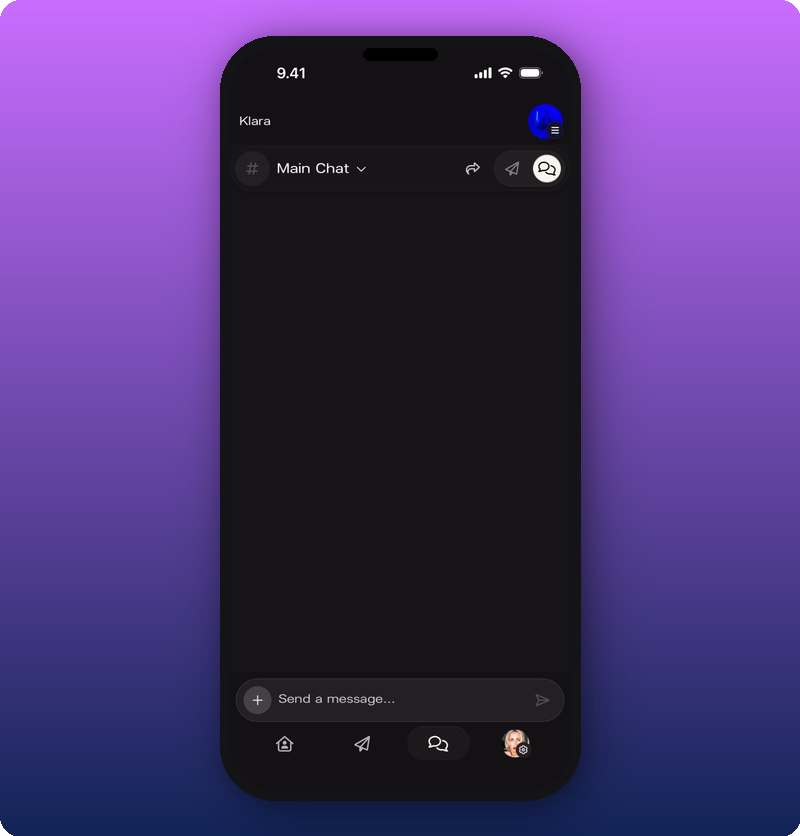
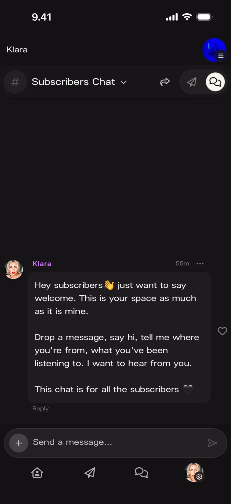
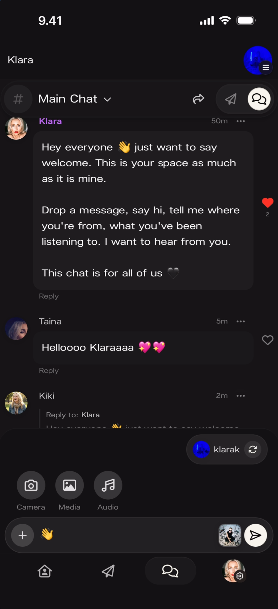
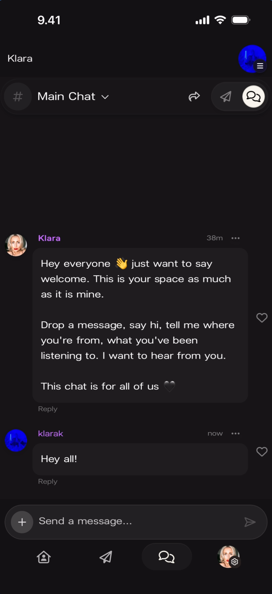
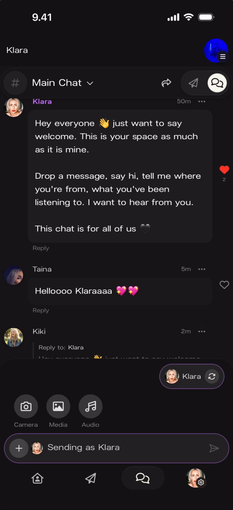
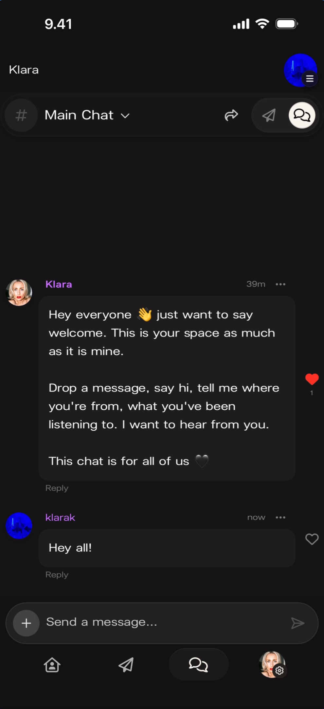
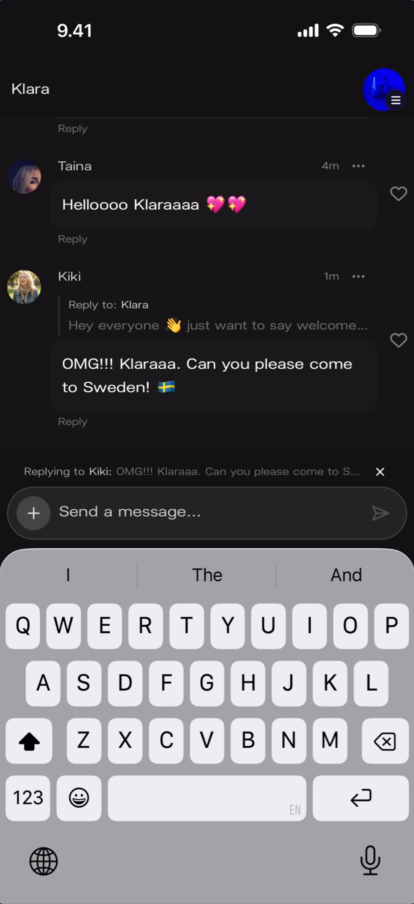
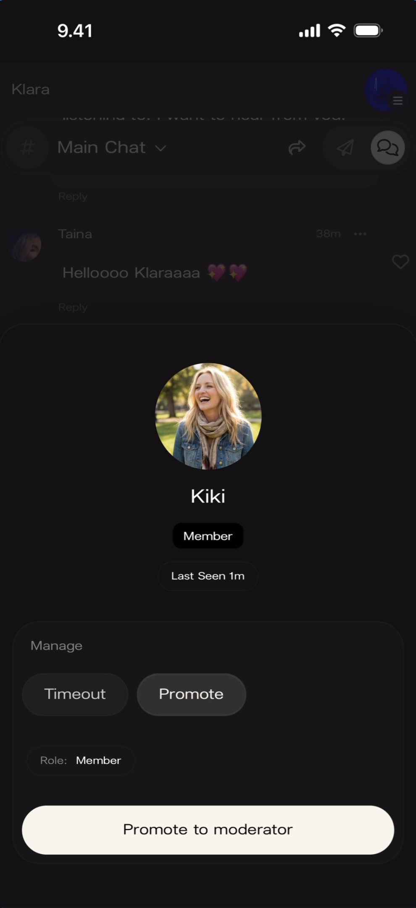

# Run your community chat

Live group messaging inside every Kollekt community. Fans can chat with each other and with you. You can send as your personal account or as your artist identity, and moderate members. For moderation specifically, see [Moderate your chat](/for-artists/chat/moderate-your-chat).

## Chat rooms

Every community has two rooms: **Main Chat** (all followers) and **Subscribers Chat** (paying subscribers only). The current room name is at the top of the screen with a **#** icon and a **dropdown arrow**.

### Switch rooms

Tap the dropdown to switch between the two rooms.

## Send as your personal account or as the artist

You can send messages as two identities: your **personal account** or your **artist identity**. Tap the **+** button next to the message input to reveal the identity switcher.

**What you'll see:** Camera, Media, Audio attachment buttons and an **identity pill** in the bottom-right showing the current account name with a **refresh icon** to toggle.

### Sending as personal

### Sending as artist

Tap the refresh icon to switch. The input field turns purple and reads "Sending as [Artist Name]".

## React with a heart

Tap the **heart icon** on any message to react.

## Reply in threads

Tap **Reply** on any message to start a thread. The reply appears below with a "Reply to:" label and a preview of the original.

## Delete your own messages

Tap the **···** menu on a message to reveal the **Delete Message** option.

## Moderate members

For timeout, promote, and member profile actions, see [Moderate your chat](/for-artists/chat/moderate-your-chat).

## Known limitations

- Media sending buttons (Camera, Media, Audio) are visible but sample media messages were not captured.
- Whether you can pin messages or make announcements within chat is not shown.
- Subscriber-specific visual distinctions (blue names, badges) need dedicated screenshots.

## Related

- [Moderate your chat](/for-artists/chat/moderate-your-chat)
- [Send a Direct Line message](/for-artists/direct-line/sending-messages)
- [See your stats and revenue](/for-artists/subscriptions/see-your-stats-and-revenue)
- [Edit your user profile](/for-artists/user-profile/edit-user-profile)
