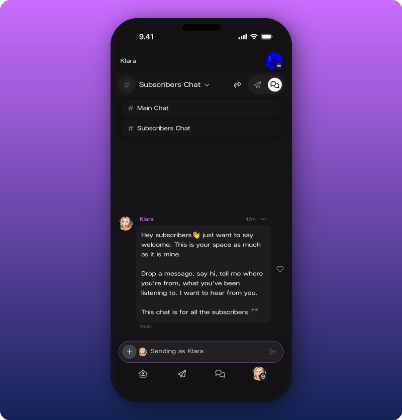
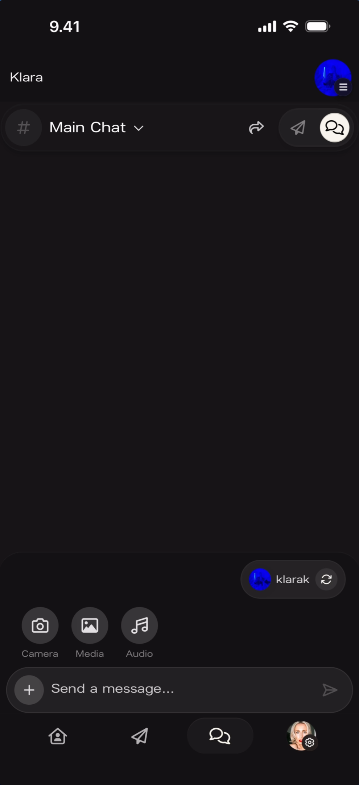
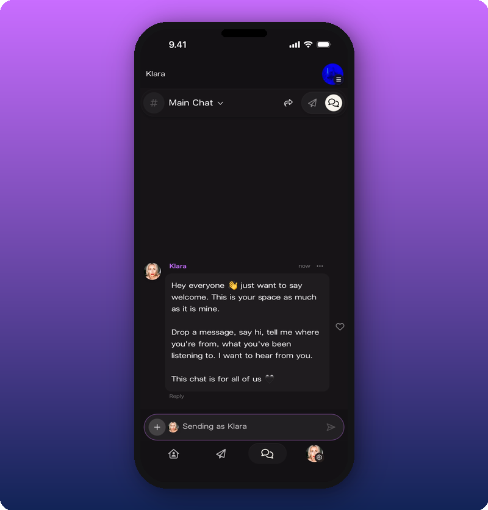
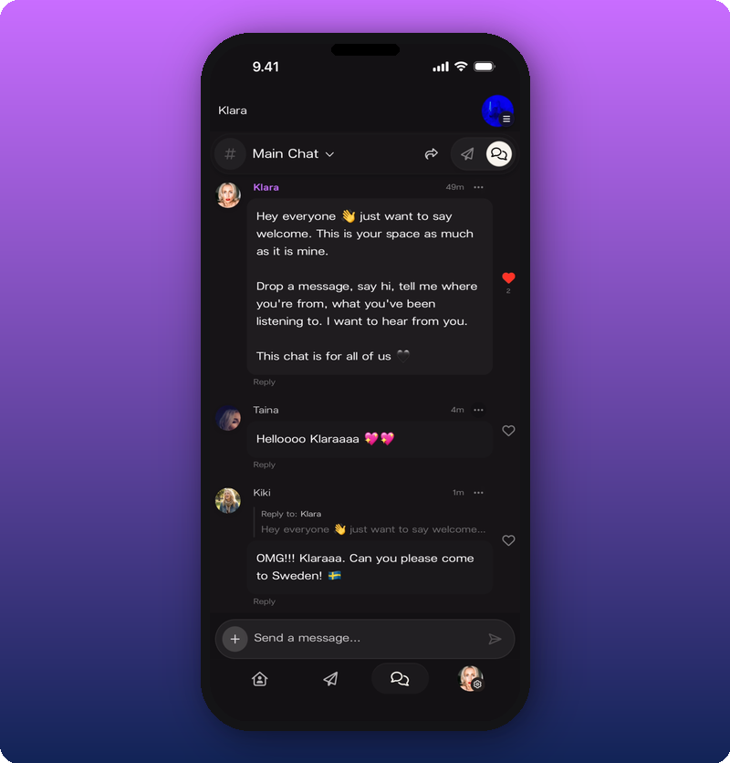
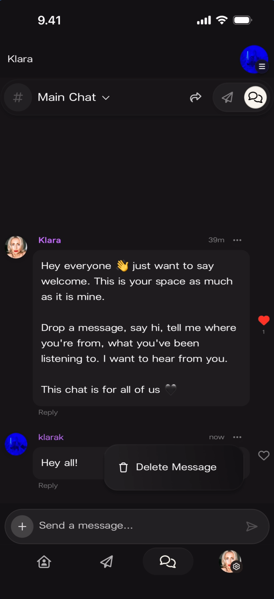

Chat is where loyalty compounds — when fans start talking to other fans who care about you, the space becomes sticky in a way a broadcast feed never is. It's the live group room inside your Kollekt space, and it's theirs as much as yours: they can react, reply, and thread on every message. For moderation actions, see [Moderate your chat](/for-artists/chat/moderate-your-chat).

## Switch between rooms

Every space has two rooms. **Main Chat** is open to every member. **Subscribers Chat** is only for paying subscribers. The current room name sits at the top of the screen with a dropdown arrow. Tap it to switch between Main Chat and Subscribers Chat.

## Send as personal or as artist

You have two identities in Chat: your personal account (your own avatar) or your artist identity (your artist page). You pick per message. Tap the **+** button next to the message input. The identity pill at the bottom shows who you're currently sending as — your personal account by default.

Tap the refresh icon on the pill to switch. When you're sending as your artist, the input field turns purple and reads "Sending as [Artist Name]" so you don't forget mid-thread.

## React, reply, delete

- **React.** Tap the heart icon on any message.
- **Reply.** Tap **Reply** on a message to start a thread. The reply appears below the original with a "Reply to:" label and a preview.

- **Delete your own message.** Tap the three-dot menu on a message you sent and choose **Delete Message**.

## Signs it's working

- Fans are posting in Main Chat without you starting every thread.
- The Subscribers Chat room has activity from your paying members.
- Your identity pill reads the one you want before you send — personal for casual hangs, artist when you're speaking officially.

## Related

- [Moderate your chat](/for-artists/chat/moderate-your-chat)
- [Send a Direct Line message](/for-artists/direct-line/sending-messages)
- [See your stats and revenue](/for-artists/subscriptions/see-your-stats-and-revenue)
- [Edit your user profile](/for-artists/user-profile/edit-user-profile)
