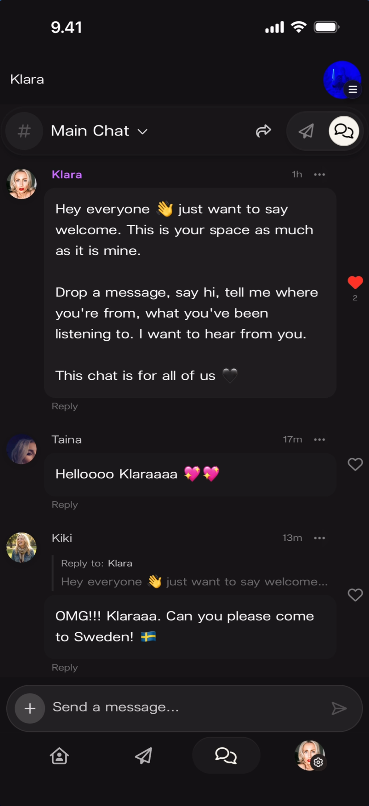
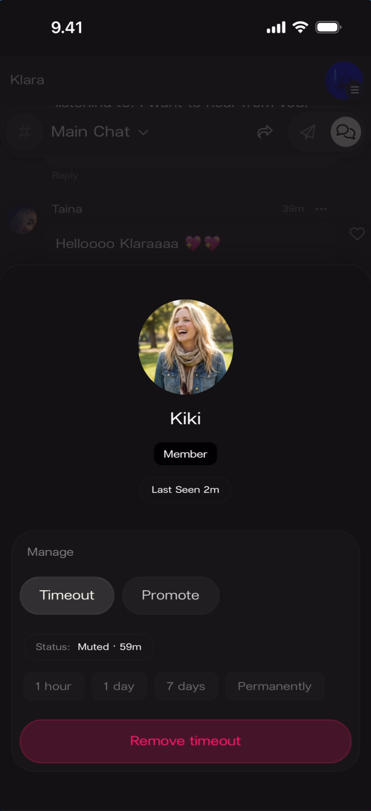

# Community Chat

Live group messaging space inside every artist's Kollekt page. Fans can chat with each other and the artist. Artists can send messages as their artist identity and moderate community members.

## Chat Rooms

Every artist community has two chat rooms: **Main Chat** and **Subscribers Chat**. Main Chat is open to all followers. Subscribers Chat is exclusive to paying subscribers.

The current room name is displayed at the top of the screen with a **#** icon and a **dropdown arrow**. Tapping the dropdown reveals both rooms so you can switch between them.

**What you'll see:** Top-left shows the artist community name ("Klara"). Below that: "# Main Chat ∨" with share, send, and members icons to the right. The message input ("Send a message...") sits at the bottom with a + button and send arrow. Bottom navigation bar: Home, Direct Line, Chat (active), Profile.

**What you'll see:** The dropdown is open under "# Subscribers Chat ∨", listing two rooms: "# Main Chat" and "# Subscribers Chat". The currently active room is Subscribers Chat. A message from "Klara" is visible below, addressed to subscribers.

**What you'll see:** The header reads "# Subscribers Chat ∨". A message from "Klara" (55m ago) says "Hey subscribers..." — the content mirrors the Main Chat welcome but is addressed specifically to subscribers. The input field reads "Send a message..." in the default (personal) mode.

## Sending Messages

### Identity Switcher

Artists can send messages as two identities: their **personal account** or their **artist identity**. The identity switcher is accessed by tapping the **+** button next to the message input.

When expanded, the input area shows three attachment buttons (**Camera**, **Media**, **Audio**) and an **identity pill** in the bottom-right. The pill displays the current account name with a **refresh icon** to toggle between personal and artist.

**What you'll see:** The message input is expanded. Camera, Media, and Audio buttons are visible with icons. Bottom-right: a dark pill showing "klarak" (personal account) with a refresh icon. The input field reads "Send a message..."

### Sending as Personal Account

When the identity pill shows your personal account name (e.g., "klarak"), messages are sent from your personal profile. The input field stays in its default dark style.

**What you'll see:** The expanded input area with Camera, Media, Audio buttons. The identity pill reads "klarak" with the refresh icon. Messages from "Klara" (artist) and fans are visible above. Input field is in default dark style.

**What you'll see:** Two messages visible — the first from "Klara" (artist identity, purple name) with a welcome message, and below it a message from "klarak" (personal account, no purple) saying "Hey all!" The input returns to default state: "Send a message..."

### Sending as Artist Identity

Tapping the refresh icon on the identity pill switches to the artist identity. The pill changes to show the artist name, and the input field **turns purple** and reads "Sending as [Artist Name]".

**What you'll see:** The identity pill now shows "Klara" with a refresh icon, displayed in a purple-tinted pill. Camera, Media, Audio buttons remain visible. The input reads "Sending as Klara" with a purple background.

**What you'll see:** A message from "Klara" (purple-highlighted name, with artist avatar) saying "Hey everyone..." The input at the bottom reads "Sending as Klara" with the purple background, confirming artist mode is still active.

## Message Interactions

### Heart Reactions

Tap the **heart icon** on any message to react. A filled red heart appears next to the message.

**What you'll see:** The "Klara" welcome message has a **filled red heart** on its right side. Below it, a message from "klarak" saying "Hey all!" has an unfilled (empty) heart icon. Each message also shows a "Reply" link and a "···" menu.

### Threaded Replies

Tap **Reply** on any message to start a thread. The reply appears below the original message, indented, with a "Reply to: [Username]" label and a preview of the original message text.

**What you'll see:** Three messages: "Klara" (artist, 48m ago) with the welcome message and a red heart. "Taina" (4m ago) saying "Helloooo Klaraaaa" with heart emoji. "Kiki" (1m ago) with "Reply to: Klara" label, showing a greyed preview of the original message ("Hey everyone... just want to say welcome..."), followed by Kiki's reply: "OMG!!! Klaraaa. Can you please come to Sweden!"

**What you'll see:** The keyboard is open. Above the input field: a grey bar reading "Replying to Kiki: OMG!!! Klaraaa. Can you please come to S..." with an **X** button to cancel the reply. The input field reads "Send a message..." Messages from Taina and Kiki are visible above.

### Deleting Messages

Tap the **···** (three-dot menu) on a message to reveal the **Delete Message** option.

**What you'll see:** A popup next to the "klarak" message ("Hey all!") showing a "Delete Message" button with a trash icon. The artist's message above has a red heart reaction.

## Active Community View

When the chat has active conversation, messages from both the artist identity and fans are visible together. Artist messages display with the artist name in purple. Fan messages show display names in the default style.

**What you'll see:** Three messages in Main Chat: "Klara" (artist, 1h ago) with the welcome message and a red heart. "Taina" (17m ago) saying "Helloooo Klaraaaa". "Kiki" (13m ago) with a threaded reply to Klara: "OMG!!! Klaraaa. Can you please come to Sweden!" Each message has Reply, heart, and ··· controls.

## Moderation

Artists can moderate community members by tapping on a fan's **name or avatar** in the chat to open their **profile card**. The card shows the fan's avatar, display name, role badge, and "Last Seen" timestamp. Under "Manage" there are two actions: **Timeout** and **Promote**.

### Member Profile Card (Default State)

**What you'll see:** Profile card for "Kiki" showing: avatar, name, a **"Member" badge** below the name, "Last Seen 1m". Under "Manage": Timeout button (outline) and Promote button (filled). Below: "Role: Member". At the bottom: a cream-colored button reading **"Promote to moderator"**.

### Timeout

Tapping **Timeout** reveals duration options: **1 hour**, **1 day**, **7 days**, or **Permanently**. A confirmation button at the bottom reads "Timeout for [selected duration]". While a timeout is active, the profile card shows the remaining time.

**What you'll see:** The same "Kiki" profile card, but now Timeout is selected (highlighted outline). Below it: "Status: Can message". Four duration pills: "1 hour", "1 day", "7 days", "Permanently". Bottom button: **"Timeout for 1 hour"**.

**What you'll see:** "Kiki" profile card showing the timeout is active. "Status: **Muted · 59m**" (59 minutes remaining). The duration pills are greyed out/inactive. The Timeout button has a highlighted outline. The bottom button is now **red**, reading **"Remove timeout"**.

### Promote to Moderator

Tapping **Promote** (or the "Promote to moderator" button) gives the fan a **Moderator** role. The profile card updates to show a **shield badge** next to the name and "Role: Moderator". The action can be reversed.

**What you'll see:** "Kiki" profile card showing: avatar, name with a **gold/orange shield badge** next to the "Member" text badge, "Last Seen 2m". Under "Manage": Timeout and Promote buttons. "Role: **Moderator**". Bottom button is **red**, reading **"Remove moderator status"**.

## Known Limitations

- The full scope of moderator permissions (what a promoted moderator can do beyond a regular member) is not shown in the source material.
- Media sending (Camera, Media, Audio buttons are visible) but actual media messages were not demonstrated.
- Whether artists can pin messages or make announcements within chat is not shown.
- Subscriber-specific visual distinctions (blue names, badges) are not visible in the current screenshots — this was described in earlier documentation but needs dedicated screenshots.

## Related Features

- [Sending Direct Line Messages](/for-artists/direct-line/sending-messages) — One-way broadcast messages with push notifications
- [Stats Dashboard](/for-artists/admin/admin-panel) — Chat activity metrics alongside Direct Line and earnings data
- [Edit User Profile](/for-artists/user-profile/edit-user-profile) — Update the personal profile that appears in Chat
- Participating in Chat — The fan's perspective of Community Chat