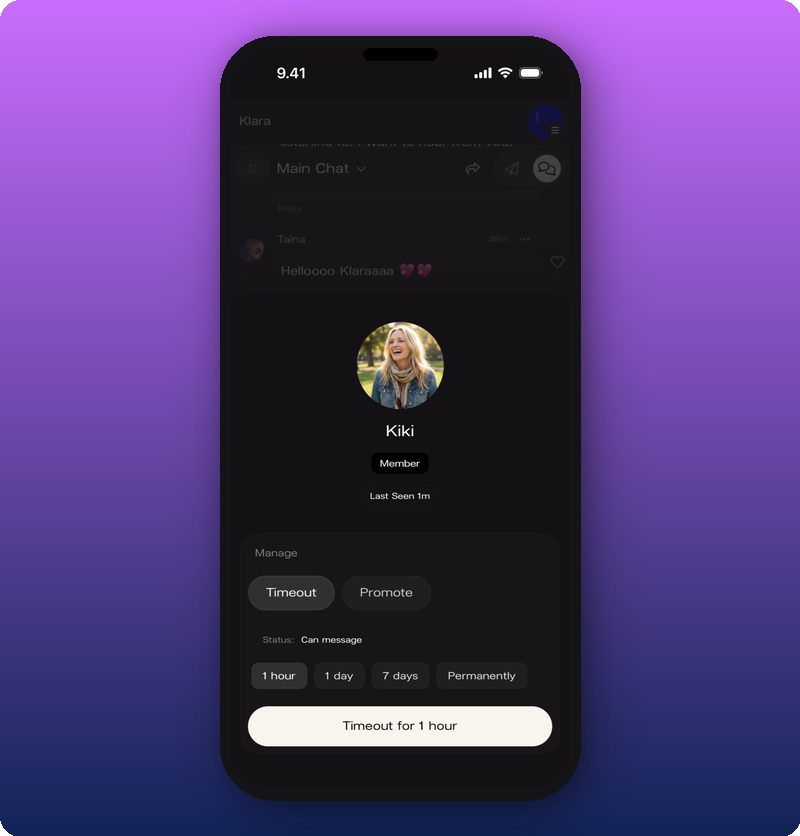
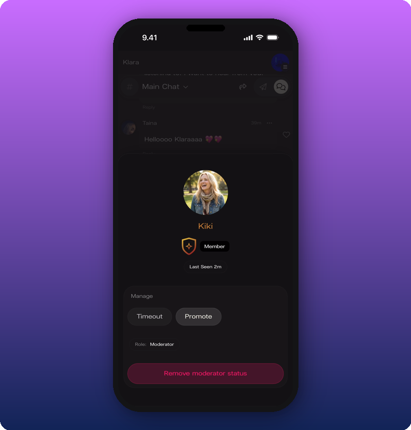

You can moderate community members by tapping on a fan's **name or avatar** in Chat to open their **profile card**. The card shows the fan's avatar, display name, role badge, and Last Seen timestamp. Under **Manage** there are two actions: **Timeout** and **Promote**.

## Open a member profile card

**What you'll see:** Profile card showing the fan's avatar, name, a **"Member" badge**, "Last Seen" timestamp. Under "Manage": **Timeout** (outline) and **Promote** (filled). Below: **Role: Member**. At the bottom: a cream-colored **"Promote to moderator"** button.

## Timeout a member

Tap **Timeout** to reveal duration options.

**What you'll see:** Four duration pills — **1 hour**, **1 day**, **7 days**, **Permanently** — and a bottom button reading **"Timeout for [duration]"**. While a timeout is active, the status shows **"Muted · [time remaining]"** and the bottom button turns red, reading **"Remove timeout"**.

## Promote a moderator

Tap **Promote** (or the **"Promote to moderator"** button). The profile card updates with a **shield badge** and **Role: Moderator**.

**What you'll see:** The "Member" badge is joined by a **gold/orange shield badge**. Role shows **Moderator**. The bottom button is **red** and reads **"Remove moderator status"**.

## Known limitations

- The full scope of moderator permissions is not documented.
- Whether moderators see additional UI beyond regular members is not shown.

## Related

- [Run your community chat](/for-artists/chat/community-chat)
- [Manage admins and roles](/for-artists/admin/manage-admins-and-roles)
