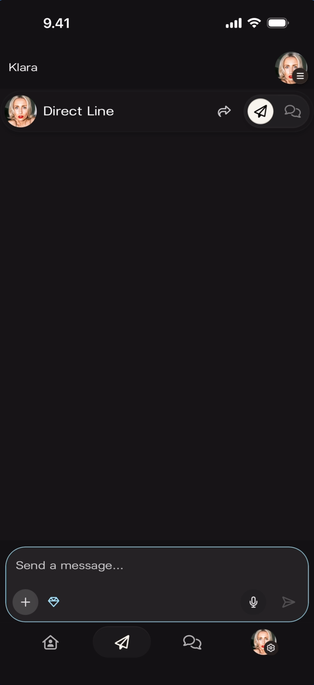

Subscriber-only posts are Direct Line messages that only paying subscribers can open. Non-subscribers still see the post exists — a locked preview in their feed that tells them they're missing something. That visibility is the point: it's how subscription value becomes obvious without you having to sell it.

## Turn on subscriber-only mode

The diamond icon in the compose bar is the toggle. Tap the diamond icon to the right of the **+** button. The icon lights up and the compose bar gets a blue-teal outline to confirm the mode is active. The mode sticks until you turn it off — if you post three subscriber-only messages in a row, you only need to toggle once.

## Send the message

Compose and send like any other Direct Line message. Text, photos, video, voice — all of it works. The post only reaches fans with an active subscription.

## Turn it back off

Tap the diamond icon again. The outline disappears. Your next message goes to every member.

## When to use it

- Early demos, unreleased snippets, work-in-progress.
- Personal thank-yous or shout-outs to subscribers.
- Anything that feels too loose for the main feed but too good to keep off the platform.

## Signs it's working

Your post shows in the Direct Line feed with a visible lock for non-subscribers, and your subscriber count ticks up over the following days as fans upgrade to unlock what they're seeing.

## Related

- [Send a Direct Line message](/for-artists/direct-line/sending-messages)
- [Attach photos, videos, and audio](/for-artists/direct-line/attach-media)
- [How subscriptions and earnings work](/for-artists/subscriptions/how-subscriptions-and-earnings-work)
