# Sending Direct Line Messages

One-way broadcast feed where every message sends a push notification to all community members. Artists can share text, photos, videos, and voice messages. Messages can be marked as subscriber-only.

## Direct Line Feed

Direct Line is accessed via the second tab in the bottom navigation bar (paper plane icon). The feed displays messages in reverse-chronological order — newest at the bottom.

### Empty State

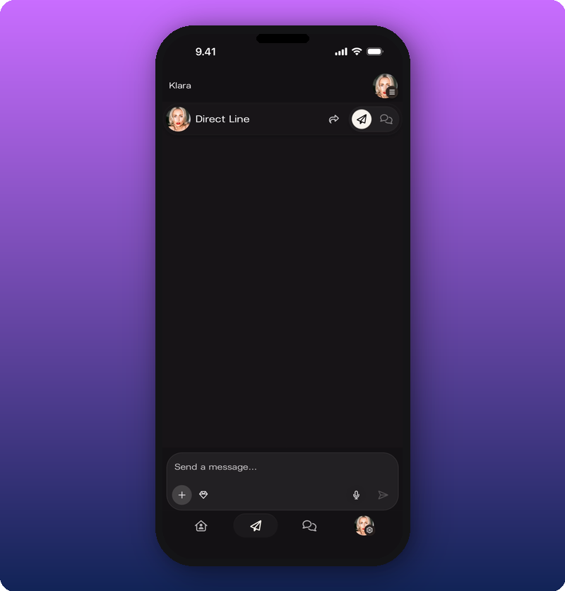

**What you'll see:** Top-left shows the artist community name ("Klara"). Below that: the artist avatar with "Direct Line" label, and three action icons to the right — share, send (paper plane), and chat bubble. The message input ("Send a message...") sits at the bottom with a **+** button, **diamond icon**, **microphone icon**, and **send arrow**. Bottom navigation bar: Home, Direct Line (active), Chat, Profile.

### Text Message in Feed

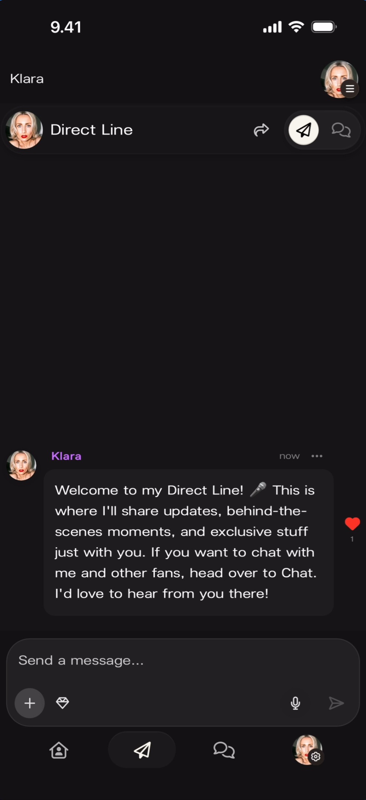

**What you'll see:** The "Direct Line" header at the top. A single message from "Klara" (purple name, artist avatar, timestamp "now", three-dot menu **···**) reading "Welcome to my Direct Line! 🎤 This is where I'll share updates, behind-the-scenes moments, and exclusive stuff just with you. If you want to chat with me and others, head over to Chat. I'd love to hear from you there!" The message has a **filled red heart** on the right side. Below: the empty compose area with "Send a message..."

### Text and Image Message in Feed

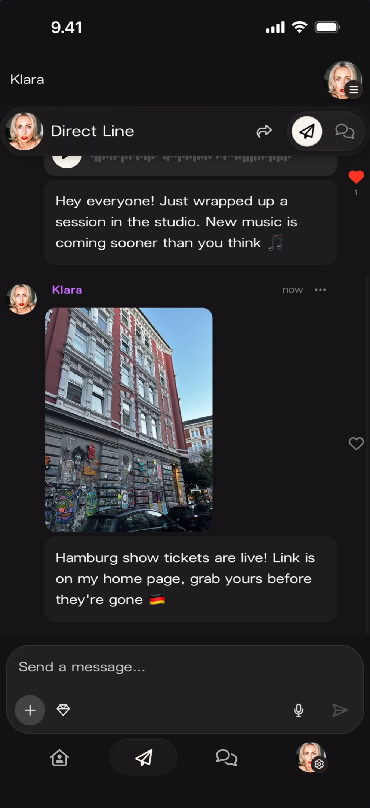

**What you'll see:** The feed shows two messages. The first is a voice message from "Klara" with a play button and audio waveform. The second is a new message from "Klara" (timestamp "now") showing a large photo of a Hamburg street scene with the text "Hamburg show tickets are live! Link is on my home page, grab yours before they're gone 🇩🇪" below the image. Heart icon on the right side. Compose area at the bottom.

### Full Feed with Mixed Message Types

**What you'll see:** Three messages visible in the feed. First: "Klara" (timestamp "now", **···** menu) with a long text-only welcome message and a **filled red heart**. Second: "Klara" (timestamp "now", **···** menu) with a **play button**, **audio waveform**, and **0:00 duration** — a voice message. Text below reads "Hey everyone! Just wrapped up a session in the studio. New music is coming sooner than you think 🎵". Third message is partially visible below. Heart icons on each message.

## Composing Messages

### Text Only

Tap the message input field to open the keyboard. Type your message and tap the **send arrow** to post it.

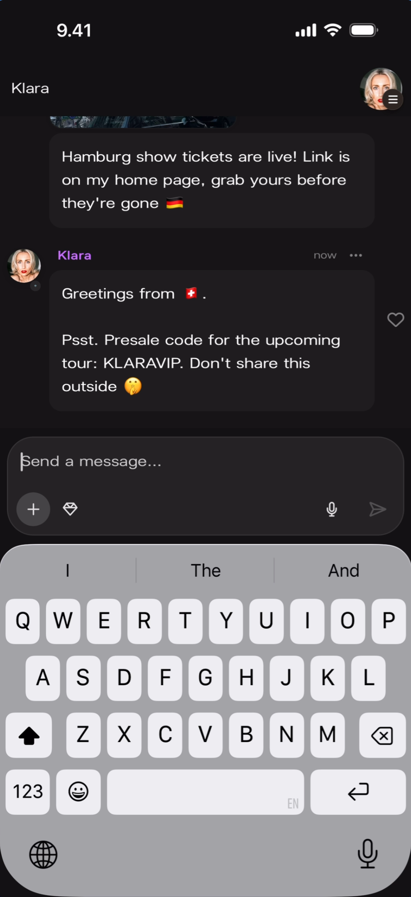

**What you'll see:** The keyboard is open. The feed shows two existing messages — one with an image (Hamburg show tickets) and one text-only from "Klara" (purple name). The message being composed reads: "Psst. Presale code for the upcoming tour: KLARAVIP. Don't share this outside 🤫". The compose bar has **+**, **diamond**, **microphone**, and **send arrow** buttons. The input field reads "Send a message..."

### Attachment Options

Tap the **+** button on the left side of the compose bar to reveal attachment options.

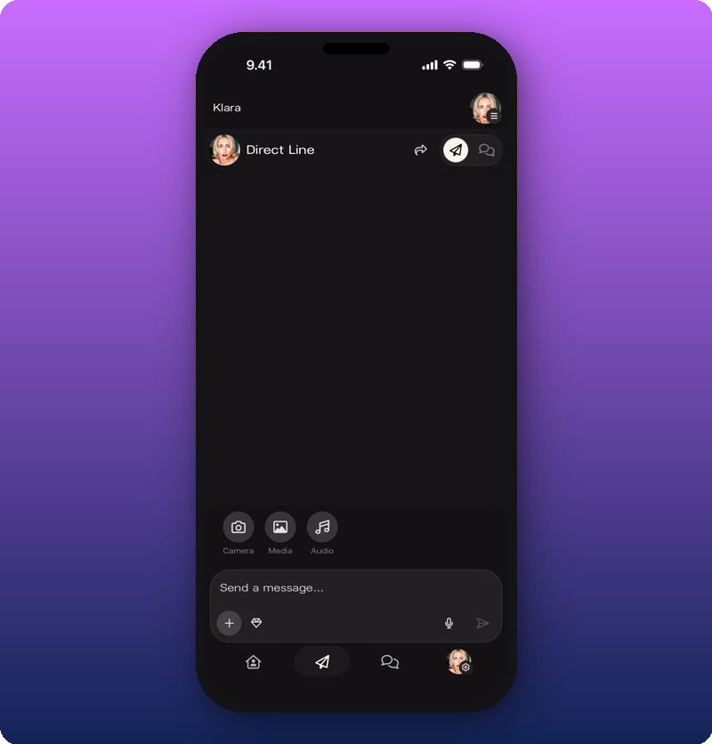

**What you'll see:** The empty Direct Line feed with the "Direct Line" header. Above the compose bar, three attachment options are displayed as circular icons with labels: **Camera** (camera icon), **Media** (image icon), and **Audio** (music note icon). The compose bar below reads "Send a message..." with **+**, **diamond**, **microphone**, and **send arrow** buttons.

### Text with Media Attached

After selecting media and typing a message, both appear together in the compose area.

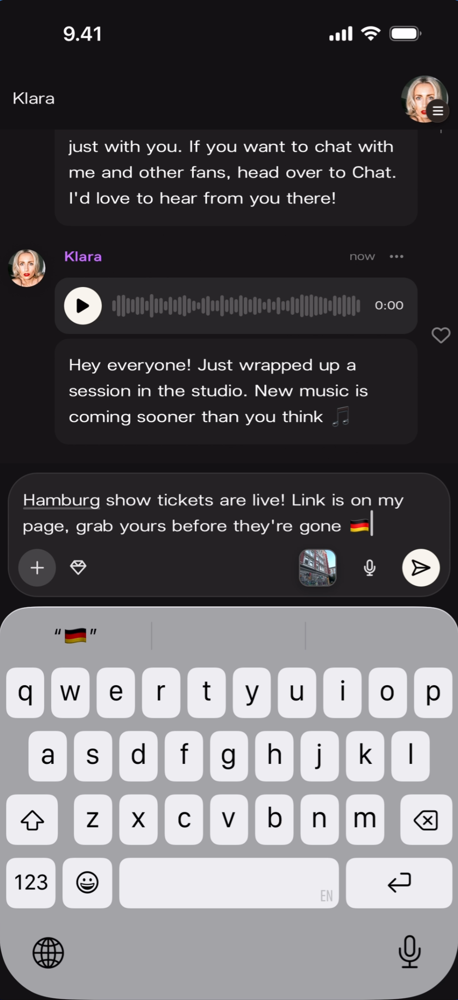

**What you'll see:** The feed shows existing messages above. The compose bar at the bottom contains the typed message "Hamburg show tickets are live! Link is on my page, grab yours before they're gone 🇩🇪" with small **photo thumbnails** visible next to a **country flag emoji picker**. The keyboard is open. **+**, **diamond**, **microphone**, and **send arrow** buttons remain visible.

### Multiple Photos

Messages can include multiple photos. Thumbnails appear as a horizontal row in the compose area with a count badge.

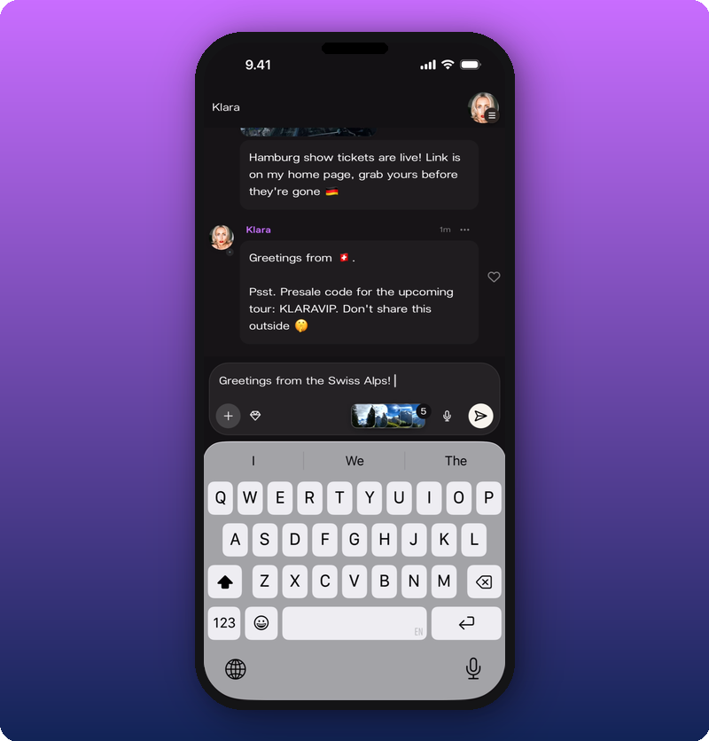

**What you'll see:** The feed shows two existing messages above (one with image, one text-only). The compose bar contains the text "Greetings from the Swiss Alps!" with a row of **photo thumbnails** showing mountain scenery and a **badge reading "5"** indicating five photos attached. The keyboard is open with **+**, **diamond**, **microphone**, and **send arrow** buttons visible.

## Voice Messages

### Recording

Tap the **microphone icon** in the compose bar to start recording a voice message. A recording interface appears over the feed.

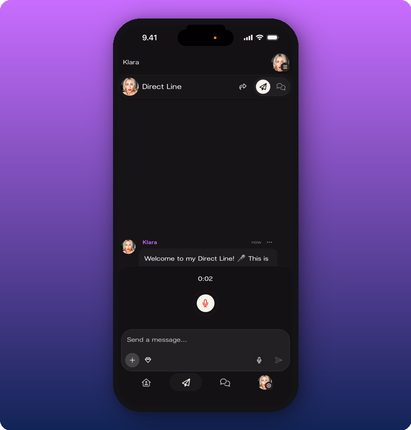

**What you'll see:** The feed is dimmed behind. Center screen shows a **recording timer** reading "0:02" with a large **red microphone button** (pulsing) below it. The most recent message text is partially visible at the top. The compose bar reads "Send a message..." at the bottom. A red dot appears in the status bar indicating active recording.

### Review and Send

After stopping the recording, a review interface appears with playback controls.

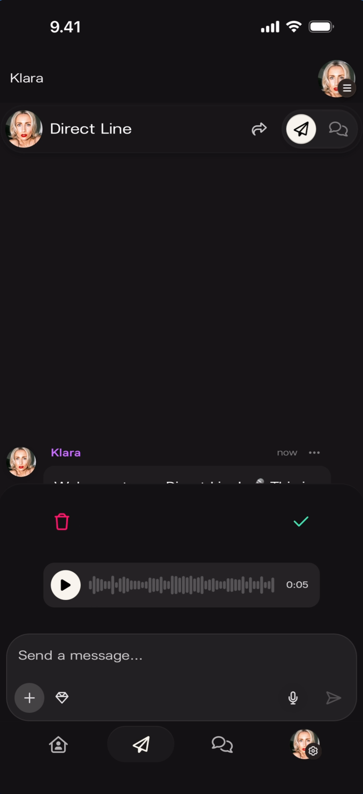

**What you'll see:** The feed is visible above. A recording review bar appears showing: a **play button** (triangle) on the left, an **audio waveform visualization** in the center, and a **duration reading "0:05"** on the right. Below the waveform: a **red trash icon** (delete) on the left and a **green checkmark** (confirm/send) on the right. The compose bar reads "Send a message..." below.

## Video Messages

Videos appear in the feed with a play button overlay and can include a text caption displayed as a quote block.

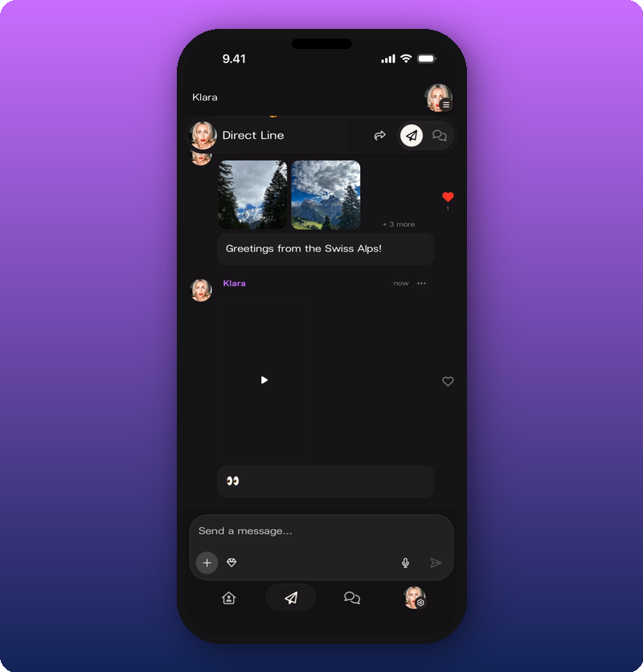

**What you'll see:** The "Direct Line" header at the top. A message from "Klara" showing two **photo thumbnails** in a grid (mountain scenery) with a **heart icon** and a **"+3 more"** label indicating additional photos. Below the photos: text reading "Greetings from the Swiss Alps!" Below that: another message from "Klara" (purple name, **···** menu) with a large **dark video player** area showing a **centered play button** (triangle). A **heart icon** appears on the right. Below the video: a **quote block** with quotation marks (❝). Compose bar at the bottom.

## Subscriber-Only Messages

### Activating Subscriber-Only Mode

Tap the **diamond icon** in the compose bar to toggle subscriber-only mode. The compose bar highlights with a **blue/teal outline** to indicate the mode is active.

**What you'll see:** The empty Direct Line feed with "Direct Line" header. The compose bar at the bottom has a **blue/teal glowing outline** around it. The **diamond icon** next to the **+** button is highlighted in **blue/teal**. The input reads "Send a message..." with the microphone and send arrow buttons. This visual change confirms subscriber-only mode is active — only paying subscribers will see the next message sent.

### Subscriber-Only Message in Feed

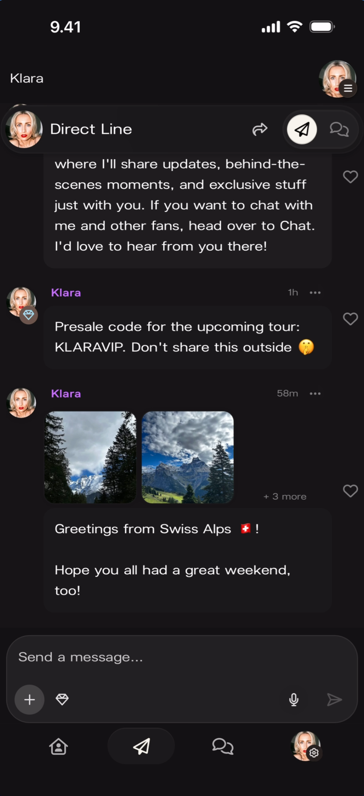

**What you'll see:** The feed shows two messages. First: a photo message from "Klara" with a Hamburg street image and text "Hamburg show tickets are live! Link is on my home page, grab yours before they're gone 🇩🇪" with a heart icon. Second: a text-only message from "Klara" (purple name, timestamp "now", **···** menu) reading "Greetings from 🇯🇵." followed by "Psst. Presale code for the upcoming tour: KLARAVIP. Don't share this outside 🤫" with a heart icon. Compose bar at the bottom in default (non-subscriber) state.

## Deleting Messages

Tap the **···** (three-dot menu) on any message to reveal the **Delete Message** option as an inline popover.

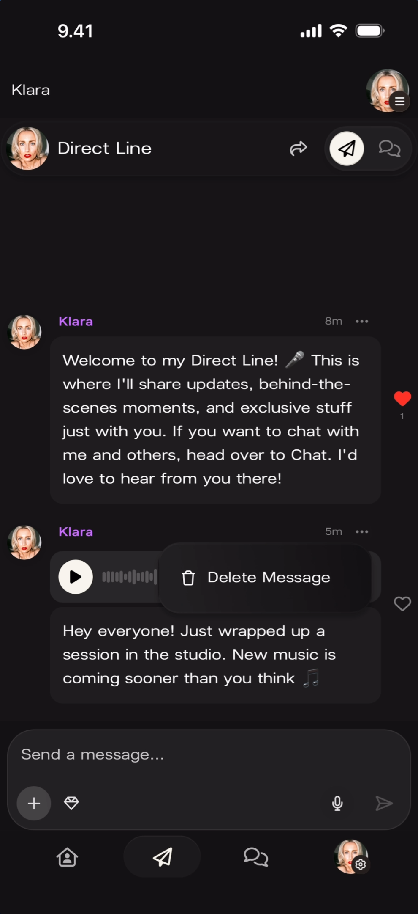

**What you'll see:** The feed shows two messages. The first is a text welcome message from "Klara" (8m ago) with a filled red heart. The second is a voice message from "Klara" (5m ago) with a play button, audio waveform, and text. An **inline popover** appears next to the voice message showing a **"Delete Message"** button with a **trash icon**. The popover points to the **···** menu of that message. Compose bar at the bottom.

## Sharing

After sending a message, tap the **share icon** at the top of the Direct Line screen to open the sharing panel. You can share your Direct Line to Instagram Stories or copy a link.

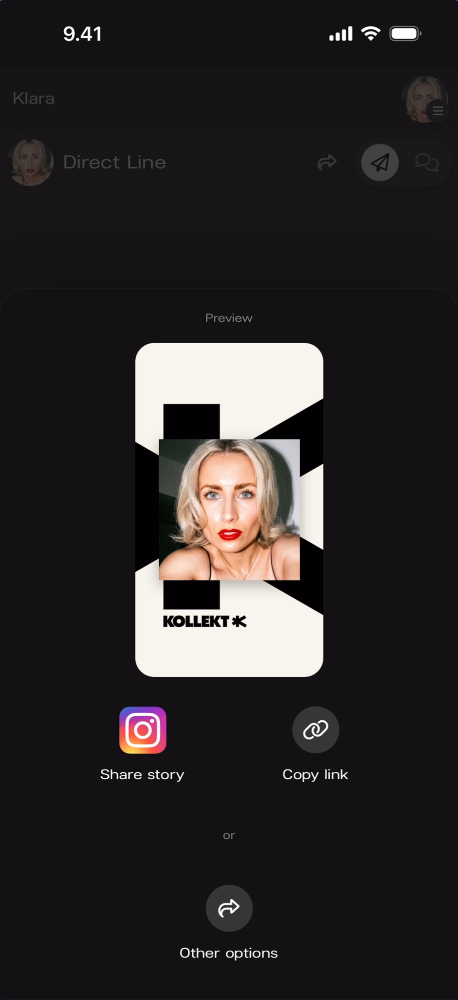

**What you'll see:** The Direct Line feed is dimmed behind a **bottom sheet**. The sheet shows a **"Preview"** label at the top with a **card preview** of the artist's profile — the Kollekt logo and the artist's photo on a black-and-white background. Below the preview: an **Instagram icon** with **"Share story"** label, and a **link icon** with **"Copy link"** label. Below those: an "or" divider and an **"Other options"** button with a share icon.

## Push Notifications

Every Direct Line message sends an iOS push notification to all community members (or subscribers only, if subscriber-only mode was used).

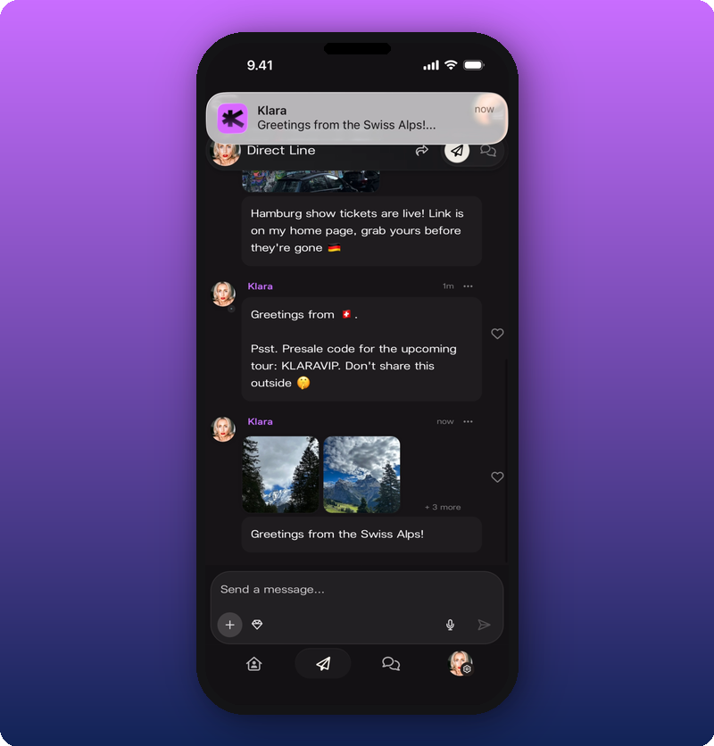

**What you'll see:** The Direct Line feed is visible behind an **iOS push notification banner** at the top of the screen. The banner shows the **Kollekt app icon** (purple "K"), the artist name **"Klara"**, timestamp **"now"**, and a preview of the message text: **"Greetings from the Swiss Alps!..."**. The feed below shows three messages: a photo message (Hamburg), a text message (presale code), and a new multi-photo message from "Klara" with two mountain thumbnails, a "+3 more" badge, and the text "Greetings from the Swiss Alps!" with a heart icon.

## Known Limitations

- Whether fans can react to Direct Line messages (heart icon is visible but fan-side interaction is not shown in the source material).
- The exact behavior of the quote block (❝) below video messages is not fully demonstrated.
- Whether subscriber-only messages show a visual lock or badge to non-subscribers is not shown from the artist perspective.
- The maximum number of photos per message is not confirmed — five were attached in the screenshots.
- Audio attachment via the **+** menu vs. the **microphone** button in the compose bar — whether these produce different results is not shown.

## Related Features

- [Community Chat](/for-artists/chat/community-chat) — Two-way conversation space where fans talk to each other and to the artist
- [Customizing the Link Hub](/for-artists/home/editing-the-artist-page) — Set up your Home page so fans can find your Direct Line
- [Browsing Direct Line](/for-fans/direct-line/browsing-direct-line) — The fan's perspective of Direct Line