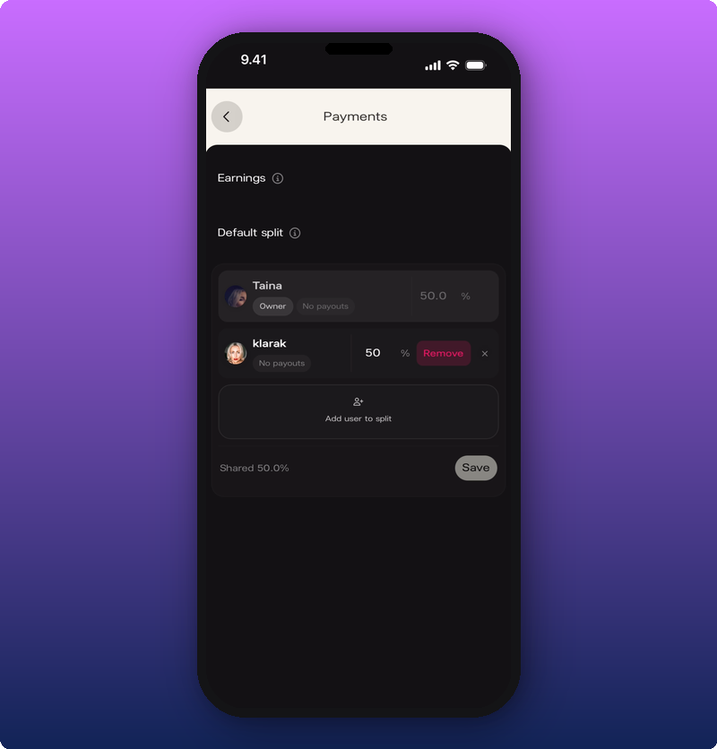
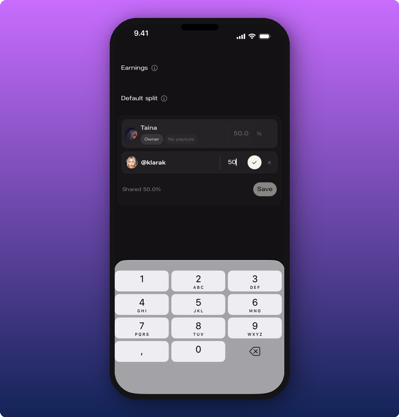
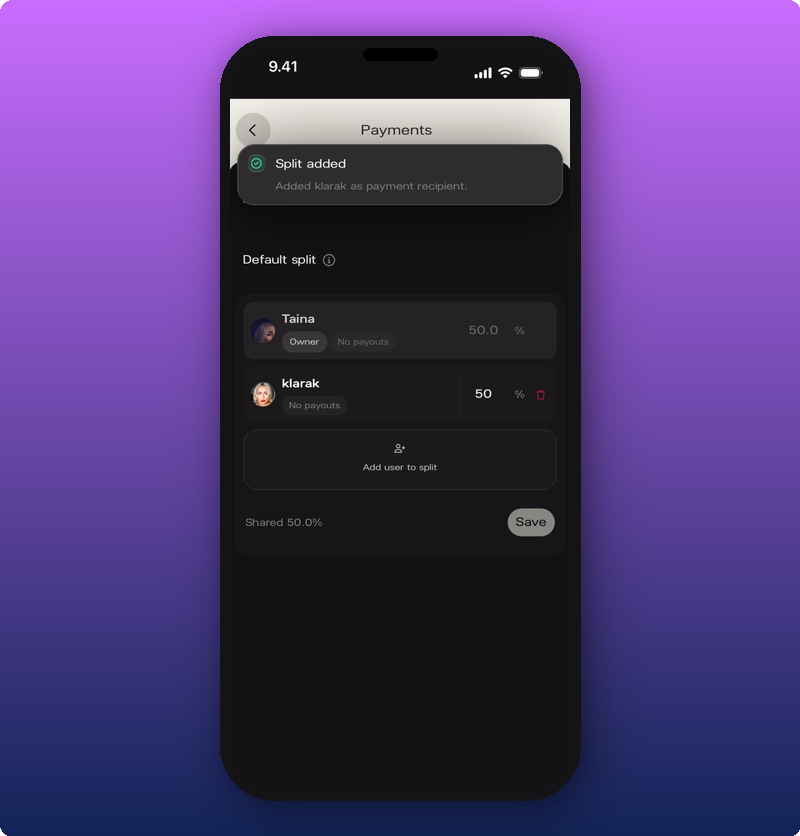

If you work with a manager, label, or featured artist, revenue splits mean everyone gets paid automatically. Pick a percentage on the Payments screen and they take that share of every sale. Stripe handles the rest.

Open Payments from the Settings gear in the bottom nav, then tap **Edit** to go to your editor and find **Payments**.

## What you see

You'll see two sections:

- **Earnings.** Money from all sales. Split into **Pending** (waiting for payout) and **Paid** (already sent).
- **Default split.** How money divides across the team. Tap the info icon on either section for more.

## Add someone to the split

The total can't go over 100%. Whatever's left stays with you.

1. Tap **Add user to split**.
2. Search for the team member by name or username.
3. Type their percentage.
4. Tap the checkmark to confirm.

The row shows **Shared [percentage]%** at the bottom. Tap **Save** to lock it in.

A green **Split added** banner confirms.

## Remove someone from the split

Tap the delete icon next to the team member's row. **Remove** appears. The percentage goes back to 100% for you (or splits across other team members if there are any).

## Related

- [Connect your payout account](/for-artists/earn/connect-your-payout-account)
- [How subscriptions and earnings work](/for-artists/earn/how-subscriptions-and-earnings-work)
- [Manage admins and roles](/for-artists/your-space/manage-admins-and-roles)
