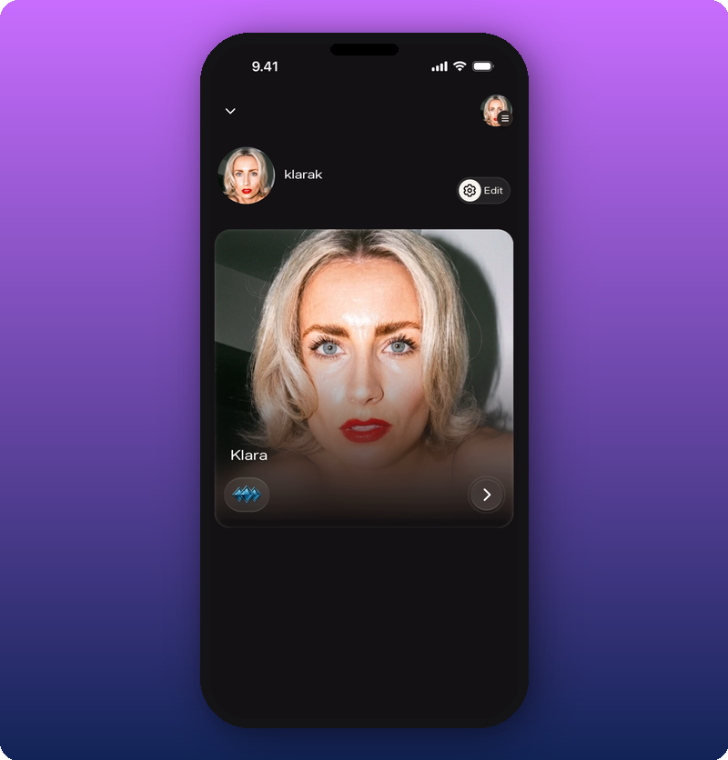
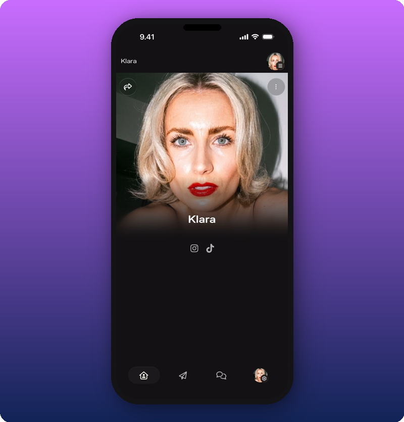
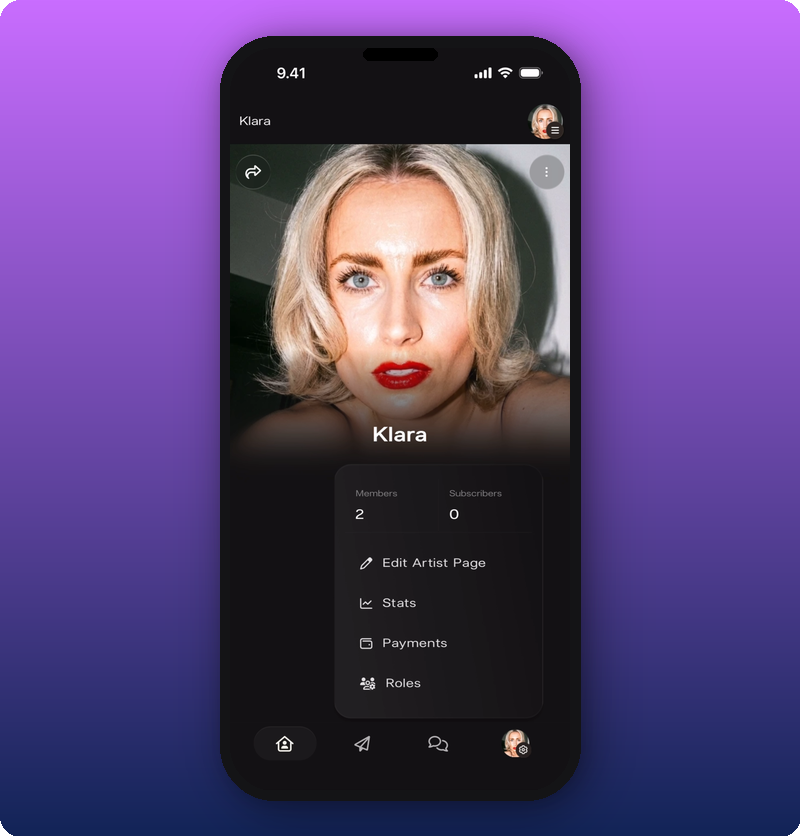
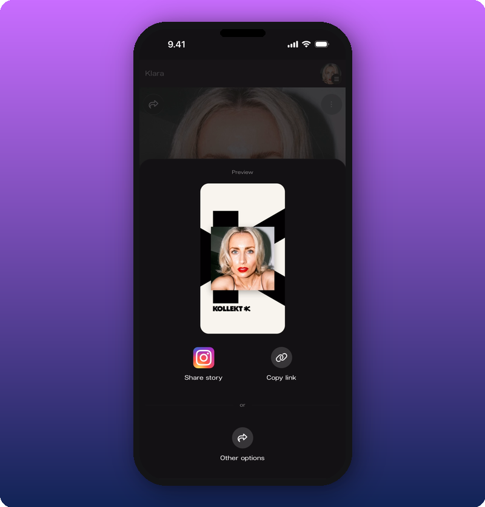

Your Artist page is the central screen of the artist experience in Kollekt. It's what fans see when they visit, and the starting point for navigating to Direct Line, Chat, and everything else.

## First view

When you open the app, you land on a screen showing your personal account identity at the top and your artist page as a card below.

**What you'll see:** Top-left: a **down arrow** (∨) to collapse. Top-right: a small profile avatar with a menu indicator. Below that: the personal account avatar and name ("klarak") on the left, and a **gear icon labeled "Edit"** on the right. Below: a large artist card showing the cover photo for "Klara" with the artist name overlaid, the Kollekt logo badge (blue waves) in the bottom-left, and a **right arrow** (›) button to enter the Artist Page.

## The public page

Tapping into the artist card opens the full Artist page — this is what fans see when they visit your Kollekt page. The URL is `app.kollekt.io/[ArtistName]`.

**What you'll see:** Full-width cover photo at the top. Artist name ("Klara") centered below the photo. Social media icons (Instagram, TikTok) displayed as tappable icons below the name. Top-left: a **share icon** (curved arrow). Top-right: a **three-dot menu** (⋮) for admin options. Bottom navigation bar: Home (active), Drops, Direct Line, Chat, Profile.

## Navigation

The bottom navigation bar is persistent across the app. From Home, tap the **paper plane icon** to reach [Direct Line](/for-artists/direct-line/sending-messages) or the **speech bubble icon** to reach [Chat](/for-artists/chat/community-chat).

## Admin menu

Tapping the **three-dot menu** (⋮) on the top-right of the Artist page opens the admin menu. This is only visible to you — fans do not see this menu.

**What you'll see:** The admin menu overlays the bottom half of the screen. At the top: two stats — **Members: 2** and **Subscribers: 0**. Below: four menu items with icons:

- **Edit Artist Page** (pencil icon) — opens the page editor. See [Edit your Artist page](/for-artists/home/editing-the-artist-page).
- **Stats** (chart icon) — opens the stats dashboard. See [See your stats and revenue](/for-artists/subscriptions/see-your-stats-and-revenue).
- **Payments** (wallet icon) — opens payment settings.
- **Roles** (people icon) — opens role management.

## Sharing

Tapping the **share icon** (curved arrow) on the top-left of the Artist page opens the share screen. See [Share your Kollekt link](/for-artists/sharing/sharing-your-page).

## Known limitations

- The Members and Subscribers counts are visible in the admin menu but their detail screens are not documented.
- Whether the share preview image can be customized is not shown.
- The first-view screen shows a single artist card — behavior with multiple managed artists is not shown here.

## Related

- [Edit your Artist page](/for-artists/home/editing-the-artist-page)
- [Add and organize link groups](/for-artists/home/add-and-organize-link-groups)
- [Share your Kollekt link](/for-artists/sharing/sharing-your-page)
- [Send a Direct Line message](/for-artists/direct-line/sending-messages)
- [Run your community chat](/for-artists/chat/community-chat)
