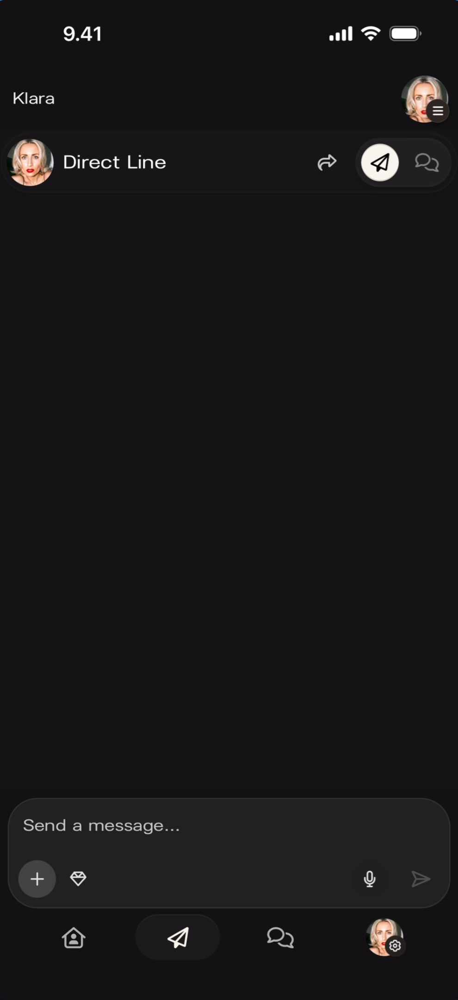
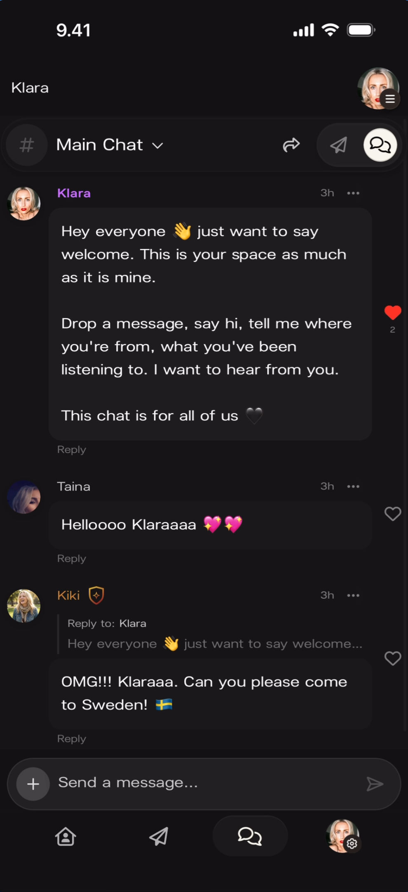

# Artist Home

The Artist Home is the central screen of the artist experience in Kollekt. It's the artist's public page — what fans see when they visit — and the starting point for navigating to all other sections.

## First View

When an artist opens the app, they land on a screen showing their personal account identity at the top and their artist page as a card below.

**What you'll see:** Top-left: a **down arrow** (∨) to collapse. Top-right: a small profile avatar with a menu indicator. Below that: the personal account avatar and name ("klarak") on the left, and a **gear icon labeled "Edit"** on the right. Below: a large artist card showing the cover photo for "Klara" with the artist name overlaid, the Kollekt logo badge (blue waves) in the bottom-left, and a **right arrow** (›) button to enter the Artist Page.

## Artist Page

Tapping into the artist card opens the full **Artist Page** — this is what fans see when they visit the artist's Kollekt page. The URL is `app.kollekt.io/[ArtistName]`.

**What you'll see:** Full-width cover photo at the top. Artist name ("Klara") centered below the photo. Social media icons (Instagram, TikTok) displayed as tappable icons below the name. Top-left: a **share icon** (curved arrow). Top-right: a **three-dot menu** (⋮) for admin options. Bottom navigation bar: Home (active), Drops, Direct Line, Chat, Profile.

## Navigation

The bottom navigation bar is persistent across the app. From Home, artists can reach all other sections.

### Direct Line

**What you'll see:** Tapping the **paper plane icon** (second from left in the nav bar) opens Direct Line. Header shows the artist avatar and "Direct Line" with share and chat icons. The message input reads "Send a message..." with attachment options (+, sticker, microphone). The Direct Line icon is highlighted in the nav bar.

### Chat

**What you'll see:** Tapping the **speech bubble icon** (third from right in the nav bar) opens Chat. Shows "# Main Chat ∨" header with active messages from fans. The Chat icon is highlighted in the nav bar. For full Chat documentation, see [Community Chat](/for-artists/chat/community-chat).

## Admin Menu

Tapping the **three-dot menu** (⋮) on the top-right of the Artist Page opens the admin menu. This is only visible to the artist — fans do not see this menu.

**What you'll see:** The admin menu overlays the bottom half of the screen. At the top: two stats — **Members: 2** and **Subscribers: 0**. Below: four menu items with icons:

- **Edit Artist Page** (pencil icon) — opens the page editor. See [Editing the Artist Page](/for-artists/home/editing-the-artist-page).
- **Stats** (chart icon) — opens the stats dashboard. See [Stats Dashboard](/for-artists/admin/admin-panel).
- **Payments** (wallet icon) — opens payment settings.
- **Roles** (people icon) — opens role management.

## Sharing

Tapping the **share icon** (curved arrow) on the top-left of the Artist Page opens the share screen.

**What you'll see:** A preview card at the top showing the Kollekt-branded share image — the artist's photo composited with the Kollekt logo in a black-and-white design, labeled "Preview". Below the preview, three sharing options:

- **Share story** — with the Instagram icon, shares directly to Instagram Stories.
- **Copy link** — with a link icon, copies the artist page URL to clipboard.
- **Other options** — with a share icon, opens the device's native share sheet.

## Known Limitations

- The Members and Subscribers counts are visible in the admin menu but their detail screens (tapping on the counts) are not documented.
- The Payments and Roles screens accessible from the admin menu are not documented in this video.
- Whether the share preview image can be customized is not shown.
- The first-view screen shows a single artist card — behavior with multiple managed artists is not shown here (see [Community Chat](/for-artists/chat/community-chat) for the community switcher).

## Related Features

- [Editing the Artist Page](/for-artists/home/editing-the-artist-page) — Customize cover photo, artist name, social links, and link groups
- [Community Chat](/for-artists/chat/community-chat) — Live group messaging in the artist's community
- [Sending Direct Line Messages](/for-artists/direct-line/sending-messages) — One-way broadcast messages to fans
- [Stats Dashboard](/for-artists/admin/admin-panel) — View community metrics, chat activity, and earnings
- [Edit User Profile](/for-artists/user-profile/edit-user-profile) — Update the personal account profile (separate from the Artist Page)