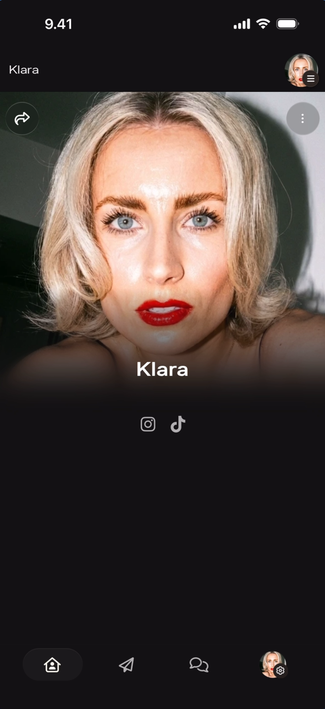
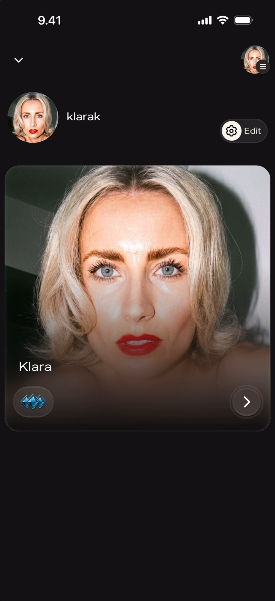

Your Artist page is the home of your Kollekt space. It's where you start in the app, and the page fans land on when they tap your link. The four tabs at the bottom (Home, Direct Line, Chat, Settings) take you everywhere else.

## What's on the page

- **Cover photo and artist name.** The first thing fans see.
- **Social icons.** Quick links to your other platforms.
- **Link groups.** Custom sections for merch, tour dates, music, or anything else you want fans to find. You add these yourself. See [Add and organize link groups](/for-artists/home/add-and-organize-link-groups).
- **Bottom nav bar.** Four tabs that move you between Home, Direct Line, Chat, and Settings.

## The four tabs

The bottom nav bar shows up on every main screen. Each tab takes you to a different part of your space.

- **Home.** Your public Artist page. The one fans see. See [Home](/for-artists/start-here/home).
- **Direct Line.** Your one-way broadcast to every fan. Every post sends a push notification. See [Direct Line](/for-artists/start-here/direct-line).
- **Chat.** The group room where fans talk to each other and to you. See [Chat](/for-artists/start-here/chat).
- **Settings.** Your account, payouts, and the admin menu (Edit Artist Page, Stats, Payments, Roles).

## The admin menu

The Settings icon in the bottom nav opens controls that fans don't see. Tap it to open the admin menu. It shows your Members and Subscribers counts at the top, then four options:

- **Edit Artist Page.** Change your cover photo, name, socials, and link groups. See [Edit your Artist page](/for-artists/home/editing-the-artist-page).
- **Stats.** Earnings, members, subscribers, messages. See [See your stats and revenue](/for-artists/subscriptions/see-your-stats-and-revenue).
- **Payments.** Subscription price and revenue splits. See [Add team members and split revenue](/for-artists/admin/team-members-and-revenue-splits).
- **Roles.** Add admins and moderators. See [Manage admins and roles](/for-artists/admin/manage-admins-and-roles).

## The first view

Your personal account is separate from your Artist page. When you open the app, you start on your account home. Your personal identity is at the top, your artist page as a card below. Tap the card to open your Artist page.

## Related

- [Edit your Artist page](/for-artists/home/editing-the-artist-page)
- [Add and organize link groups](/for-artists/home/add-and-organize-link-groups)
- [Share your Kollekt link](/for-artists/sharing/sharing-your-page)
- [Send a Direct Line message](/for-artists/direct-line/sending-messages)
