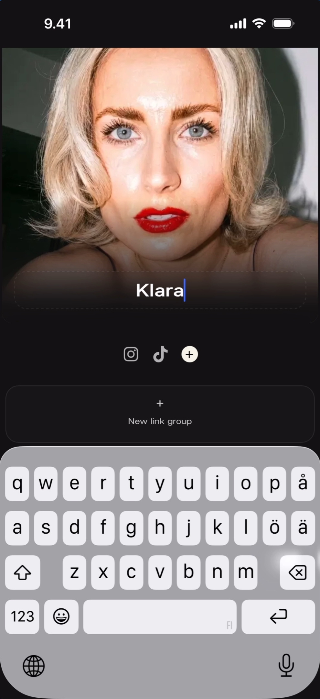
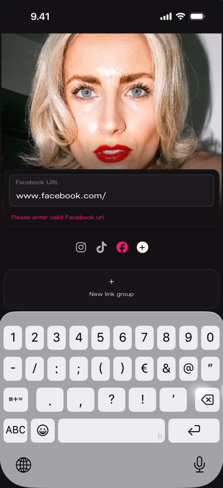
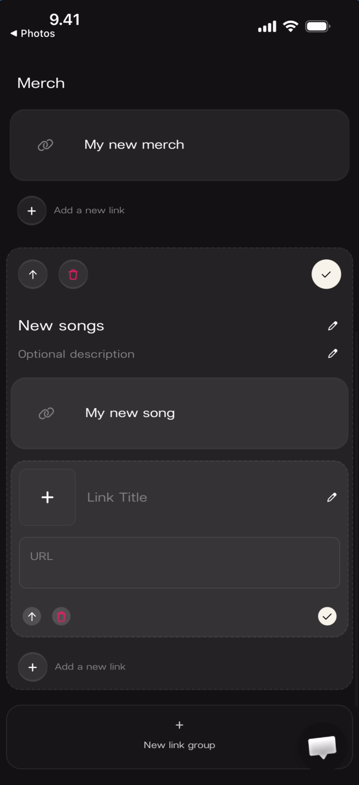
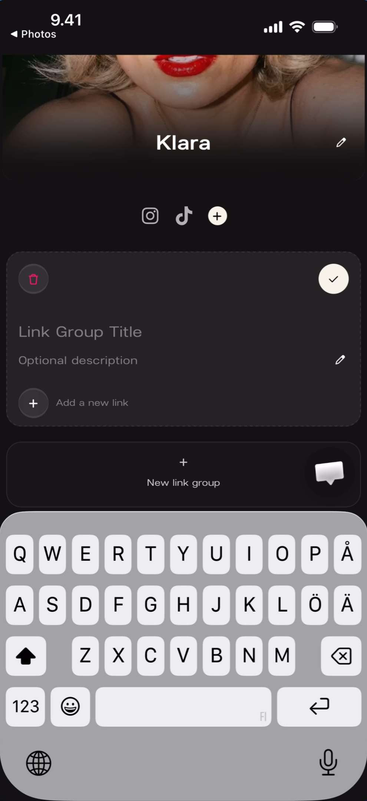
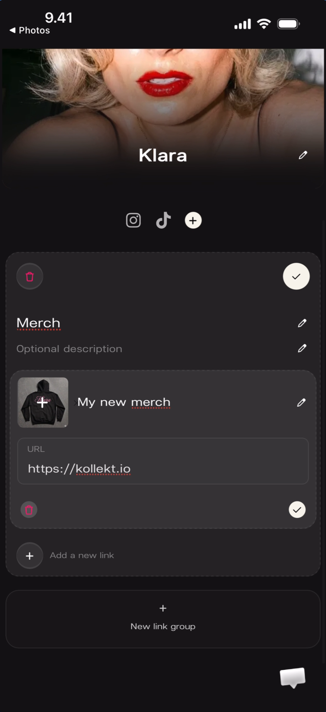
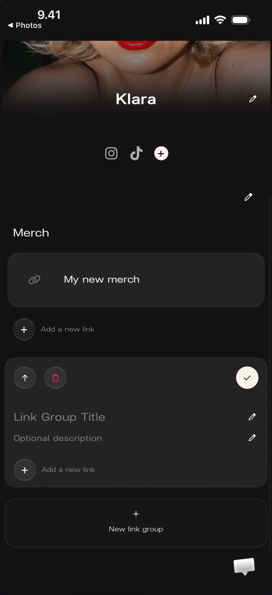
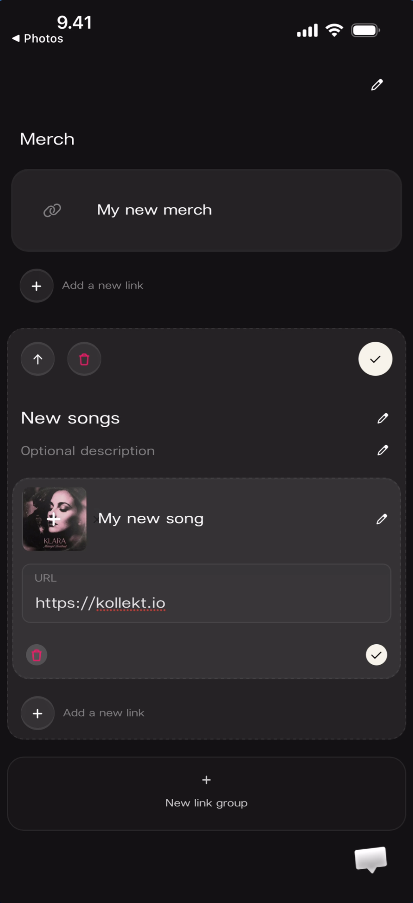
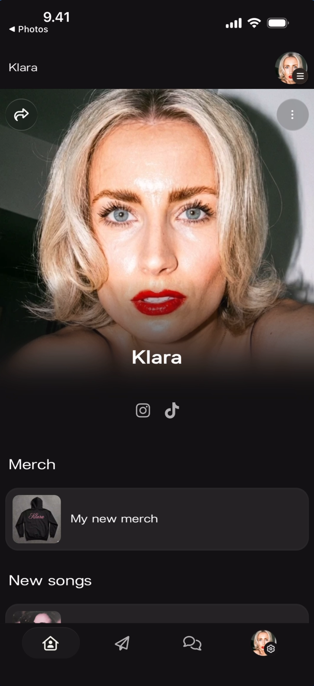
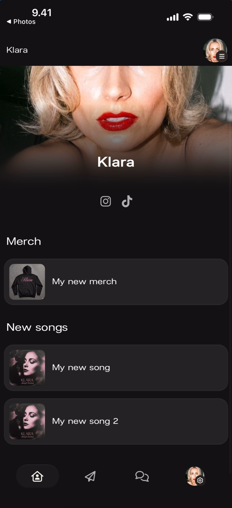

# Editing the Artist Page

The edit screen lets artists customize their public page — cover photo, artist name, social media links, and custom link groups. Accessed via the admin menu on the Artist Home page (⋮ → Edit Artist Page).

## Edit Overview

The edit screen has a header bar with a **back arrow** (‹), the title "Edit page", and a **Save** button (blue). Below that: the cover photo, the artist name, social media icons, and a **+ New link group** button at the bottom.

**What you'll see:** Header: "‹ Edit page — Save". Cover photo with a **pencil icon** in the top-right corner (tap to change photo). Artist name "Klara" with a **pencil icon** to the right (tap to edit). Social icons: Instagram, TikTok, and a **+ circle** button to add more. Below: "+ New link group" button.

## Cover Photo

Tapping the **pencil icon** on the cover photo opens a menu with three options for changing the image.

**What you'll see:** A dropdown menu over the cover photo with three options: **Photo Library** (image icon), **Take Photo** (camera icon), **Choose File** (folder icon). The rest of the edit screen is visible behind the menu.

## Artist Name

Tapping the **pencil icon** next to the artist name makes the name field editable. The keyboard opens and you can type a new name.

**What you'll see:** The artist name "Klara" is now an active text field with a cursor visible. The keyboard is open at the bottom. Social icons and "+ New link group" are visible below the name field.

## Social Media Links

### Adding Socials

Tapping the **+ circle** button next to the existing social icons opens the social picker. It lists all supported platforms.

**What you'll see:** A full-screen overlay titled "Select socials to show" with "2 selected" in the top-right. Ten platforms listed, each with their icon and a **+** or **×** button:

- **Twitter** (X icon) — +
- **Facebook** (F icon) — +
- **Instagram** (camera icon) — × (already selected)
- **TikTok** (note icon) — × (already selected)
- **Youtube** (play icon) — +
- **Spotify** (waves icon) — +
- **Apple Music** (note icon) — +
- **Twitch** (diamond icon) — +
- **Discord** (gamepad icon) — +
- **Soundcloud** (cloud icon) — +

A **checkmark circle** button at the bottom confirms the selection.

### URL Validation

After selecting a social platform, you enter the profile URL. The app validates the URL format and shows an error if it's invalid.

**What you'll see:** A text field labeled "Facebook URL" with the value "www.facebook.com/" entered. Below it in **red text**: "Please enter valid Facebook url". The social icons row now shows Instagram, TikTok, and Facebook (highlighted in red/pink to indicate the error). The keyboard is open with a numeric layout.

## Saving Changes

Tapping **Save** in the top-right saves all changes. A success toast appears at the top.

**What you'll see:** A green toast notification at the top: **"Profile updated"** with subtext "Profile updated successfully." and a green checkmark icon. The edit screen is visible below, unchanged, with the Save button still in the header.

## Custom Link Groups

Link groups are sections on the Artist Page that contain one or more links. Each group has a title, an optional description, and one or more links. Links have a title, a URL, and an optional image.

### Creating a New Link Group

Tapping **+ New link group** at the bottom of the edit screen adds an empty link group.

**What you'll see:** The keyboard is open. A new link group form shows: a **red circle** (delete button) on the left, a **checkmark circle** (confirm) on the right. Fields: "Link Group Title" (editable, cursor active), "Optional description" with a pencil icon, and "+ Add a new link" below. The "+ New link group" button remains at the bottom for adding more groups.

### Link Group Structure

Each link group can be collapsed or expanded. When expanded, it shows the group title, description, and all its links with their fields.

**What you'll see:** The social icons row (Instagram, TikTok, +) is visible at the top. Below: an empty link group form with a red delete circle, a checkmark circle, "Link Group Title", "Optional description", and "+ Add a new link". At the bottom: "+ New link group".

**What you'll see:** A "Merch" link group is expanded. It contains: the group title "Merch" with "Optional description" below. One link is shown: "My new merch" (title) with a link icon. Below that: an empty link form with fields for "Link Title" and "URL", plus a red delete button and checkmark. "+ Add a new link" and "+ New link group" at the bottom.

### Adding Links with Images and URLs

Each link within a group has: a **title**, a **URL**, and an optional **image thumbnail**. Tapping the image area lets you upload a photo.

**What you'll see:** Two link groups visible. Top: "Merch" group with one link "My new merch" (link icon, no image yet). Below: a second group titled "Link Group Title" (still default name) with "Optional description". Group controls: red delete circle (left), up arrow for reordering, checkmark (right). The "< Photos" back button is visible in the top-left, indicating an image was recently picked.

**What you'll see:** Two link groups. "Merch" has one link "My new merch" with a link icon. "New songs" group (renamed from default) has one link "My new song" with: an **image thumbnail** (album artwork showing a dark figure), a **pencil icon** to edit, "URL" field containing "https://kollekt.io", a red delete button, and a green checkmark. "+ Add a new link" below for adding more links.

## Final Result

After saving, the Artist Page displays all the configured content as fans will see it.

**What you'll see:** The public Artist Page. Cover photo at top. "Klara" centered. Social icons: Instagram, TikTok. Below: "Merch" section with one link "My new merch" (shows a merch hoodie image thumbnail). "New songs" section title visible at the bottom, cut off. Top-left: share icon. Top-right: three-dot admin menu. Bottom nav bar visible.

**What you'll see:** Scrolled down view. "Merch" section with "My new merch" link (hoodie thumbnail). "New songs" section with two links: "My new song" (album art thumbnail) and "My new song 2" (similar album art). Each link shows as a row with image thumbnail on the left and title on the right. Bottom nav bar visible.

## Known Limitations

- Whether link groups can be reordered after creation (drag-and-drop) is not fully shown — the up arrow icon suggests reordering is possible.
- Maximum number of link groups or links per group is not documented.
- Whether links open in an in-app browser or the device's default browser is not shown.
- Image size/format requirements for link thumbnails and cover photos are not documented.
- Whether the artist name change affects the public URL (app.kollekt.io/[ArtistName]) is not shown.

## Related Features

- [Artist Home](/for-artists/home/artist-home) — The Artist Page overview, navigation, admin menu, and sharing
- [Community Chat](/for-artists/chat/community-chat) — Live group messaging in the artist's community
- [Sending Direct Line Messages](/for-artists/direct-line/sending-messages) — One-way broadcast messages to fans
- [Claiming & Verification](/for-artists/start-here/welcome) — How to claim your artist page