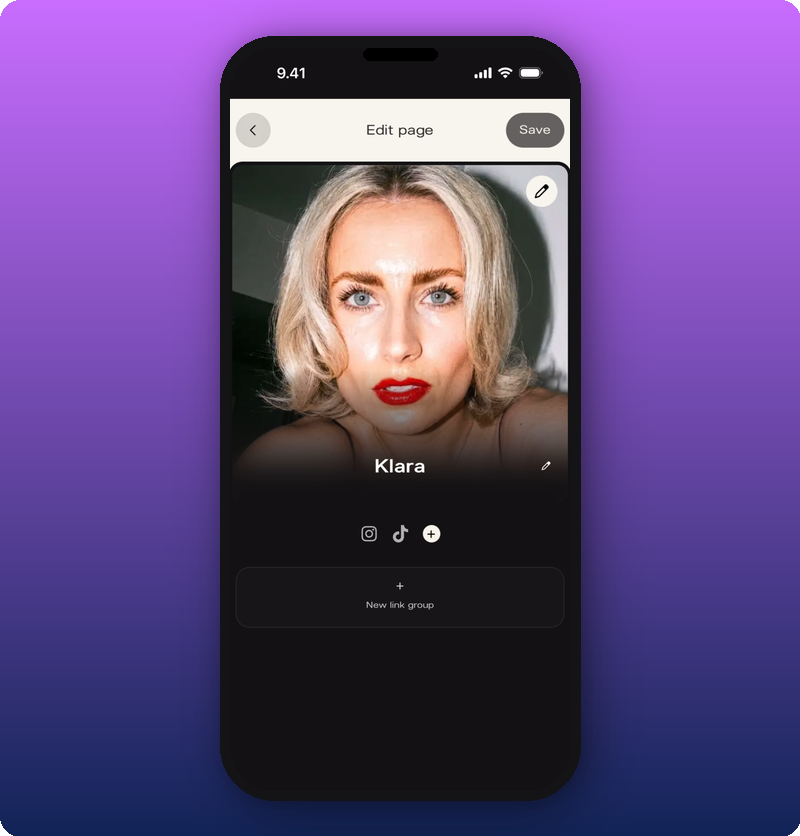
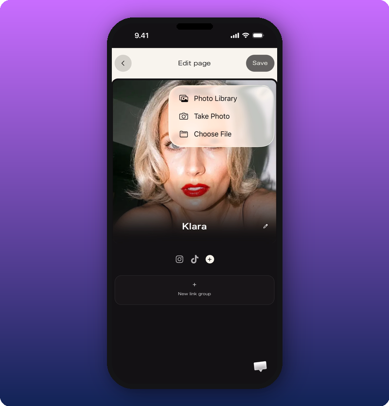
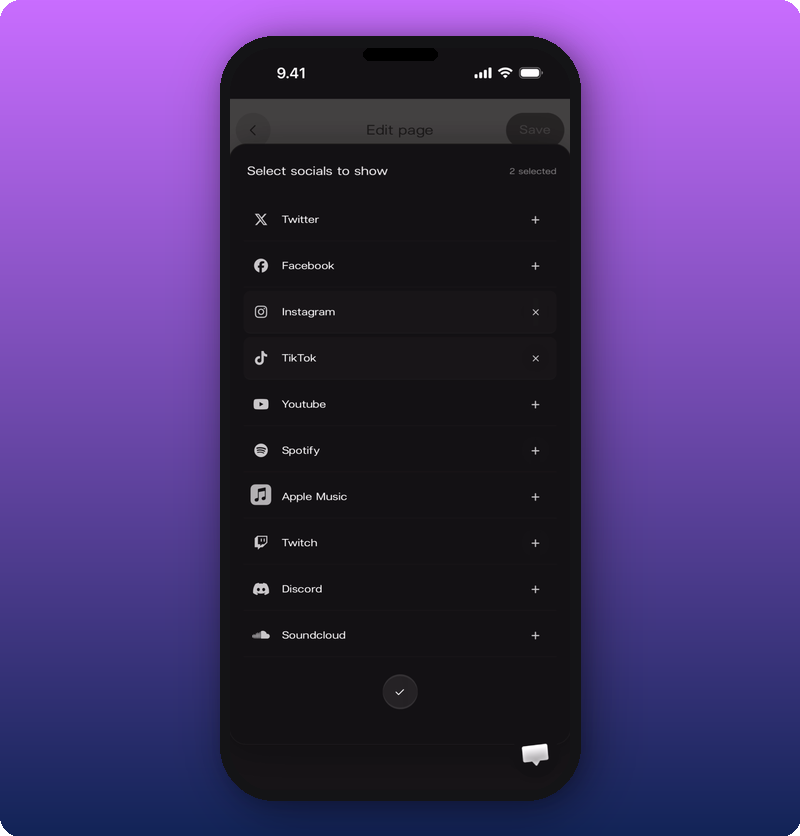
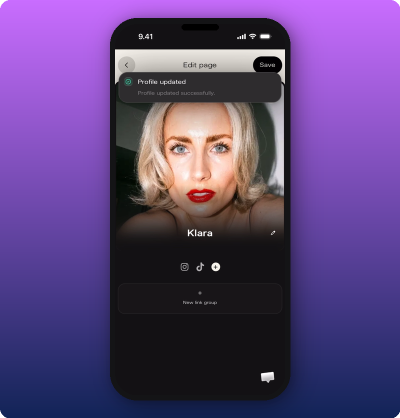

The edit screen lets you customize your public page — cover photo, artist name, social links, and link groups. Access it via the admin menu on your Artist Home page (⋮ → Edit Artist Page).

## Edit overview

The edit screen has a header bar with a **back arrow** (‹), the title "Edit page", and a **Save** button (blue). Below: the cover photo, artist name, social icons, and a **+ New link group** button at the bottom.

**What you'll see:** Header: "‹ Edit page — Save". Cover photo with a **pencil icon** in the top-right corner (tap to change photo). Artist name "Klara" with a **pencil icon** to the right. Social icons: Instagram, TikTok, and a **+ circle** button to add more. Below: "+ New link group" button.

## Change your cover photo

Tap the **pencil icon** on the cover photo to open a menu with three options.

**What you'll see:** A dropdown menu over the cover photo with three options: **Photo Library** (image icon), **Take Photo** (camera icon), **Choose File** (folder icon).

## Edit your artist name

Tap the **pencil icon** next to the artist name to make the name field editable. The keyboard opens and you can type a new name.

## Add your socials

Tap the **+ circle** button next to the existing social icons to open the social picker. It lists all supported platforms.

**What you'll see:** A full-screen overlay titled "Select socials to show" with "2 selected" in the top-right. Ten platforms listed — Twitter, Facebook, Instagram, TikTok, YouTube, Spotify, Apple Music, Twitch, Discord, SoundCloud — each with their icon and a **+** or **×** button. A **checkmark circle** button at the bottom confirms the selection.

### URL validation

After selecting a social platform, enter the profile URL. The app validates the format and shows an error in red if it's invalid ("Please enter valid [Platform] url").

## Save changes

Tap **Save** in the top-right to save all changes. A success toast appears at the top.

**What you'll see:** A green toast notification reading **"Profile updated"** with "Profile updated successfully." and a green checkmark.

## Add link groups

Link groups are sections on your Artist page that hold one or more links. For a dedicated walk-through, see [Add and organize link groups](/for-artists/home/add-and-organize-link-groups).

## Known limitations

- Whether link groups can be reordered after creation is not fully shown.
- Maximum number of link groups or links per group is not documented.
- Image size/format requirements for link thumbnails and cover photos are not documented.

## Related

- [Your Artist page, explained](/for-artists/home/artist-home)
- [Add and organize link groups](/for-artists/home/add-and-organize-link-groups)
- [Share your Kollekt link](/for-artists/sharing/sharing-your-page)
