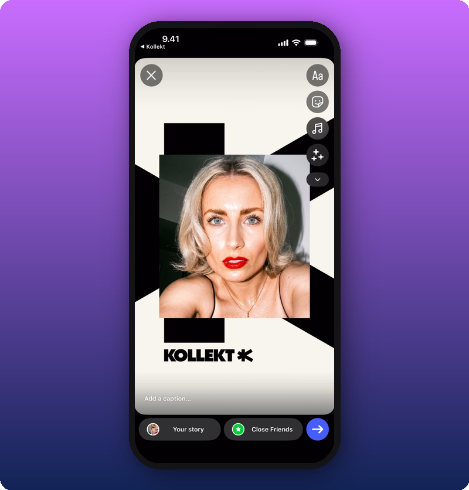
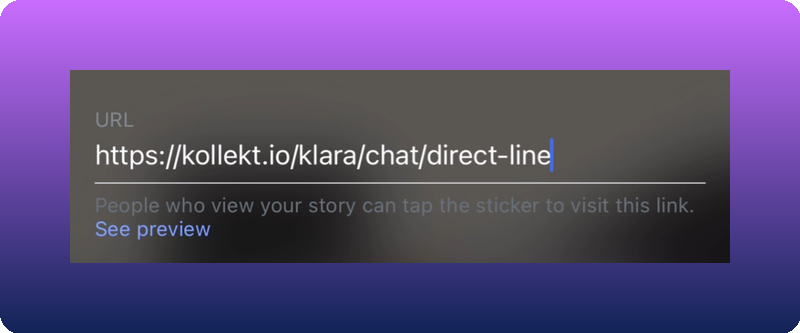

Built-in sharing tools on every screen of your Kollekt page. Share links to your Home page, Direct Line, or Chat — each lands the visitor directly on that section. Share via Instagram Stories, WhatsApp, Messages, or any app on your phone.

## Where the share icon is

A **share icon** (curved arrow) appears in the top-left of every main screen: Home, Direct Line, and Chat. Tapping it opens the Share Sheet. The URL that gets copied changes depending on which screen you're on, so the visitor lands exactly where you want them.

### Home

### Direct Line

### Chat

## The Share Sheet

Tapping the share icon opens the Share Sheet — a bottom modal with three actions.

**What you'll see:** A dimmed background with a bottom sheet. At the top: **Preview**. Below: a branded **Kollekt Card** showing your photo on a black-and-white geometric background with the "KOLLEKT K" logo. Two primary action buttons: **Share story** (Instagram icon) and **Copy link** (link icon). Below: **Other options** (share arrow icon).

### Copy link

Tap **Copy link** to copy the URL for the current screen:

- **Home** → copies your artist page link (e.g., `https://kollekt.io/klara`)
- **Direct Line** → copies the Direct Line link (e.g., `https://kollekt.io/klara/chat/direct-line`)
- **Chat** → copies the Chat link (e.g., `https://kollekt.io/klara/chat`)

### Other options

Tap **Other options** to open your device's native share sheet. From here you can share via WhatsApp, Messages, Mail, AirDrop, or any other app.

## Share to Instagram Stories

The Share Sheet has a dedicated **Share story** button for posting your Kollekt Card directly to Instagram Stories.

### 1. Copy the link first

Before tapping **Share story**, tap **Copy link** first. The link needs to be on your clipboard because Instagram doesn't always carry it over automatically.

### 2. Tap Share story

Instagram opens with the Kollekt Card already placed as a story sticker.

### 3. Add the Link sticker

Tap the **sticker icon** in the Instagram toolbar and select the **Link** sticker. Paste the Kollekt URL from your clipboard.

<Tip>
On some devices the link disappears from your clipboard when switching to Instagram. If that happens, go back to Kollekt, copy again, and paste into the Link sticker.
</Tip>

### 4. Post the story

## Quick reference

| What you want to share | Where to tap share | Where the visitor lands |
|---|---|---|
| Your artist profile | Home screen | Artist Home page |
| Your Direct Line | Direct Line screen | Direct Line feed |
| Your Chat | Chat screen | Community Chat |

## Known limitations

- The link must be copied manually before sharing to Instagram Stories — it is not automatically embedded.
- On some devices, clipboard content is cleared when switching from Kollekt to Instagram.
- The Kollekt Card image is generated automatically and cannot be customized.

## Related

- [Run your community chat](/for-artists/chat/community-chat)
- [Send a Direct Line message](/for-artists/direct-line/sending-messages)
