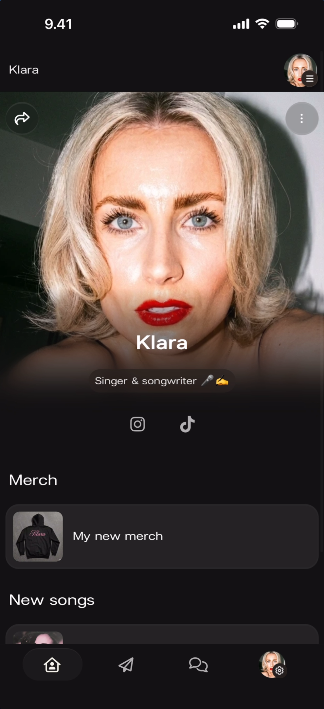
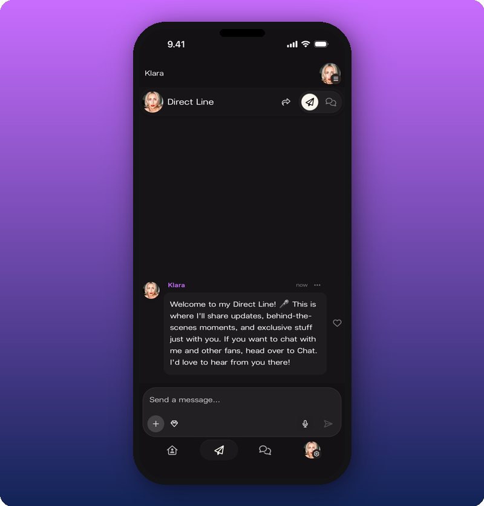
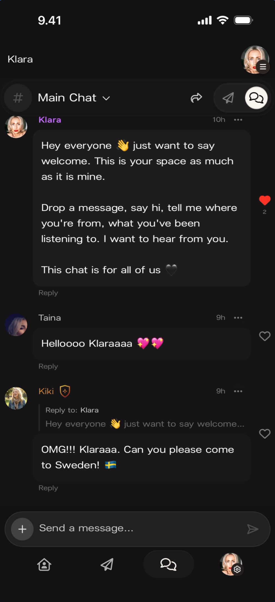
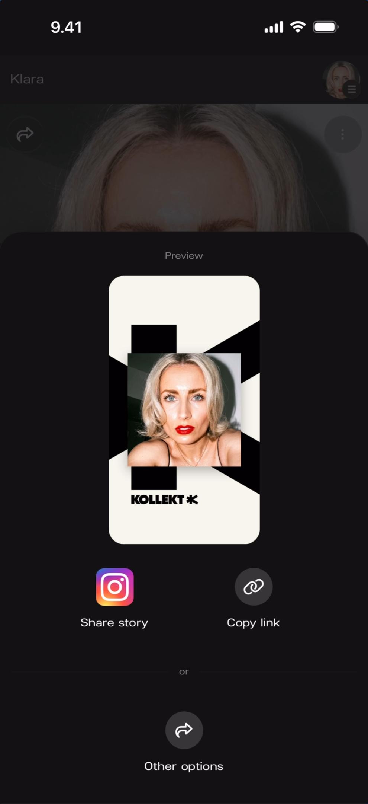

Your Kollekt page has a built-in Share button that gives your fans the right link in one tap. This page explains where it lives and what it does. For the deeper "where should I actually put the link" playbook, see the tactical guides further down in this section.

## What to know first

- **The in-app Share button is in the top-left of every main screen** — Home, Direct Line, Chat. The URL it generates changes based on which screen you're on, so the visitor lands exactly where you sent them.
- **Three URL types** depending on where you tap Share:
  - Home → your artist page (`https://kollekt.io/yourname`)
  - Direct Line → lands the visitor directly in your Direct Line
  - Chat → lands the visitor in your Chat
- **Keep Kollekt as your primary link.** Your Home already shows your social platforms, merch, tickets, and music — so it doubles as your one-link-everywhere. Everyone who taps lands in your space and becomes reachable.

## Where the Share button is

Tap the **share icon** (curved arrow) in the top-left of Home, Direct Line, or Chat.

## The Share Sheet

Tapping the share icon opens the Share Sheet. It has three actions:

- **Copy link** — copies the URL for the current screen to your clipboard. Paste anywhere.
- **Share story** — posts your branded Kollekt Card directly to Instagram Stories.
- **Other options** — opens your device's native share sheet (WhatsApp, Messages, Mail, AirDrop, any other app).

## Where to put your link

The Share button is the mechanic. The harder question is where to share. Each of these has its own guide:

- [Add Kollekt to your Instagram bio](/for-artists/bring-fans-in/instagram-bio) — the single highest-leverage placement
- [Post to your Instagram Story](/for-artists/bring-fans-in/instagram-stories) — 30-second move with a branded Story card
- [Share Kollekt at your live shows](/for-artists/bring-fans-in/live-shows) — QR codes, stage banter, merch table

And when you're ready to announce to your fanbase properly:

- [Announce Kollekt to your fans](/for-artists/bring-fans-in/announce-to-your-fans) — the launch playbook with sample scripts
- [Your first 10 fans](/for-artists/bring-fans-in/your-first-10-fans) — who to DM first, what to say

## Quick reference

| What you want to share | Where to tap | Where the visitor lands |
|---|---|---|
| Your artist page | Home screen | Artist Home page |
| Your Direct Line | Direct Line screen | Direct Line feed |
| Your Chat | Chat screen | Community Chat |
