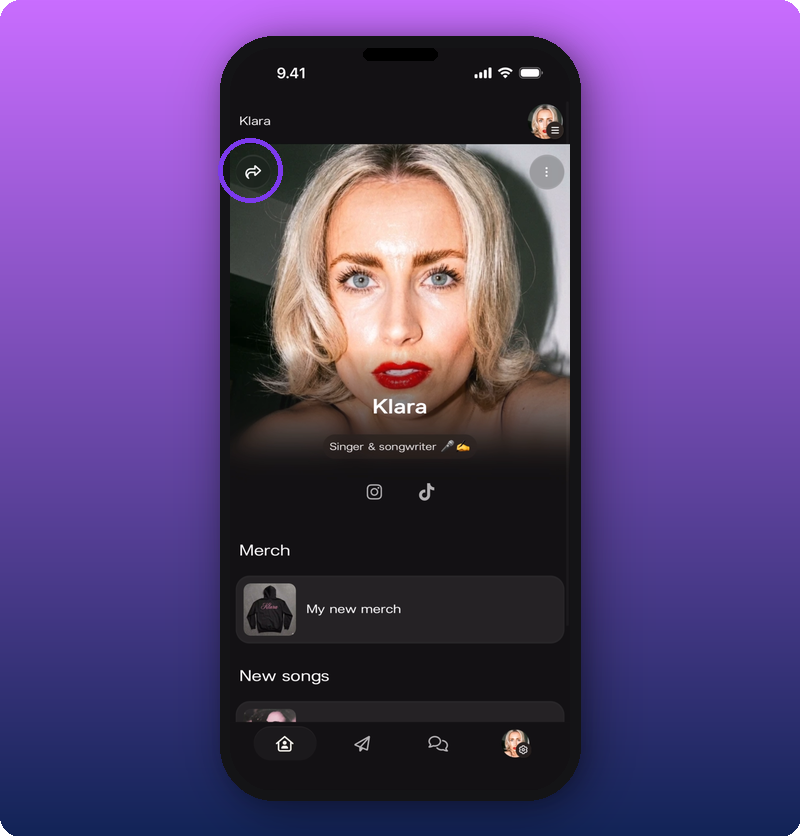
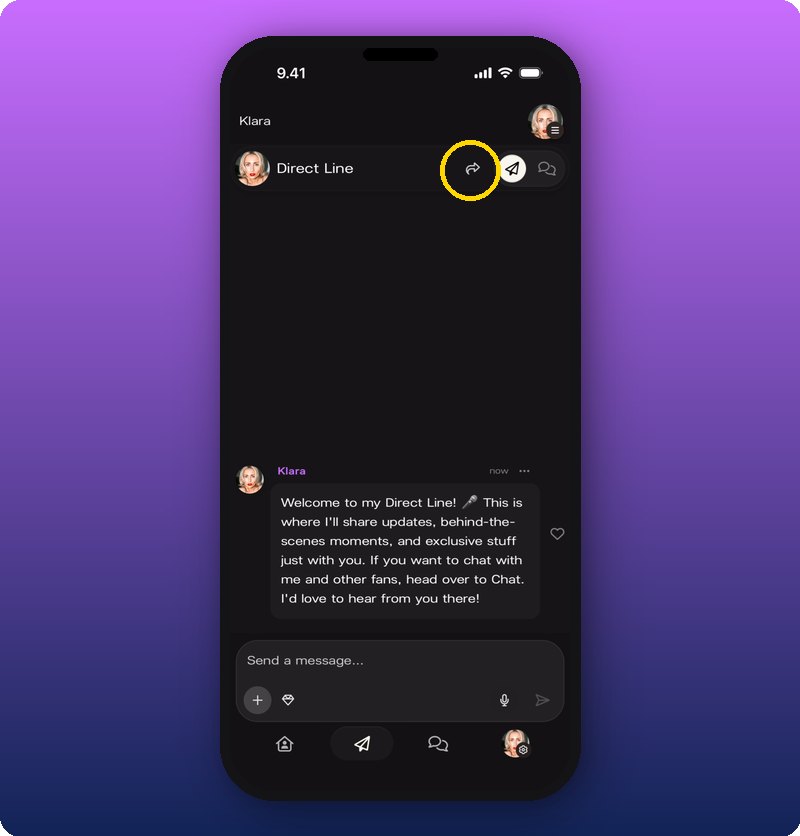
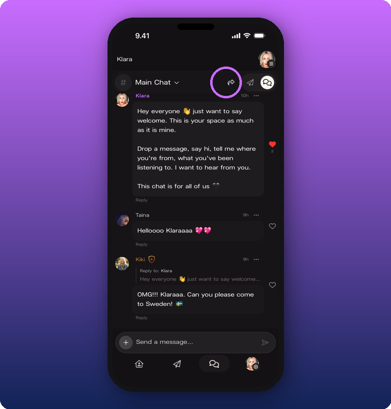
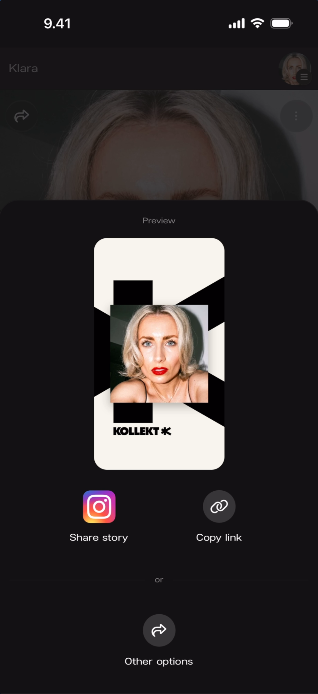

The Share button is how you send your Kollekt link to fans. Tap it on Home, Direct Line, or Chat to copy the link, or to send it straight to your Instagram Story.

## Where the Share button is

The Share button (a curved arrow icon) sits at the top of every main screen. The link it gives you changes based on which screen you're on, so the fan lands exactly where you sent them.

- Home: your artist page (`https://kollekt.io/yourname`)
- Direct Line: lands the fan in your Direct Line
- Chat: lands the fan in your Chat

**Home**

**Direct Line**

**Chat**

## The Share Sheet

Tapping the Share button opens the Share Sheet. It has three actions:

- **Copy link.** Copies the link for the current screen to your clipboard. Paste anywhere.
- **Share story.** Drops your Kollekt card into the Instagram Story composer. You still need to add the link yourself using Instagram's link sticker. See [Post to your Instagram Story](/for-artists/bring-fans-in/instagram-stories).
- **Other options.** Opens your phone's normal share menu (WhatsApp, Messages, Mail, AirDrop, any other app).

## Quick reference

| What you want to share | Where to tap | Where the fan lands |
|---|---|---|
| Your artist page | Home screen | Artist Home page |
| Your Direct Line | Direct Line screen | Direct Line feed |
| Your Chat | Chat screen | Community Chat |

## Related

- [Announce Kollekt to your fans](/for-artists/bring-fans-in/announce-to-your-fans)
- [Add Kollekt to your social bios](/for-artists/bring-fans-in/social-bios)
- [Post to your Instagram Story](/for-artists/bring-fans-in/instagram-stories)
