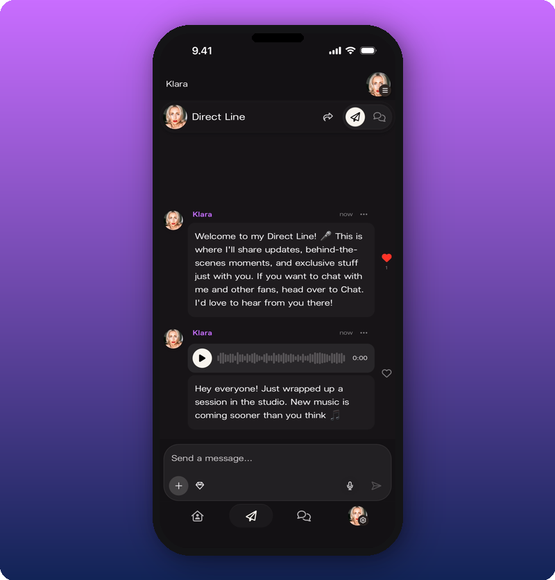

Direct Line is your broadcast feed inside Kollekt. Every post sends a push notification to every fan who's joined your space, so messages always land. No algorithm, no feed competition. Voice notes, photos, videos, and text all work.

It's the highest-reach surface on your page. Use it like dropping a message to a close group of friends: short, frequent, real.

## Use it

- [Send a Direct Line message](/for-artists/direct-line/sending-messages). Text, voice, the basics.
- [Attach photos, videos, and audio](/for-artists/direct-line/attach-media). Rich media posts.
- [Post subscriber-only content](/for-artists/direct-line/post-subscriber-only-content). Locked posts for paying fans.

## Related

- [Home](/for-artists/start-here/home)
- [Chat](/for-artists/start-here/chat)
