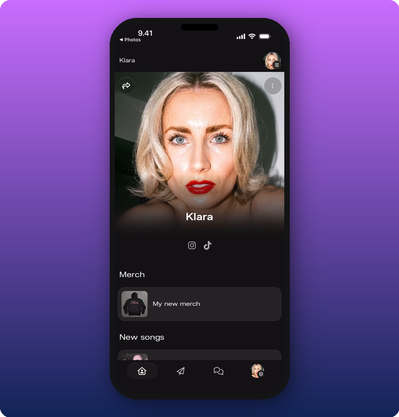
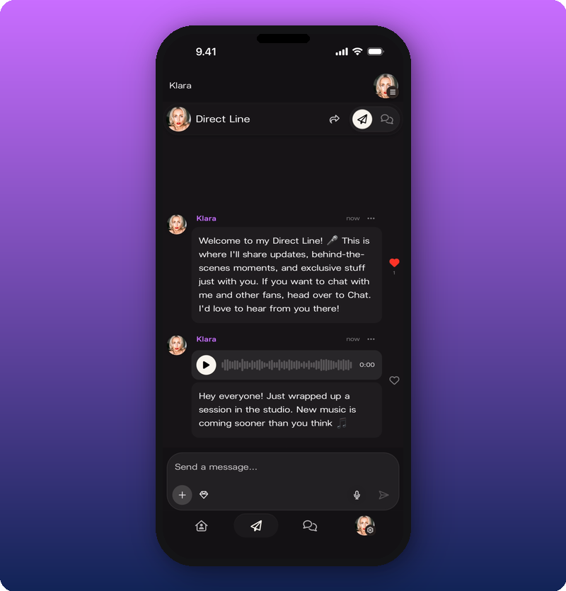
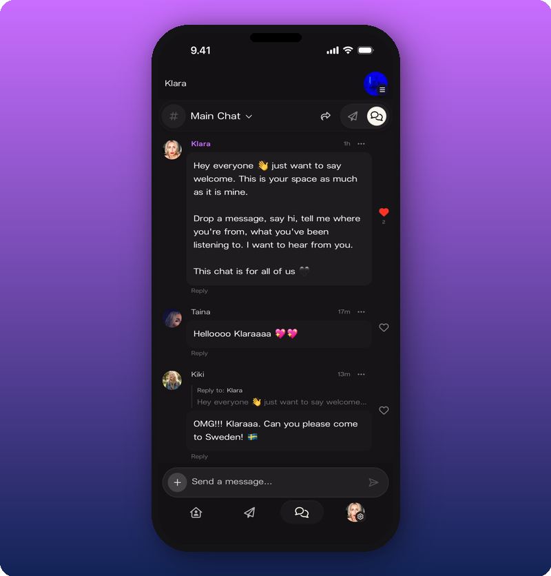

Your Kollekt space has three parts. Each one does a different job. Knowing what each is for helps you pick the right place to post, talk, or launch something.

## Home

Your public page at `app.kollekt.io/yourname`. This is what fans see the first time they land on your Kollekt, and it's the one page that's accessible without signing up.

What's on it:
- Cover photo and your name
- A short bio
- Social platform icons (Instagram, Spotify, TikTok, Facebook, YouTube, X, etc.)
- Custom link sections for anything else — tour dates, merch store, tickets, newsletter. You add these yourself
- A Share button that gives you a branded Story card for Instagram, or a plain link

Home is the only public part of your space. Fans can see it without joining. Every other surface is only visible once they've joined.

## Direct Line

A one-way broadcast from you (and your team) to every member. Every message sends a push notification. Only you can post.

What you can send:
- Text
- Photos and videos
- Voice messages
- Audio files
- Subscriber-only posts that regular members can't see

Direct Line is the highest-reach, lowest-effort tool you have. No algorithm. Every fan who joined sees what you post.

Use it like dropping a message to a group of friends. A photo from a venue. A voice note about a new song. A "should I buy this jacket?" shot from a store. Casual, high-frequency, moment-driven. It doesn't need to be polished.

## Chat

A two-way conversation between your fans. Members post, reply, and react. You can post too, but the point of Chat is fans talking to each other.

What Chat includes:
- A default "Main Chat" room, with threaded replies and heart reactions
- Additional rooms if you create them
- A subscriber-only Chat room that only paying subscribers can access
- Subscriber perks: highlighted names, the ability to send images and videos, subscriber badges

Chat is where loyalty compounds. When fans meet other fans who care about you, the space becomes sticky in a way a broadcast feed never is.

## Where to go next

- [Edit your artist page](/for-artists/home/editing-the-artist-page) — customize what fans see when they land
- [Send a Direct Line message](/for-artists/direct-line/sending-messages) — post your first broadcast
- [Run your community Chat](/for-artists/chat/community-chat) — kick off the conversation
