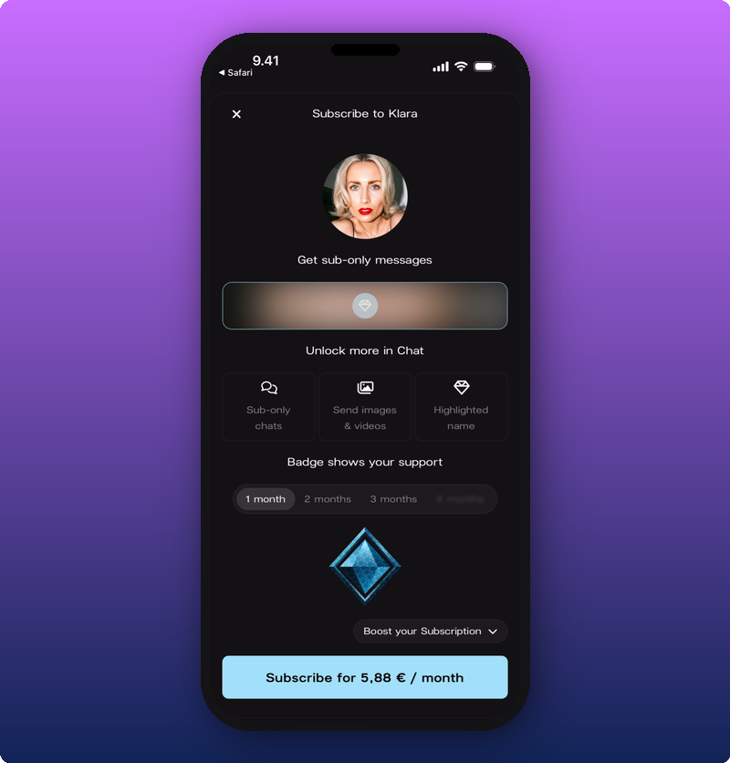

Subscriptions turn your most committed fans into monthly support. They're on from day one. Nothing to set up, nothing to unlock. Fans can subscribe from the moment you claim your space, and your earnings start adding up from the first sale.

## What subscribers get

This is what a fan sees when they're about to subscribe. The perks are built into the platform, so you don't have to keep making new ones.

- **Subscriber-only Direct Line posts.** Lock a post and only paying fans can open it. See [Post subscriber-only content](/for-artists/direct-line/post-subscriber-only-content).
- **Subscribers Chat room.** A separate room just for subscribers.
- **Send images and videos in Chat.** Subscribers can share media. Other members can't.
- **Highlighted names in Chat.** Subscribers stand out in the room.
- **Subscriber badge.** A small badge next to their name.

A fan in Main Chat sees subscribers with highlighted names. A fan in Direct Line sees locked posts they can't read. The perks are visible to everyone, so you just have to keep showing up.

## Pricing and your share

Subscriptions start at €4.99 a month. From there, it's pay-what-you-want. Fans can pay more if they want to support you further. Everyone gets the same perks no matter what they pay.

You keep 80% of subscription revenue after VAT and Stripe fees. Kollekt takes 20%.

## A note on iOS pricing

Apple charges a fee on in-app purchases in the App Store. Kollekt passes that fee through to fans who subscribe inside the iOS app, so the starting price looks different depending on where a fan signs up:

| Where the fan subscribes | Starting price |
|---|---|
| Web (`app.kollekt.io/yourname`) | €4.99 / month |
| Android app | €4.99 / month |
| iOS app | €5.88 / month |

Your earnings are the same either way. The extra on iOS covers Apple's fee, not your share. Worth mentioning to your fans: if they sign up through the web or Android, they pay less for the same perks.

## How the money reaches you

1. **A fan subscribes.** They pay monthly at the amount they chose.
2. **Earnings add up in your space.** No payout account needed yet. The money is tracked either way.
3. **Split with your team if you want.** If you've added team members, each takes their share. See [Add team members and split revenue](/for-artists/admin/team-members-and-revenue-splits).
4. **Withdraw when you're ready.** Connect your payout account any time. Money held until then comes through on Stripe's normal schedule once you connect. See [Connect your payout account](/for-artists/subscriptions/connect-your-payout-account).

## When to lean into subscriptions

Not on day one. Wait until your Chat is active on its own (fans talking to each other without you starting every thread) and your Direct Line has a regular rhythm. At that point, subscriber perks feel natural, not a sales pitch.

When you're ready to push:

- Post subscriber-only content regularly. See [Post subscriber-only content](/for-artists/direct-line/post-subscriber-only-content).
- Show up in the Subscribers Chat room yourself.
- Mention the web subscription option when you tell fans about it. They pay less, you earn the same.

## Related

- [See your stats and revenue](/for-artists/subscriptions/see-your-stats-and-revenue)
- [Connect your payout account](/for-artists/subscriptions/connect-your-payout-account)
- [Add team members and split revenue](/for-artists/admin/team-members-and-revenue-splits)
- [Post subscriber-only content](/for-artists/direct-line/post-subscriber-only-content)
