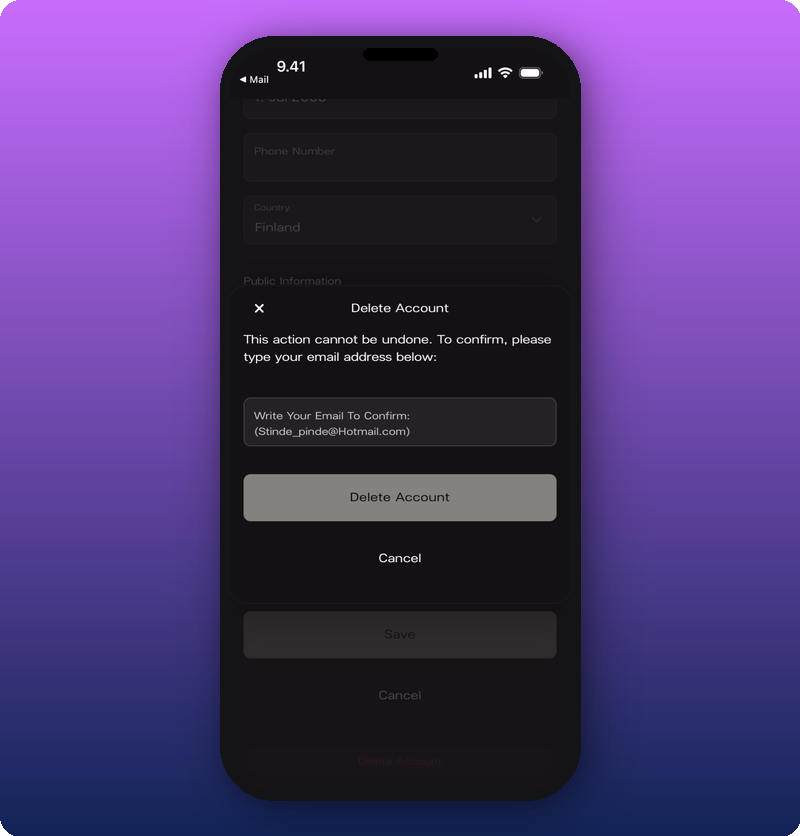

Account deletion is self-serve and permanent. Pausing isn't self-serve yet — email support and we'll handle it.

## What to know first

- **Delete is permanent.** There's no undo once it's confirmed.
- **Delete removes your personal account and your Owner access to any Artist spaces.** If you're an Admin or Moderator on someone else's space, deletion removes you from those too.
- **Pause keeps your data intact.** Email [support@kollekt.io](mailto:support@kollekt.io) to pause instead.

## Delete your account

1. Tap the profile icon in the bottom-right of the nav bar.
2. Tap **Edit** to open the profile editor.
3. Scroll to the bottom, past **Save** and **Cancel**.
4. Tap the red **Delete Account** link.
5. In the confirmation modal, type your email address to confirm.
6. Tap **Delete Account**.

What gets removed:

- Your user profile and personal account.
- Owner access to any Artist spaces you own.
- Your role on any spaces where you're an Admin or Moderator.

## Pause your account

Pausing isn't available in-app yet. Email [support@kollekt.io](mailto:support@kollekt.io) and we'll suspend your account without losing your data. When you're ready to come back, email again and we'll restore it.

## Signs it's working

After deletion, signing back in with the same email doesn't find an account. For pauses, you'll get an email confirmation from support within a business day.

## Related

- [Edit your user profile](/for-artists/user-profile/edit-user-profile)
- [Manage admins and roles](/for-artists/admin/manage-admins-and-roles)
