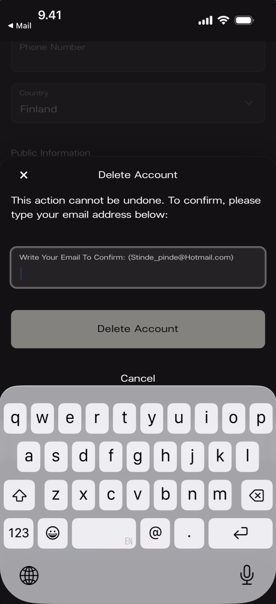

Account deletion is permanent. Pausing is not self-serve yet — reach out to support.

## Delete your account

At the bottom of the **Edit your user profile** form, below **Save** and **Cancel**, there's a red **Delete Account** link. Tapping it opens a confirmation modal.

**What you'll see:** A bottom sheet with an **X** close button and **"Delete Account"** title. Warning: **"This action cannot be undone. To confirm, please type your email address below:"** An email confirmation field, a full-width **Delete Account** button, and a **Cancel** link.

### What gets deleted

- Your user profile and personal account.
- Access to any artist spaces you own as Owner.

If you're a team member on another artist's space (Admin or Moderator), deletion removes you from those spaces too.

{/* TODO: Tina — confirm exact data deletion policy with Stefan and update */}

## Pause your account

<Warning>
**Pausing is not self-serve yet.** Email [support@kollekt.io](mailto:support@kollekt.io) to temporarily suspend your account without losing your data.
</Warning>

## Related

- [Edit your user profile](/for-artists/user-profile/edit-user-profile)
- [Manage admins and roles](/for-artists/admin/manage-admins-and-roles)
