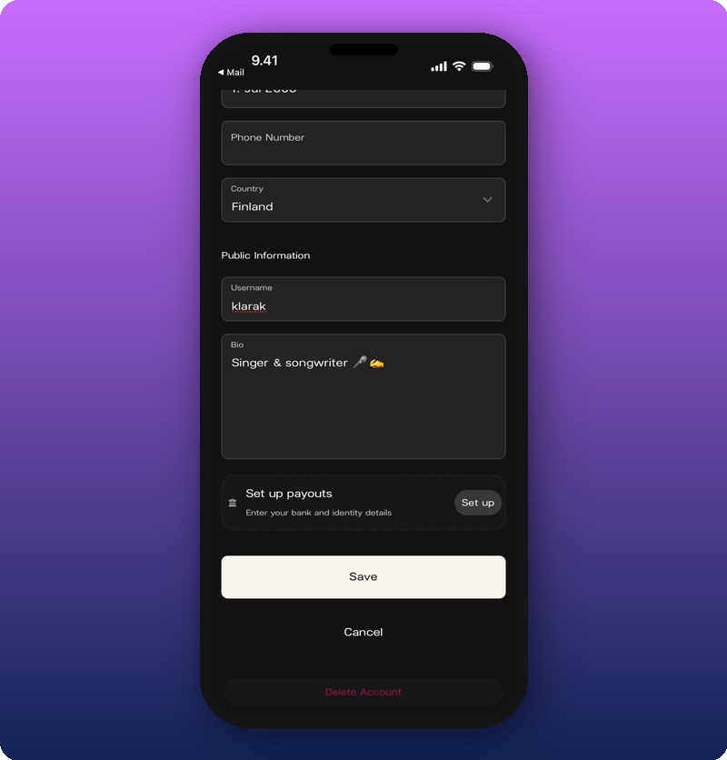
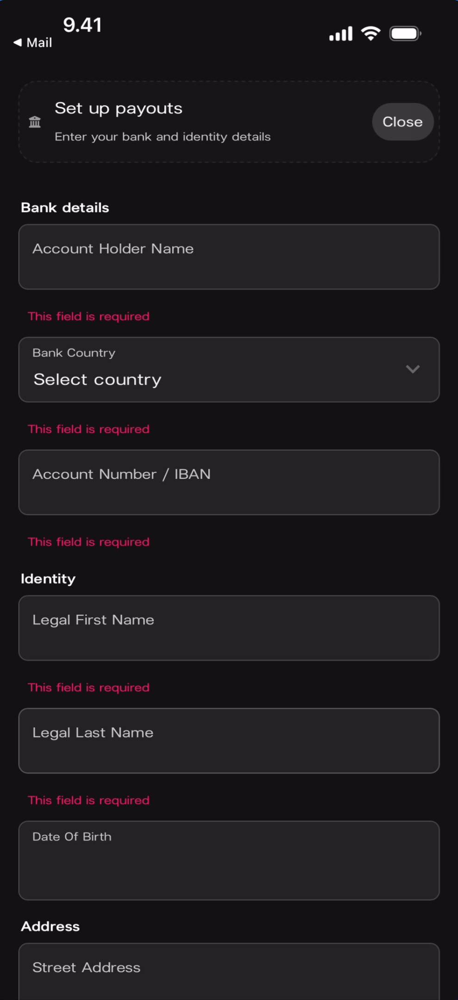
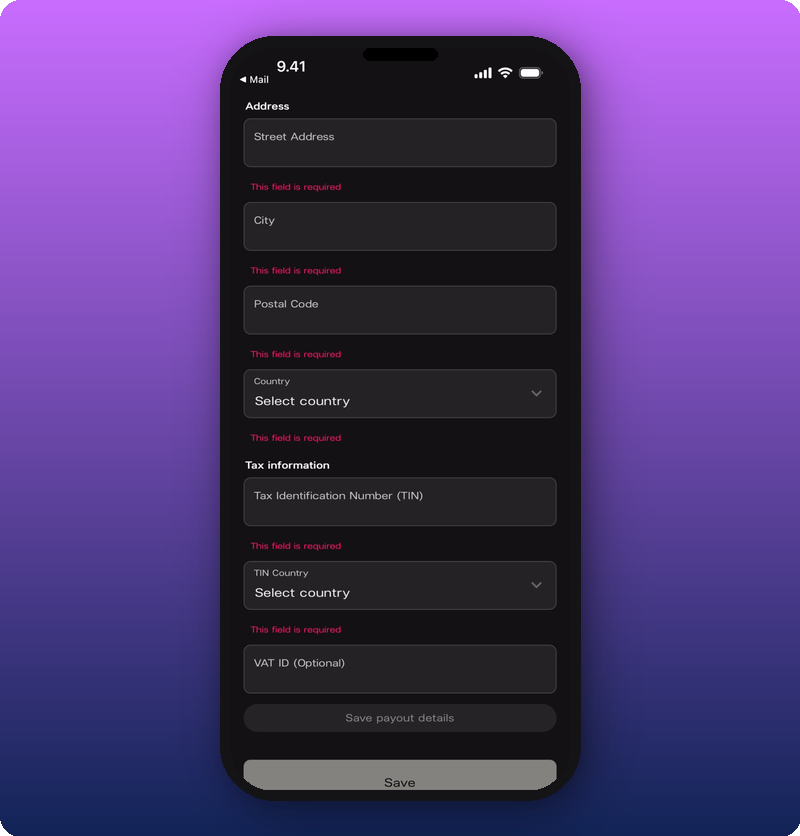

# Edit Your User Profile

Personal account settings screen where artists manage their profile picture, contact details, username, bio, payout setup, and account deletion. Separate from the public Artist Home page.

## Profile Overview

The profile screen is accessed by tapping the **profile icon** in the bottom-right corner of the navigation bar. It shows your user avatar, username, bio, and a large card preview of your artist page below.

### Default State (New Account)

**What you'll see:** Top-left: a **down-arrow (∨)** dismiss button. Top-right: a **hamburger menu icon** (three horizontal lines). Below: a **generic silhouette avatar** (no photo set yet), the username **"kollektor001"**, and grey italic text **"No user bio yet"**. To the right of the username: a **gear icon** with **"Edit"** label. Below: a large card showing the artist page — the artist's photo with name "Klara", a **blue Kollekt wave icon** in the bottom-left, and a **right-arrow (>)** button in the bottom-right.

### Default State (With Profile Photo)

**What you'll see:** Same layout as above but the avatar is now a **circular photo** of the artist (matching the artist page photo). The username reads **"klarak"**. Bio still reads **"No user bio yet"** in grey italic. Top-left shows **"◀ Mail"** back navigation. The **gear + "Edit"** button, hamburger menu, and artist card are identical to the previous state.

### Edited State (With Bio)

**What you'll see:** Same layout as above. The username reads **"klarak"**. Below it, the bio now shows **"Singer & songwriter 🎤👋"** instead of the placeholder text. The **gear + "Edit"** button, hamburger menu, and artist card remain unchanged.

## Sidebar Navigation

Tapping the **hamburger menu icon** (top-right of the profile overview) opens a sidebar panel. The sidebar provides account switching, artist search, and support links.

### Sidebar Menu

**What you'll see:** A dark sidebar overlays the profile screen from the right. Top: **"KOLLEKT ≪"** logo with an **X** close button to the right. Below: the user avatar and username **"klarak"** with a **right-arrow (>)** to access the profile. Below that: a **search field** with placeholder text **"Find an artist"**. Under a **"Yours"** label: the artist avatar and name **"Klara"** — this is the artist page owned by the account. At the bottom: three links — **"Help & Support"** (question mark icon), **"Find yours"** (search icon), and **"Log out"** (exit icon).

### Artist Search

**What you'll see:** The sidebar is open with the search field active. The typed query is **"Mikael"** with an **X** clear button. Below the search field: a search result showing an avatar and the name **"Mikael Gabriel"** with a **right-arrow (>)**. Under the "Yours" section: **"Klara"** is still visible. The keyboard is open at the bottom with autocomplete suggestions: **"Mikael"**, **"Mikaela"**, **"Mikaela's"**.

## Editing Your Profile

Tap the **gear + "Edit"** button on the profile overview to open the Edit profile screen. The screen has a top **X** close button, the title **"Edit profile"**, and a scrollable form.

### Edit Form (Default — No Photo)

**What you'll see:** Top: **X** close button (left) and **"Edit profile"** title (center). Below: a **circular generic silhouette avatar** with a **pencil icon** overlay in the bottom-right. Form fields below: **Email** (greyed out, showing "stinde_pinde@hotmail.com"), **Birthday** ("1. Jul 2000"), **Phone Number** (empty), **Country** ("Finland" with a dropdown arrow). A divider, then **"Public Information"** heading with: **Username** ("kollektor001") and **Bio** (empty).

### Edit Form (With Photo)

**What you'll see:** Same layout as above but the avatar now shows the **artist's circular photo** with the **pencil icon** overlay. The **Email** field shows "stinde_pinde@hotmail.com" (greyed out). **Birthday**: "1. Jul 2000". **Phone Number**: empty. **Country**: "Finland" with dropdown. **Username** now reads **"klarak"**. **Bio**: empty.

### Edit Form (Bottom Half)

**What you'll see:** Scrolled down past the Birthday field. Visible fields: **Phone Number** (empty), **Country** ("Finland" with dropdown). **"Public Information"** section: **Username** ("klarak"), **Bio** ("Singer & songwriter 🎤👋" — now filled in). Below the form: **"Set up payouts"** section with subtext "Enter your bank and identity details" and a cream-colored **"Set up"** button. Below: a full-width cream **"Save"** button, a **"Cancel"** text link, and a red **"Delete Account"** text link at the very bottom.

### Profile Photo Picker

Tapping the **pencil icon** on the avatar opens an iOS action sheet with three options.

**What you'll see:** The Edit profile screen is visible behind a **white action sheet** popup. The sheet shows three options with icons: **"Photo Library"** (image icon), **"Take Photo"** (camera icon), and **"Choose File"** (folder icon). The form fields are partially visible below.

### Birthday Picker

Tapping the **Birthday** field opens a scroll wheel date picker.

**What you'll see:** The Edit profile screen is visible behind a **white popover**. The popover header reads **"July 1992 ∨"** (a dropdown to jump to a month/year). Below: two scroll wheel columns — **month** (left, showing April through October with **"July"** highlighted in bold) and **year** (right, showing 1997 through 2003 with **"2000"** highlighted in bold). Bottom-left: a **"Reset"** button. Bottom-right: a **blue checkmark circle** (confirm) button. The Username and Bio fields are partially visible below the popover.

### Username Editing

Tapping the **Username** field activates it for editing with the keyboard.

**What you'll see:** The edit form scrolled to show Birthday ("1. Jul 2000"), Phone Number (empty), Country ("Finland"), then the **"Public Information"** section. The **Username** field has a **blue/highlighted border** indicating it's active, containing the text **"klarak"** with a cursor. **Bio** is empty below. The keyboard is open at the bottom with an autocomplete suggestion **"klarak"**.

## Saving Changes

After making edits, tap the **Save** button at the bottom of the edit form. A success toast appears on the profile overview screen.

**What you'll see:** The profile overview screen is visible. At the top: a **green success banner** with a **green checkmark circle** icon, bold text **"Profile updated"**, and subtext **"Profile updated successfully."**. Below: the profile overview shows the updated avatar (photo), username, and the **gear + "Edit"** button. The artist card is visible below.

## Setting Up Payouts

Tapping the **"Set up"** button in the Edit profile form opens a full-screen payout setup form powered by Stripe.

### Bank Details and Identity

**What you'll see:** Top: a **document icon**, heading **"Set up payouts"**, subtext "Enter your bank and identity details", and a **"Close"** button (top-right). The form has three sections. **"Bank details"**: fields for **Account Holder Name**, **Bank Country** ("Select country" with dropdown), and **Account Number / IBAN**. **"Identity"**: fields for **Legal First Name**, **Legal Last Name**, and **Date Of Birth**. **"Address"** (partially visible): **Street Address** field. All fields show **red "This field is required"** validation text below them.

### Address and Tax Information

**What you'll see:** The form scrolled to continue from the Address section. **"Address"**: fields for **Street Address**, **City**, **Postal Code**, and **Country** ("Select country" with dropdown). **"Tax information"**: fields for **Tax Identification Number (TIN)**, **TIN Country** ("Select country" with dropdown), and **VAT ID (Optional)**. All required fields show **red "This field is required"** validation text. At the bottom: a grey text **"Save payout details"** and a full-width **"Save"** button.

## Deleting Your Account

At the bottom of the Edit profile form, below Save and Cancel, there is a red **"Delete Account"** link. Tapping it opens a confirmation modal.

### Delete Confirmation (Keyboard Open)

**What you'll see:** The edit form is dimmed behind a **white bottom sheet modal**. The modal has an **X** close button and title **"Delete Account"**. Warning text reads: **"This action cannot be undone. To confirm, please type your email address below:"**. An input field with placeholder text **"Write Your Email To Confirm: (Stinde_pinde@Hotmail.com)"** is visible. Below: a full-width **"Delete Account"** button and a **"Cancel"** text link. The keyboard is open.

### Delete Confirmation (Full View)

**What you'll see:** Same modal as above but the keyboard is dismissed, revealing the full layout. The **X** close button and **"Delete Account"** title are at the top. Warning text and email input field with placeholder **"Write Your Email To Confirm: (Stinde_pinde@Hotmail.com)"** are visible. Below: the **"Delete Account"** button and **"Cancel"** link. Behind the modal, the edit form's **"Save"** button and **"Cancel"** link are partially visible.

## Known Limitations

- Whether the Email field can be changed from this screen is not clear — it appears greyed out in all screenshots.
- The Phone Number field is empty in all screenshots — formatting requirements and country code behavior are not shown.
- What happens after completing the Stripe payout form (success state, connected state) is not shown.
- Whether "Find yours" in the sidebar triggers an artist claim/verification flow is not confirmed.
- The relationship between the Username and the artist name displayed on the artist card is not shown — they appear to be separate (e.g., "klarak" vs. "Klara").

## Related Features

- [Editing the Artist Page](/for-artists/home/editing-the-artist-page) — Customize the public-facing Artist Home page (separate from user profile)
- [Sending Direct Line Messages](/for-artists/direct-line/sending-messages) — Your user profile avatar appears in Chat and Direct Line
- [Community Chat](/for-artists/chat/community-chat) — Your username and avatar are visible when sending messages as your personal account