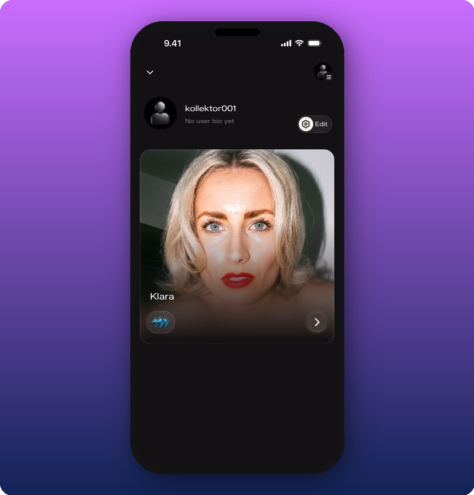
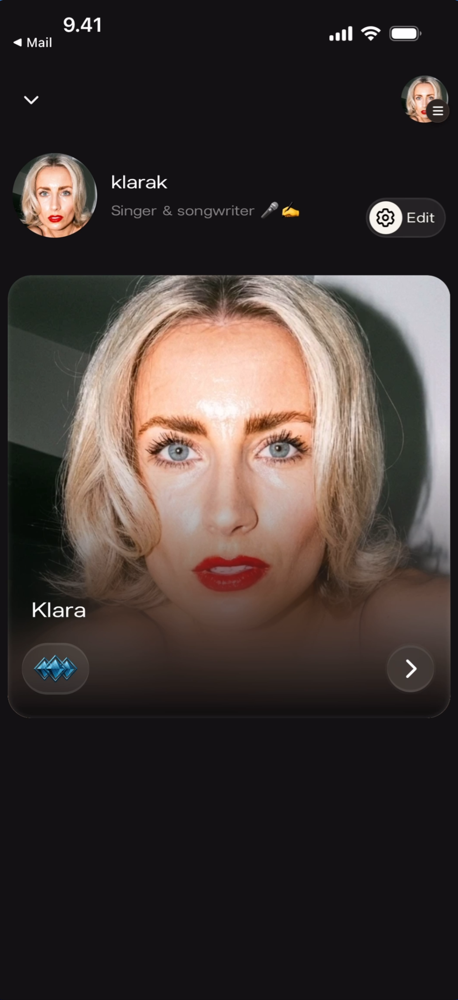
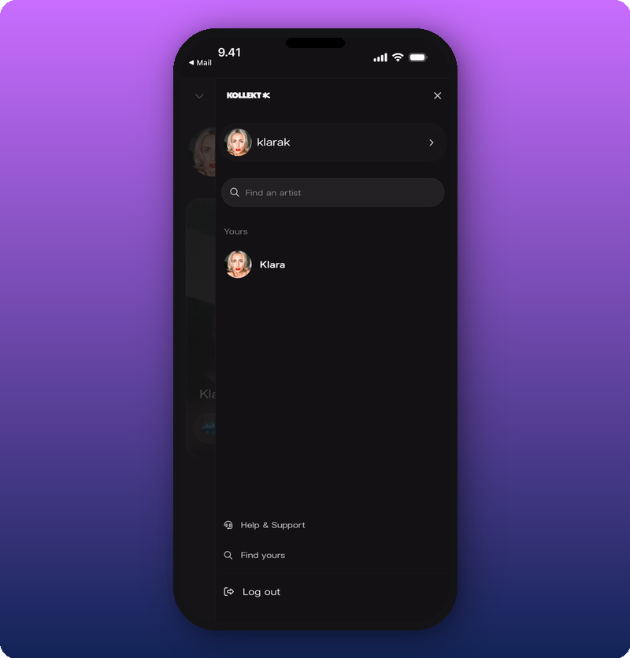
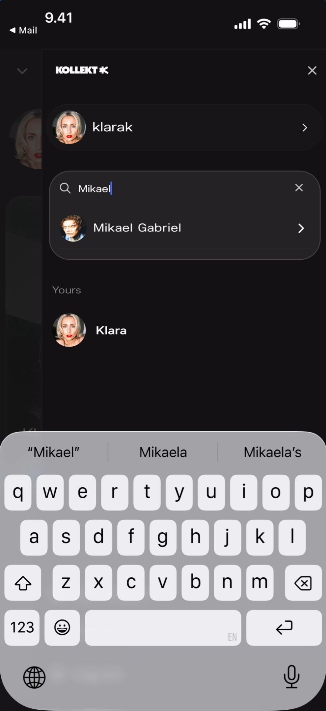
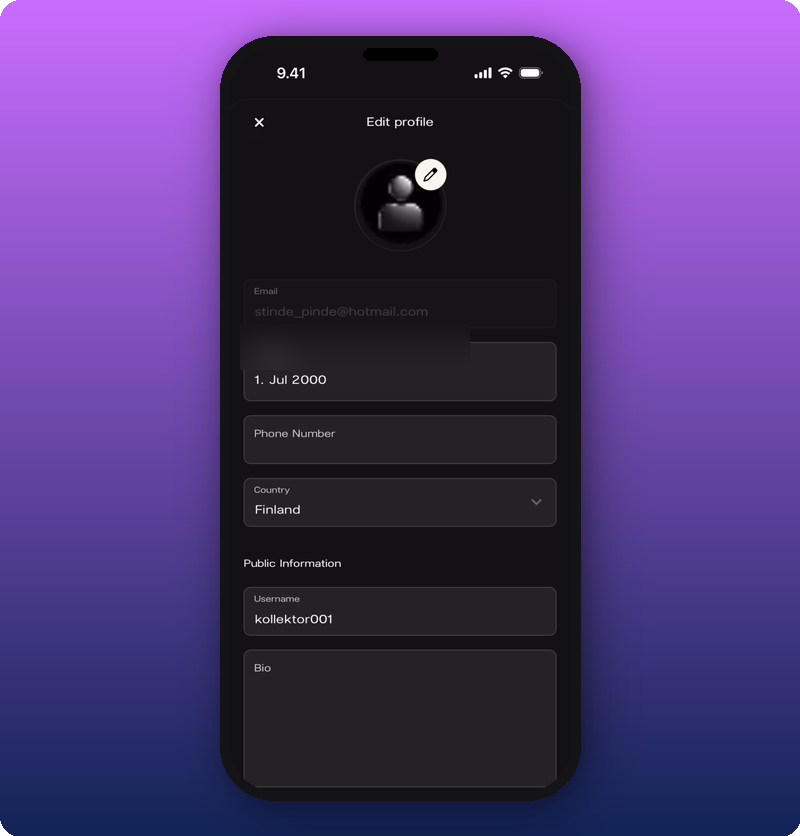
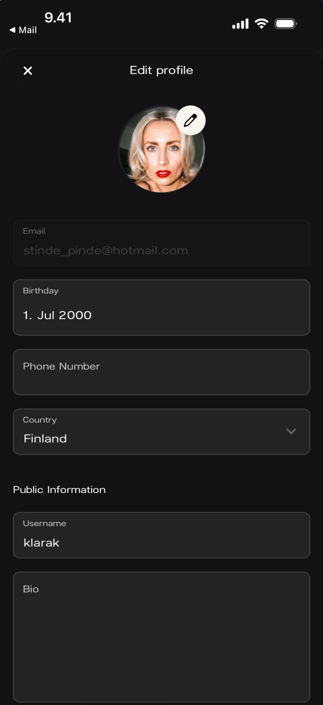
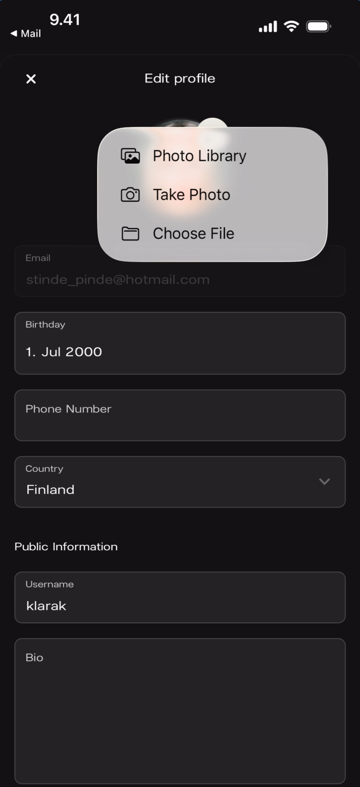
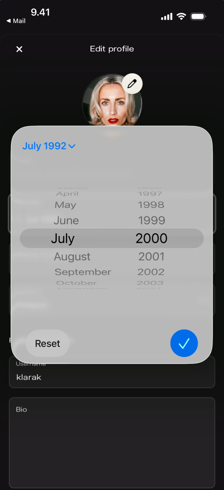
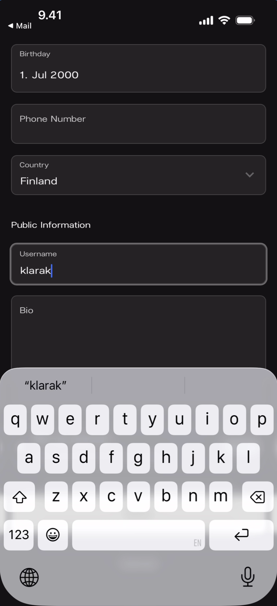
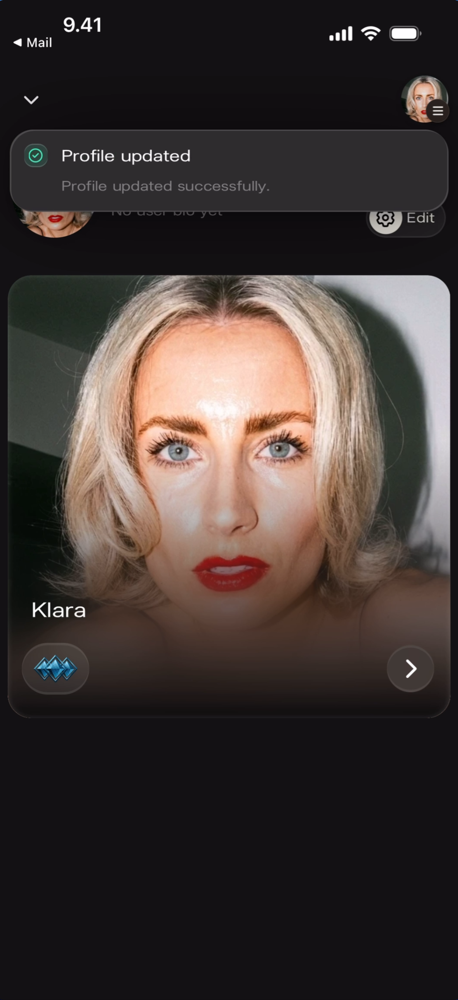

Your personal account settings — avatar, username, bio, email, birthday, phone, country. This is separate from your public Artist page, and it's what shows up when you comment in Chat as your personal self rather than as the artist.

For payouts, see [Connect your payout account](/for-artists/subscriptions/connect-your-payout-account).
To delete your account, see [Delete or pause your account](/for-artists/user-profile/delete-or-pause-your-account).

## Profile overview

Access the profile screen by tapping the **profile icon** in the bottom-right of the navigation bar. It shows your avatar, username, bio, and a card preview of your artist page.

### Default state (new account)

**What you'll see:** A generic silhouette avatar, username ("kollektor001"), and grey italic **"No user bio yet"**. A **gear icon with "Edit"** label for editing. Below: a card showing your artist page.

### With a profile photo

### With a bio filled in

## Sidebar menu

Tap the **hamburger icon** (top-right) to open the sidebar — account switcher, artist search, and support links.

**What you'll see:** The Kollekt wordmark, your user avatar and name, a **Find an artist** search, your own artist under **Yours**, and at the bottom: **Help & Support**, **Find yours**, **Log out**.

### Search for another artist

## Edit your profile

Tap the **gear + "Edit"** button on the profile overview to open the Edit profile screen.

### Edit form

**What you'll see:** An **X** close button, the **"Edit profile"** title, and a scrollable form. Private fields: **Email** (read-only), **Birthday**, **Phone Number**, **Country**. Public fields: **Username**, **Bio**.

### Change your profile photo

Tap the **pencil icon** on the avatar to open a photo picker.

**What you'll see:** Three options — **Photo Library**, **Take Photo**, **Choose File**.

### Set your birthday

Tap the **Birthday** field to open a scroll wheel date picker.

### Edit your username

Tap the **Username** field to activate it for editing. The keyboard opens.

## Save changes

Tap **Save** at the bottom of the edit form. A success toast appears.

**What you'll see:** A green banner: **"Profile updated"** with "Profile updated successfully."

## Known limitations

- The Email field appears greyed out in all screenshots — whether it can be changed is not shown.
- Phone Number is empty in all screenshots — formatting and country code behavior are not documented.
- The relationship between the username (e.g., "klarak") and the public artist name (e.g., "Klara") is not documented.

## Related

- [Connect your payout account](/for-artists/subscriptions/connect-your-payout-account)
- [Delete or pause your account](/for-artists/user-profile/delete-or-pause-your-account)
- [Edit your Artist page](/for-artists/home/editing-the-artist-page)
- [Run your community chat](/for-artists/chat/community-chat)
