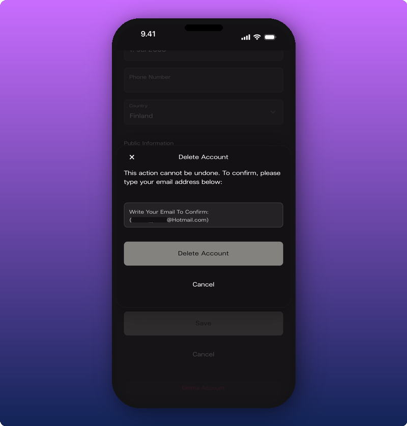

Deleting your account is something you can do yourself, and it's for good. There's no undo once it's confirmed.

## Delete your account

1. Tap your user profile icon at the top of your Home page.
2. Tap **Edit** to open the profile editor.
3. Scroll to the bottom, past **Save** and **Cancel**.
4. Tap the red **Delete Account** link.
5. In the box that pops up, type your email address to confirm.
6. Tap **Delete Account**.

What gets removed:

- Your user profile and personal account.
- Owner access to any Artist spaces you own.
- Your role on any spaces where you're an Admin or Moderator.

## Want to pause instead?

If you want to pause your account for a while without losing your data, email [support@kollekt.io](mailto:support@kollekt.io) and we'll handle it. When you're ready to come back, email again and we'll restore it.

## Related

- [Edit your user profile](/for-artists/your-account/edit-user-profile)
- [Manage admins and roles](/for-artists/your-space/manage-admins-and-roles)
