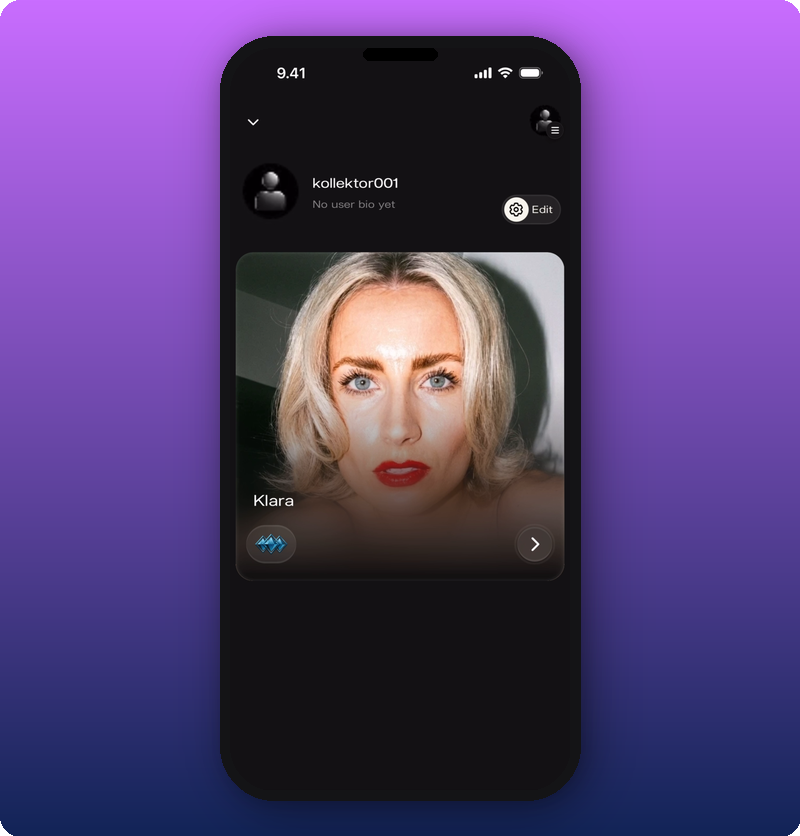
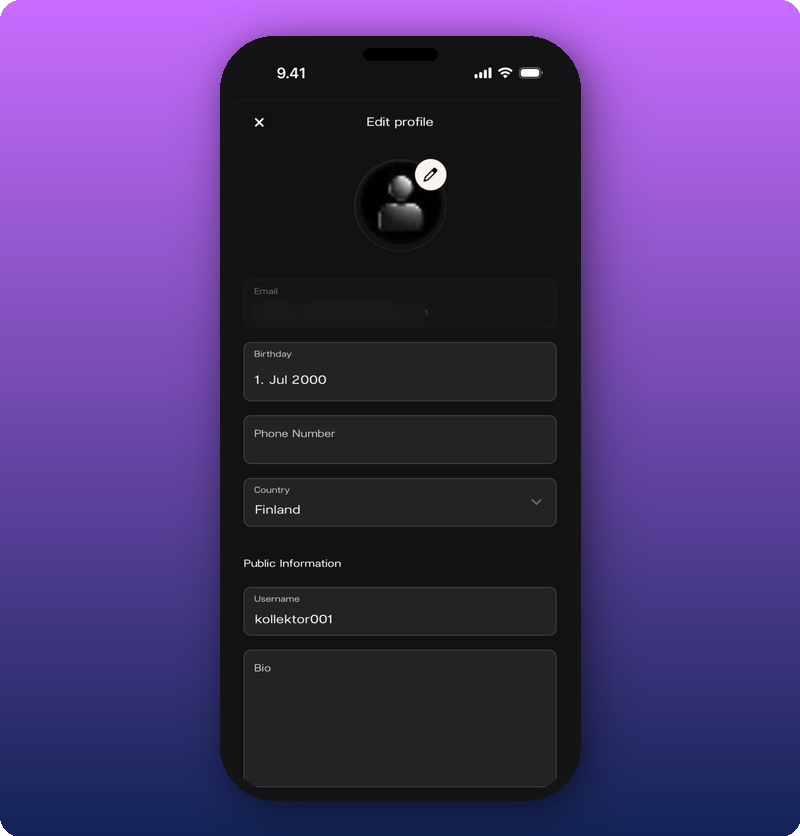
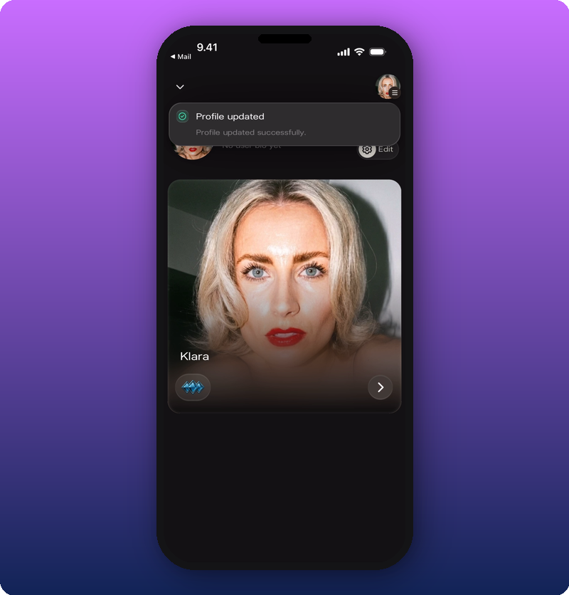
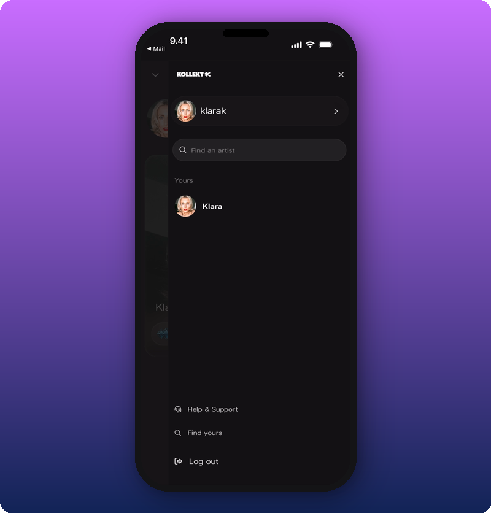

Your user profile is your personal account inside Kollekt. Avatar, username, bio, email, birthday, phone, country. It's your own identity in the app, separate from your public Artist page. It's also what shows when you post in Chat as yourself rather than as your artist.

## Profile overview

Tap your user profile icon at the top of your Home page to open the overview.

Your avatar, username, bio, and a small preview of your Artist page show here. Tap the **Edit** button at the top to open the profile editor.

## Edit your profile

Tap **Edit** on the profile overview to open the form.

The form splits into two parts:

- **Private.** Email (can't be changed here), Birthday, Phone Number, Country.
- **Public.** Username, Bio.

Tap the pencil icon on the avatar to change your photo. Tap **Birthday** for a date picker. Tap **Username** or **Bio** to type into those fields.

Payouts also live here. Scroll to the bottom of the edit form for the **Set up payouts** section. See [Connect your payout account](/for-artists/earn/connect-your-payout-account).

### Save your changes

Tap **Save** at the bottom of the form. A green **Profile updated** message confirms.

## The hamburger menu

Tap the hamburger icon in the top right to open the sidebar.

The sidebar has:

- **Find an artist.** Search for other artists on Kollekt.
- **Help & Support.** Get answers and contact us.
- **Log out.** Sign out of your account.

## Related

- [Connect your payout account](/for-artists/earn/connect-your-payout-account)
- [Delete or pause your account](/for-artists/your-account/delete-or-pause-your-account)
- [Edit your Artist page](/for-artists/your-space/editing-the-artist-page)
- [Run your community chat](/for-artists/your-space/community-chat)
