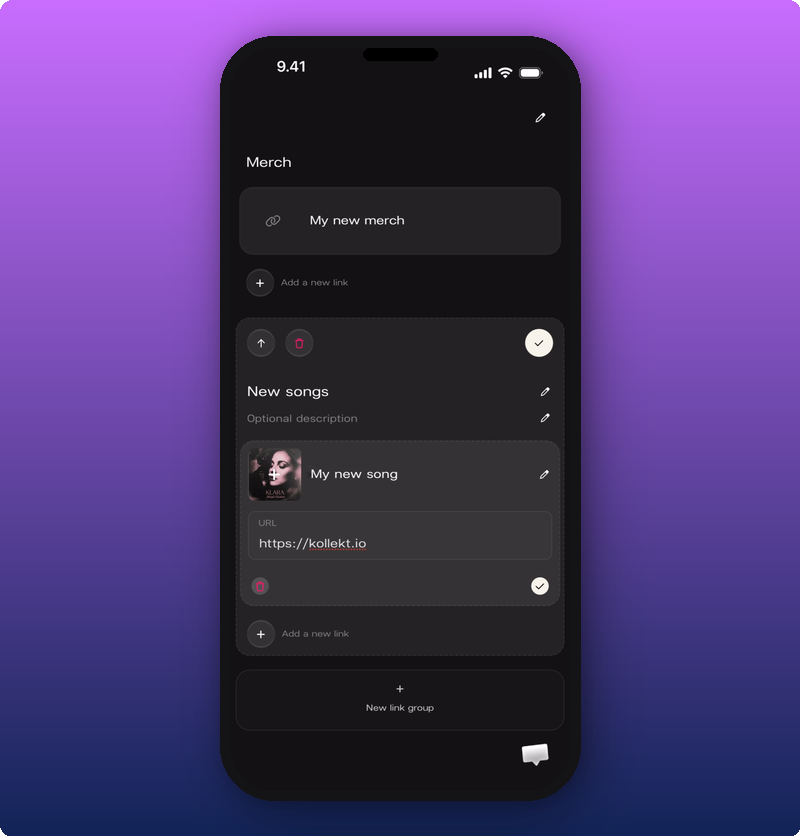
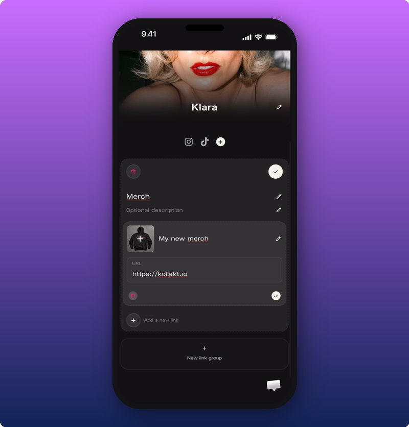
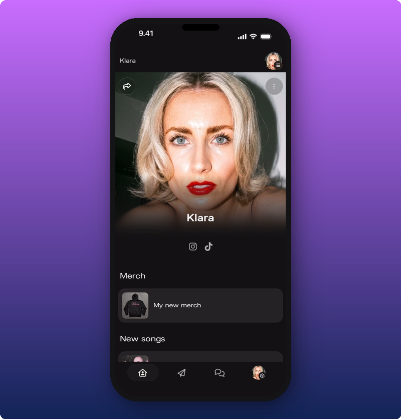

## Create a link group

1. Tap the settings icon at the bottom right of your Artist page.
2. Tap **Edit Artist Page**.
3. Scroll to the bottom and tap **+ New link group**.

You'll see a new empty link group. Fill it in:

- A title fans will recognize. Examples: **Merch**, **New songs**, **Tickets**.
- (Optional) A short description for context. Like "Limited drop" or "Tickets going fast".
- One or more links. Each link gets a title, a URL, and an optional image.

When you're done, tap **Save** in the top right.

## Add, reorder, or remove links

Inside an existing group, you can:

- Add another link.
- Change the order of links.
- Remove a single link.
- Change the order of whole groups on the page.
- Delete a group.

## What fans see

Each group becomes its own section on your public page, with the links inside it.

## Tips

- **2 to 4 groups is the sweet spot.** More than that and the page starts to feel like a list.
- **Use images when you can.** Thumbnail links work better than plain text rows.
- **Name groups by category, not by vibe.** "New music" beats "What I'm into". Fans scan, they don't read.

## Related

- [Edit your Artist page](/for-artists/your-space/editing-the-artist-page)
- [Your Kollekt space, explained](/for-artists/your-space/artist-home)
- [Share your Kollekt link](/for-artists/bring-fans-in/sharing-your-page)
