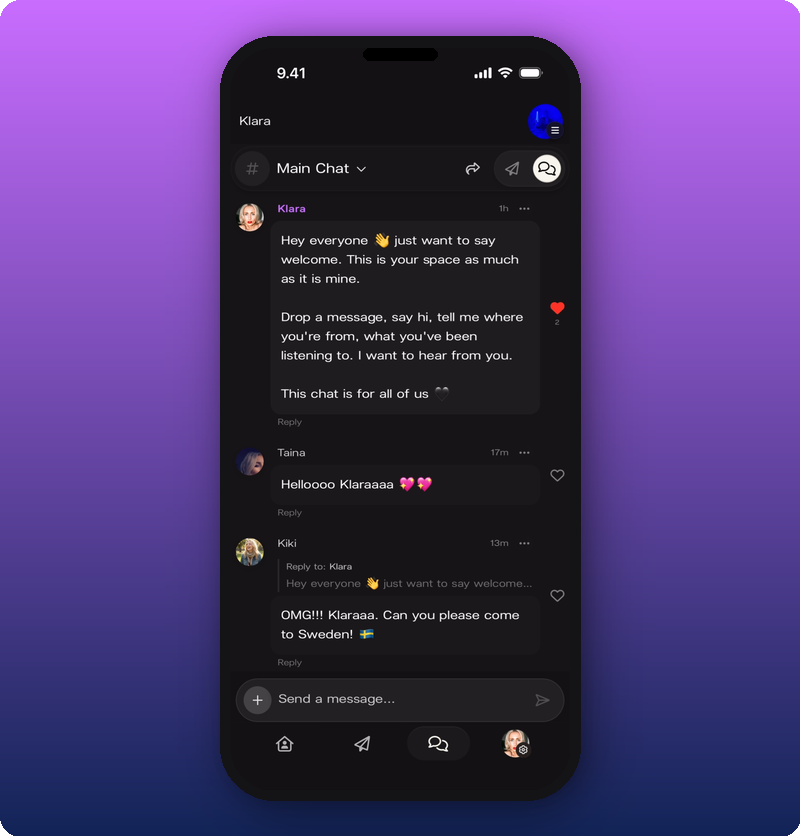

Chat is the group room inside your Kollekt space. Fans talk to each other and to you. Two rooms: **Main Chat** for every member, and **Subscribers Chat** only for paying subscribers. Anyone can send a message, tap a heart to react, or reply to someone. Replies show up under the original message.

To remove messages or put a member in timeout, see [Moderate your chat](/for-artists/your-space/moderate-your-chat).

## Use it

- [Run your community chat](/for-artists/your-space/community-chat). Switch rooms, post as your artist or as yourself.
- [Moderate your chat](/for-artists/your-space/moderate-your-chat). Put members in timeout, make members moderators.

## Related

- [Home](/for-artists/your-space/home)
- [Direct Line](/for-artists/your-space/direct-line)
