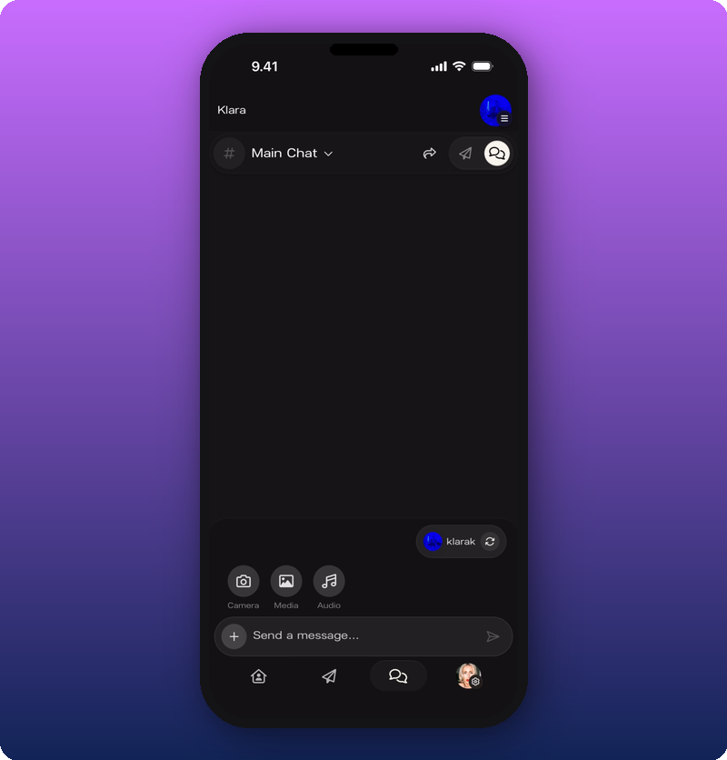
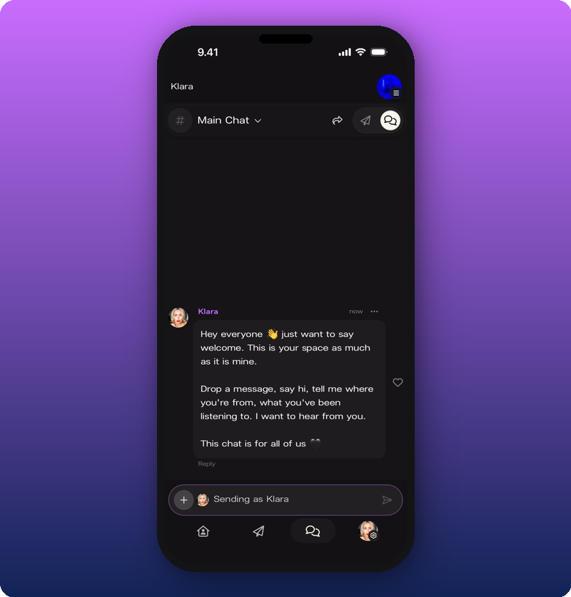
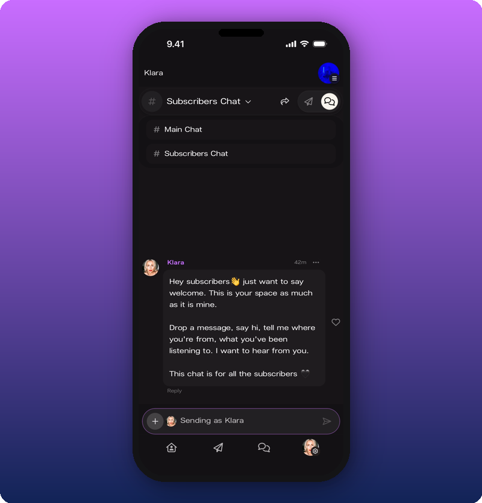
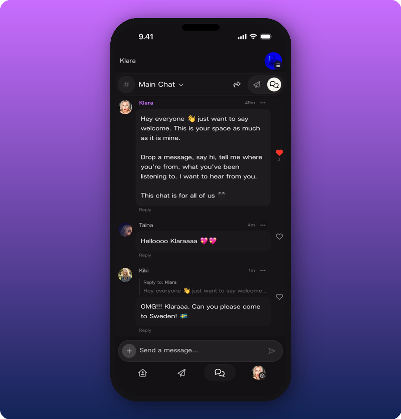
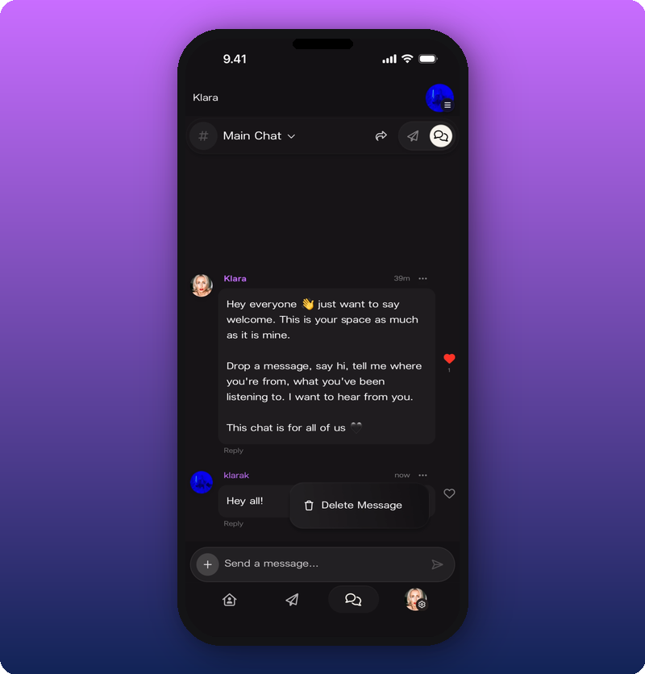

## Post as your artist or as yourself

You can post in two ways: as your personal account (your own avatar) or as your artist (your artist page). You pick per message. Tap the **+** button next to the message input. The pill at the bottom shows who you're posting as. By default, it's your personal account.

Tap the refresh icon on the pill to switch. When you're posting as your artist, the input field turns purple and reads "Sending as [Artist Name]".

## Switch between rooms

The current room name sits at the top of the screen with a dropdown arrow. Tap it to switch between Main Chat and Subscribers Chat.

## React, reply, delete

- **React.** Tap the heart icon on any message.
- **Reply.** Tap **Reply** on a message to start a thread. The reply shows below the original with a "Reply to:" label and a preview.

- **Delete your own message.** Tap the three-dot menu on a message you sent and choose **Delete Message**.

## Related

- [Moderate your chat](/for-artists/your-space/moderate-your-chat)
- [Send a Direct Line message](/for-artists/your-space/sending-messages)
- [See your stats and revenue](/for-artists/earn/see-your-stats-and-revenue)
- [Edit your user profile](/for-artists/your-account/edit-user-profile)
