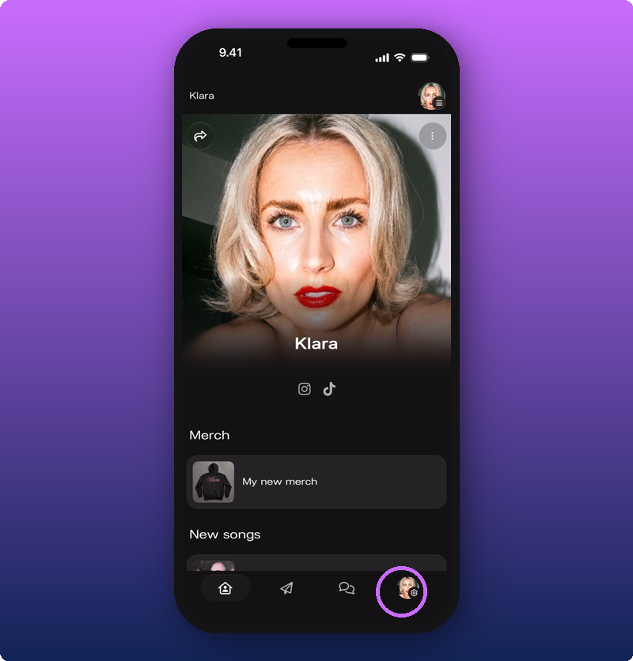
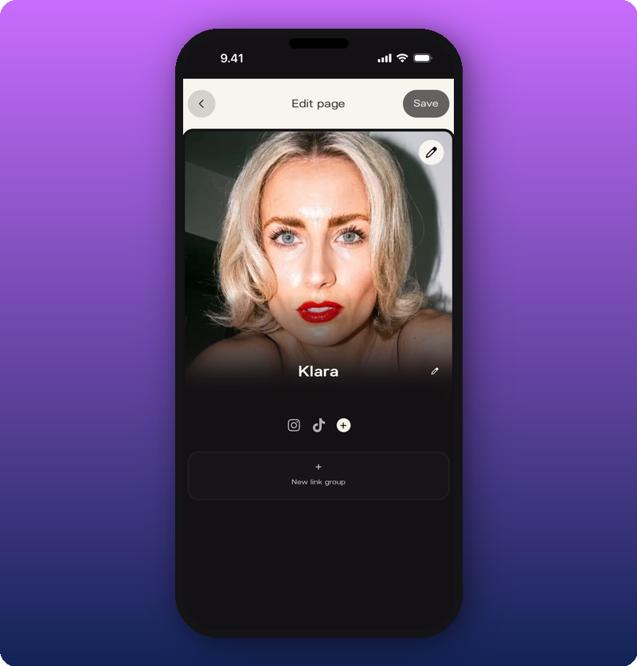
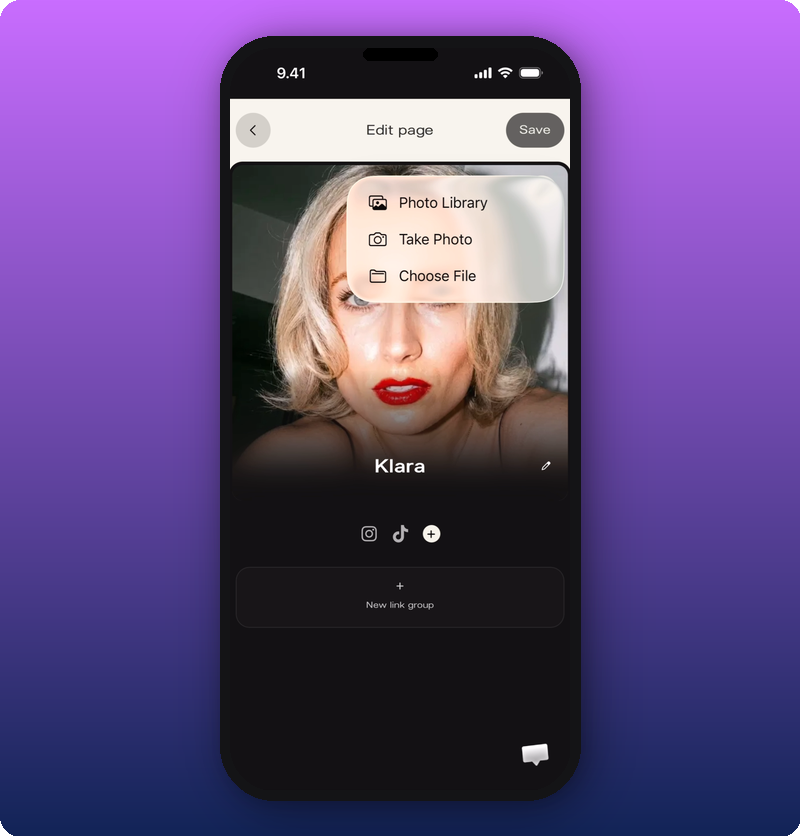
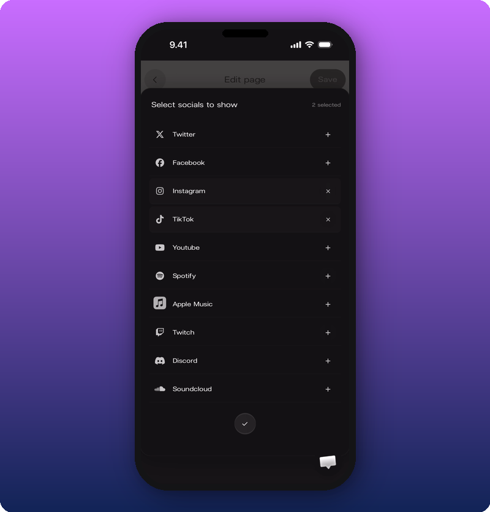
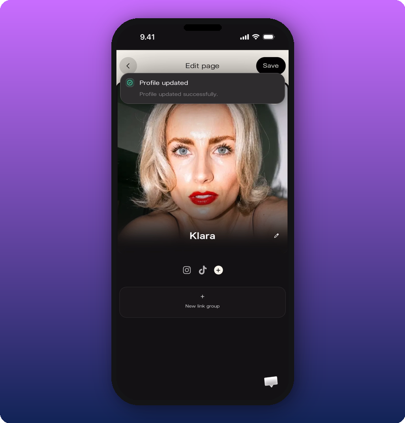

Your Artist page is the page fans see when they tap your Kollekt link. It's already filled in, so you're customizing, not building from scratch.

To add or edit link groups, see [Add and organize link groups](/for-artists/your-space/add-and-organize-link-groups).

## Open the editor

Tap the settings icon at the bottom right of your Artist page, then choose **Edit Artist Page**.

The editor opens.

## Change your cover photo

Tap the pencil icon on the cover photo to open the photo picker.

Pick a photo from your library, take a new one, or choose a file. The new cover shows in the editor right away. It goes live once you save.

## Edit your artist name

Tap the pencil icon next to your artist name. The field becomes editable and your keyboard opens. Type the name you want fans to see, then tap out of the field.

## Add your socials

Tap the **+** circle next to your existing social icons to open the platform picker.

Kollekt supports Twitter, Facebook, Instagram, TikTok, YouTube, Spotify, Apple Music, Twitch, Discord, and SoundCloud. Tap a platform to add it, then paste the full profile link. If the link doesn't look right, the field turns red.

## Save your changes

Tap **Save** in the top right. A green **Profile updated** message confirms the change is live.

## Related

- [Your Kollekt space, explained](/for-artists/your-space/artist-home)
- [Add and organize link groups](/for-artists/your-space/add-and-organize-link-groups)
- [Share your Kollekt link](/for-artists/bring-fans-in/sharing-your-page)
