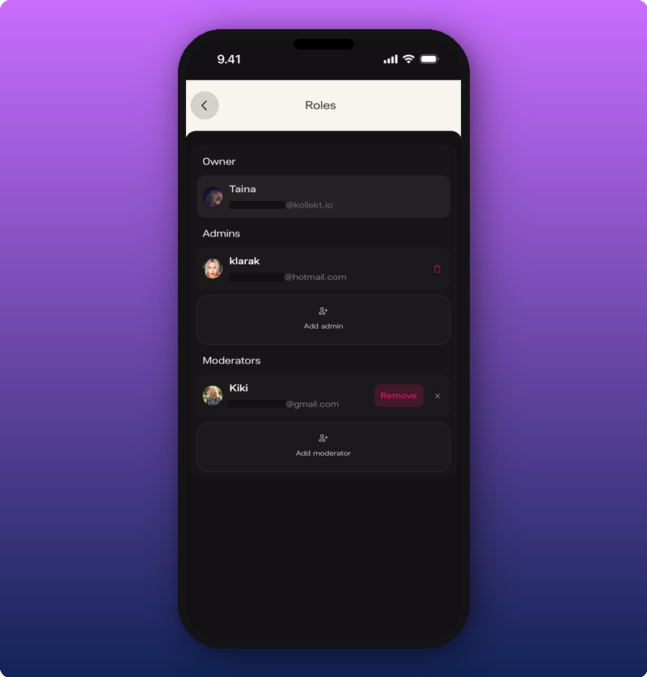
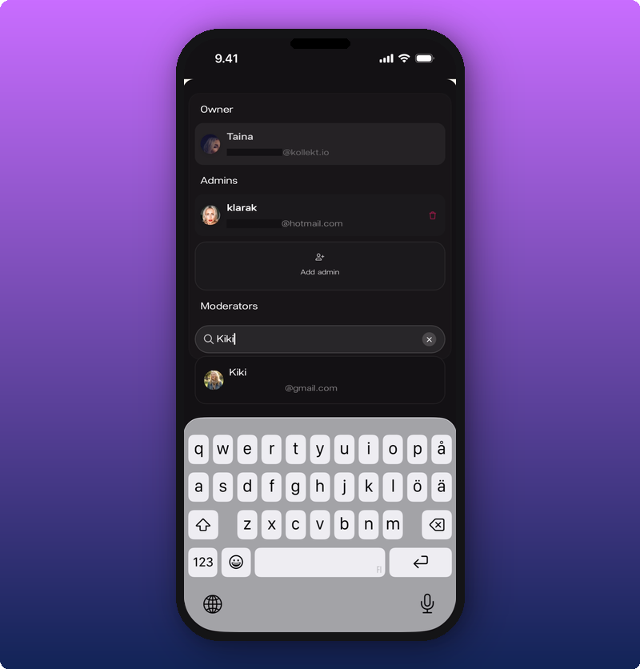

## What's on the Roles screen

Open Roles from the Settings gear in the bottom nav.

Three sections stack one under the other: Owner, Admins, and Moderators. The Admins and Moderators sections each have an **Add** button.

## Three main roles in your team

The Owner is fixed. One per space, and you can't change it from this screen.

- **Owner.** Everything, including Payments. Revenue splits and the subscription price stay with you as the owner.
- **Admins.** Can open Stats and Roles. No Payments, no revenue split changes.
- **Moderators.** Can moderate Chat. Timeout, promote, remove members. See [Moderate your chat](/for-artists/your-space/moderate-your-chat).

## Add a moderator

1. Tap **Add moderator**.
2. Type a name or username in the search field.
3. Tap a result to add them.

A green **Moderator added** banner confirms.

## Remove a moderator

Tap the delete icon next to the moderator's row. **Remove** appears. A green banner confirms the removal.

## Related

- [Moderate your chat](/for-artists/your-space/moderate-your-chat)
- [Add team members and split revenue](/for-artists/earn/team-members-and-revenue-splits)
- [See your stats and revenue](/for-artists/earn/see-your-stats-and-revenue)
