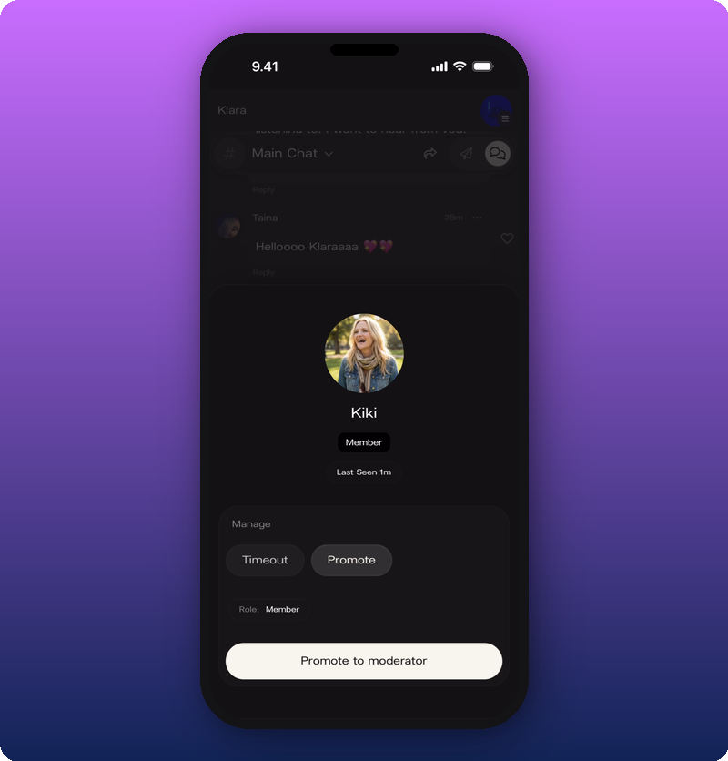
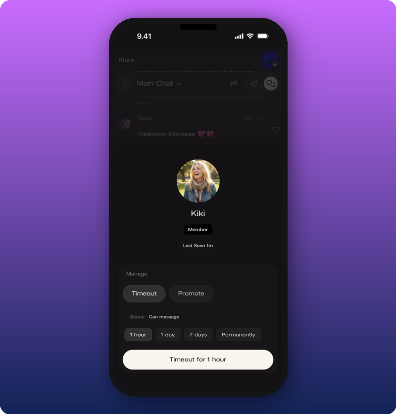
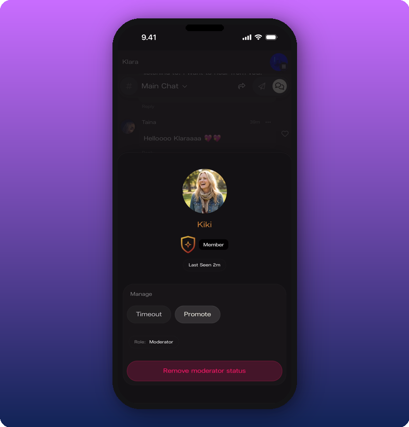

To moderate Chat, tap a fan's name or avatar to open their profile card, then pick the action from there. Two actions are under **Manage**: **Timeout** mutes them for a set time. **Promote** makes them a moderator.

## Open a member's profile card

Tap the name or avatar next to any message in Chat. The card shows the fan's avatar, display name, role badge, and when they were last seen.

## Timeout a member

Tap **Timeout** under **Manage**. Four durations appear.

Pick one:

- **1 hour.** Cool down for a single heated moment.
- **1 day.** A stronger signal, still short.
- **7 days.** For repeat issues.
- **Permanently.** Ban for good.

While a timeout is active, the member's card shows **Muted** with the time remaining. Tap **Remove timeout** (the button turns red) to end it early.

## Promote a moderator

Moderators can moderate too. Making someone a moderator gives them the same tools as you. Useful for active rooms when you can't be online all day. You can have as many moderators as you want.

Tap **Promote** to make someone a moderator. The card updates with a gold shield badge and the role changes to **Moderator**.

To remove their moderator status, open the same card and tap **Remove moderator status** at the bottom.

## Related

- [Run your community chat](/for-artists/your-space/community-chat)
- [Manage admins and roles](/for-artists/your-space/manage-admins-and-roles)
