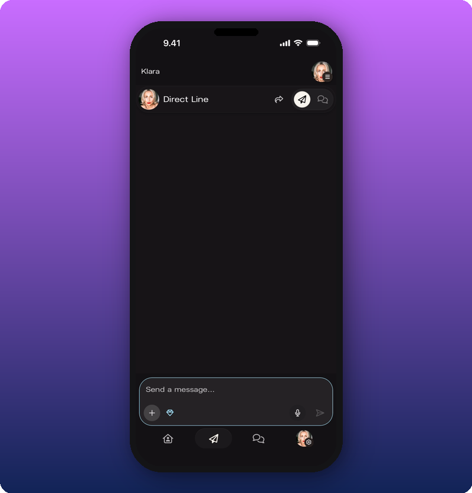

A subscriber-only post is a Direct Line message only paying subscribers can open. Other fans still see the post in their feed, but it's blurred with a lock icon. The locked preview tells them they're missing something, which is what makes more fans subscribe over time.

## Turn on subscriber-only mode

The diamond icon in the compose bar is the toggle. Tap it (it's just to the right of the **+** button). The icon lights up and the compose bar gets a blue-teal outline. The mode stays on until you turn it off, so if you post three subscriber-only messages in a row, you only tap once.

## Send the message

Send like any other Direct Line message. Text, photos, video, voice. All of it works. The post only reaches fans with an active subscription.

## What other fans see

Fans who haven't subscribed see the post is there, but it's blurred with a lock icon. They can tap it to see the option to subscribe.

## Turn it back off

Tap the diamond icon again. The outline disappears. Your next message goes to every member.

## When to use it

- Early demos, unreleased snippets, work in progress.
- Personal thank-yous or shout-outs to subscribers.
- Anything that's too loose for everyone but too good to keep off Kollekt.

## Related

- [Send a Direct Line message](/for-artists/your-space/sending-messages)
- [How subscriptions and earnings work](/for-artists/earn/how-subscriptions-and-earnings-work)
