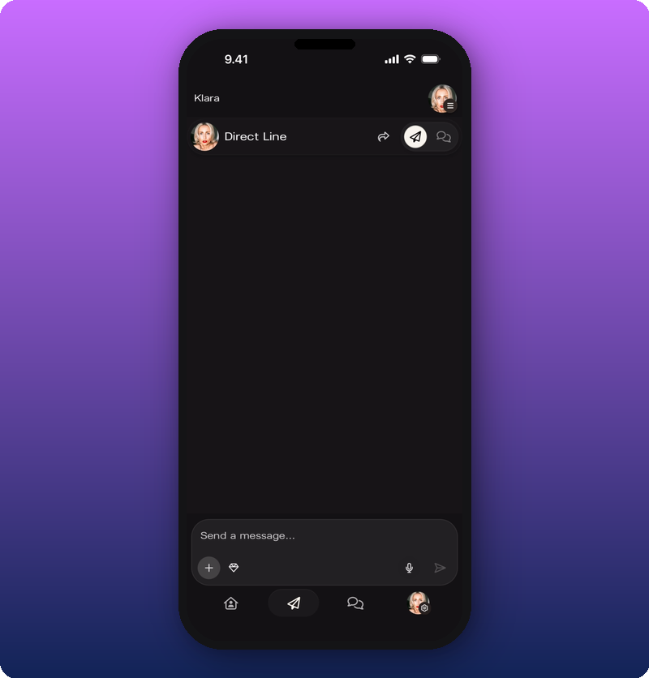
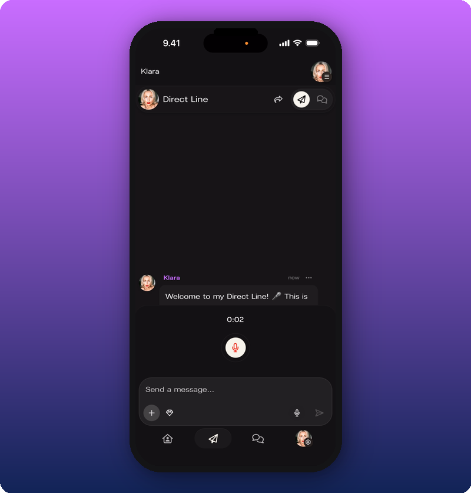
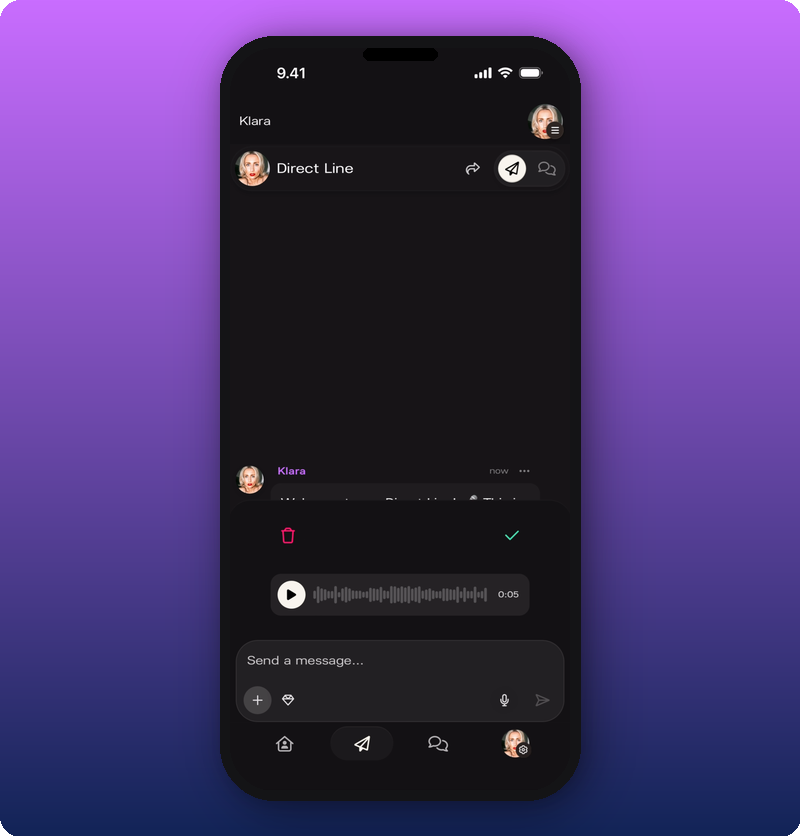
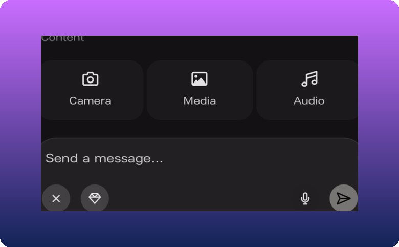
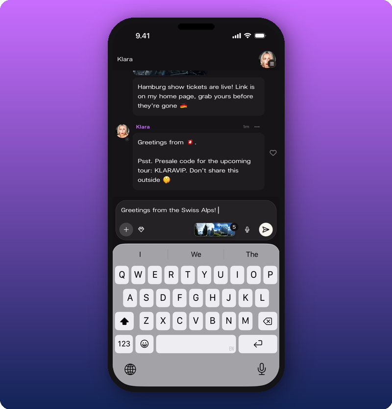
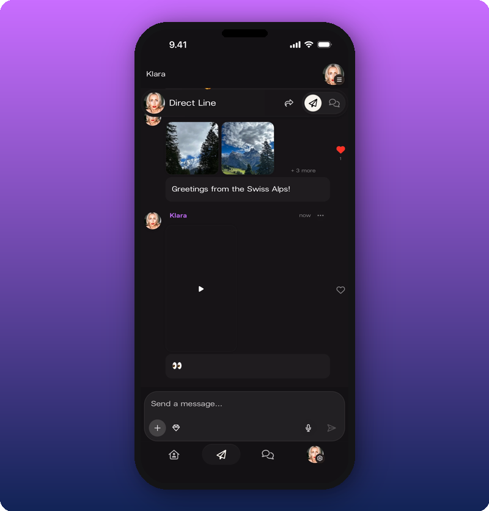
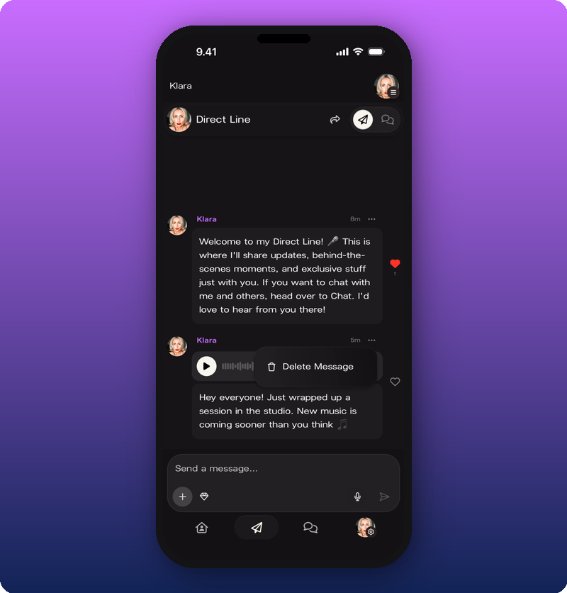
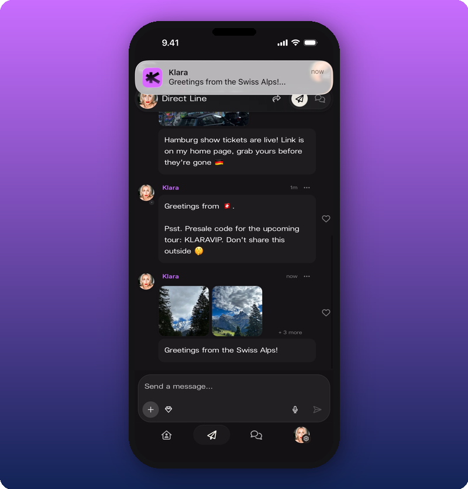

## Send a text message

Open Direct Line from the bottom nav. The paper-plane tab.

1. Open Direct Line from the bottom nav.
2. Tap the message input at the bottom.
3. Type your message.
4. Tap the send arrow.

Your message shows in the feed with your avatar, your artist name, a timestamp, and a three-dot menu for editing. The newest messages are at the bottom.

## Record a voice message

Tap the microphone icon in the compose bar to start recording.

Stop recording when you're done. A review screen lets you play it back before sending.

Tap the green checkmark to send, or the red trash icon to discard and try again.

## Attach photos, videos, or audio

Tap the **+** button in the compose bar. It's to the left of the message input.

Three options appear:

- **Camera.** Take a new photo.
- **Media.** Pick photos or videos from your library. You can select more than one at once.
- **Audio.** Upload an audio file from your phone.

You can add a caption with any of these. Every post still sends one push notification.

### Send multiple photos

Pick more than one photo from your library and they stack in the composer as a row with a count badge.

Add a caption if you want, then send. The photos show up in the feed as a grid.

### Send a video

Pick a video from your library. It shows in the feed with a play-button overlay. Captions work the same as photo posts.

## Delete a message

Tap the three-dot menu on any message you've sent and choose **Delete Message**.

## The push notification

Every Direct Line post sends a push notification to every member (or to subscribers only, if you used subscriber-only mode).

## Related

- [Post subscriber-only content](/for-artists/your-space/post-subscriber-only-content)
- [Run your community chat](/for-artists/your-space/community-chat)
- [Share your Kollekt link](/for-artists/bring-fans-in/sharing-your-page)
