# Participating in Chat

Live group chat inside every artist's Kollekt page. Read messages, react, reply, and talk with other fans and the artist. Available to all followers — subscribers unlock extra perks like sending images and accessing sub-only chat rooms.

## Before Joining

When you first land on the Chat tab, you can see messages from the artist and other fans but you haven't joined the conversation yet. A join button appears at the bottom instead of the message composer.

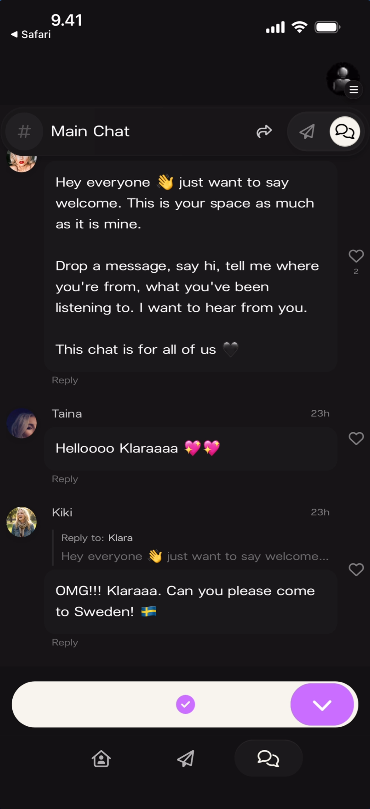

**What you'll see:** Top-left: "< Safari" back link. Header: "# Main Chat" with share, send, and members icons. The artist's welcome message from "Klara" is visible: "Hey everyone 👋 just want to say welcome. This is your space as much as it is mine..." Messages from "Taina" ("Helloooo Klaraaaa 💖💛") and "Kiki" (threaded reply: "OMG!!! Klaraaa. Can you please come to Sweden! 🇸🇪"). Bottom: a purple **checkmark** join button and a blue **arrow** button instead of the message composer.

### Community Activity Before Joining

Scrolling through the chat before joining shows the existing community conversation — threaded replies, reactions, and fan-to-fan messages are all visible.

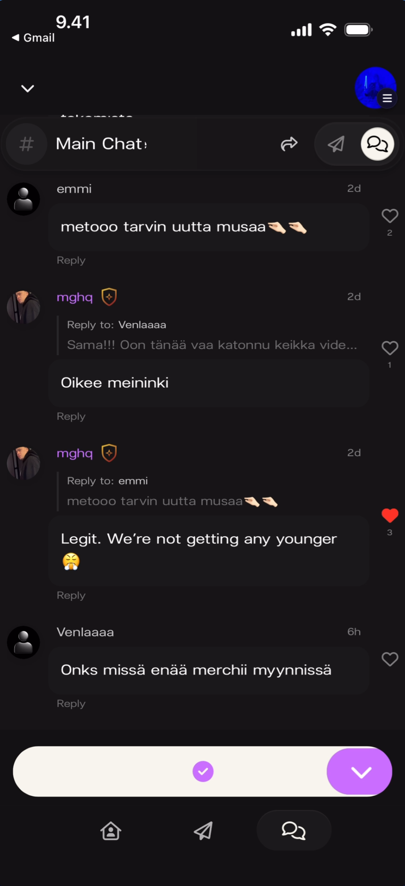

**What you'll see:** Top-left: "< Gmail" back link. Header: "# Main Chat ∨" with dropdown arrow. Multiple fan messages: "emmi" ("metooo tarvin uutta musaa 🤝🤝"), "mghq" (gold shield badge, threaded reply to Venlaaaa: "Oikee meininki"), another "mghq" reply to emmi: "Legit. We're not getting any younger 🤦" with a red filled heart. "Venlaaaa" asking "Onks missä enää merchii myynnissä". Bottom: purple checkmark and blue arrow buttons (not yet joined).

## After Joining

Once you join, the message composer appears at the bottom and you can participate fully.

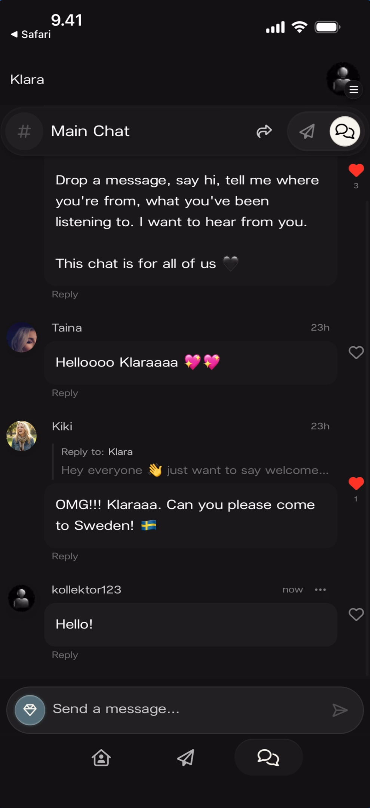

**What you'll see:** Top-left: "Klara" artist name. Header: "# Main Chat" with share, send, and members icons. The feed shows the artist's welcome message, "Taina" and "Kiki" messages, and a new message from "kollektor123" (now) saying "Hello!" with a "···" menu and heart icon. Bottom: message input with emoji icon, "Send a message..." placeholder, and send arrow.

## Sending Messages

### Typing a Message

Tap the **Send a message...** input bar. The keyboard opens and you can type your message. Tap the **send arrow** to post it.

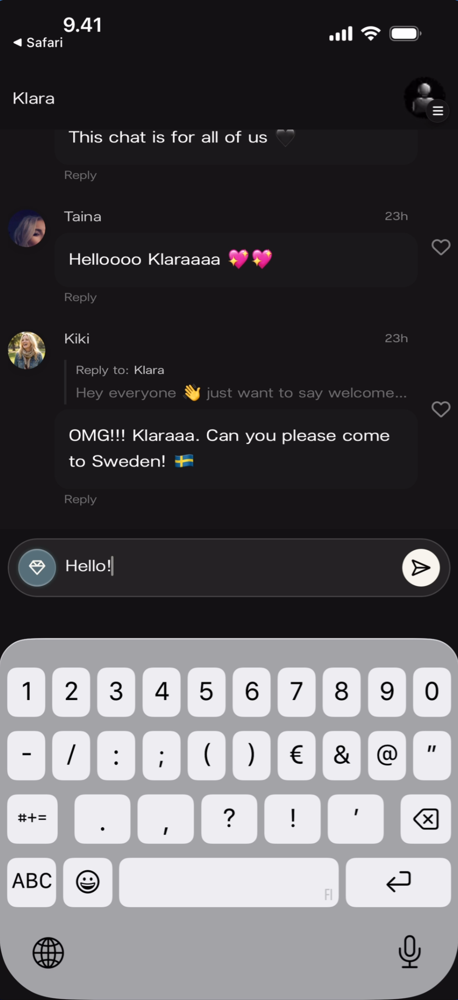

**What you'll see:** The chat feed is pushed up by the keyboard. The input field shows "Hello!" being typed with a purple send arrow button on the right. The keyboard is open (number/symbol layout visible). Messages from Taina, Kiki (threaded reply), and the artist's welcome message are visible above.

### Attachment Button

Tap the **+** button to the left of the message input to access attachment options.

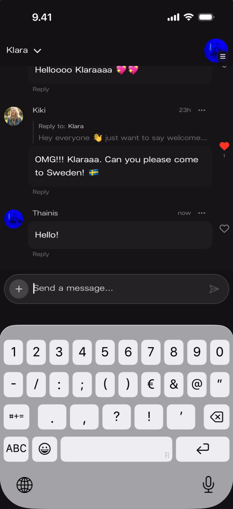

**What you'll see:** Top-left: "Klara ∨" with dropdown. Messages from Kiki (threaded reply with red heart) and "Thainis" (now, "Hello!") visible. Bottom: **+** button on the left, "Send a message..." input, and send arrow. The keyboard is open (number/symbol layout).

## Message Interactions

### Heart Reactions

Tap the **heart icon** next to any message to react. A filled red heart replaces the outline heart.

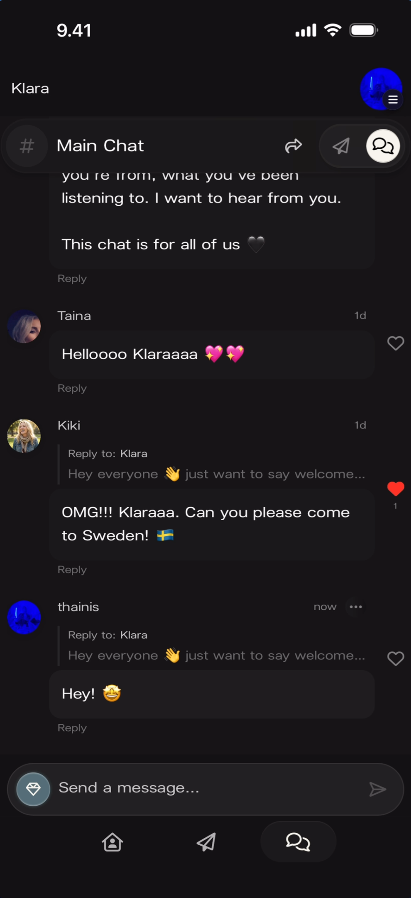

**What you'll see:** The chat feed showing the artist's welcome message, "Taina" ("Helloooo Klaraaaa 💖💛"), and "Kiki" (threaded reply with a **filled red heart**). A message from "thainis" (now) with "···" menu shows a threaded reply to Klara: "Hey! 😁" with an empty heart icon. Bottom: emoji icon, "Send a message..." input, and send arrow.

### Threaded Replies

Tap **Reply** under any message to respond directly. Your reply appears in a thread below the original message.

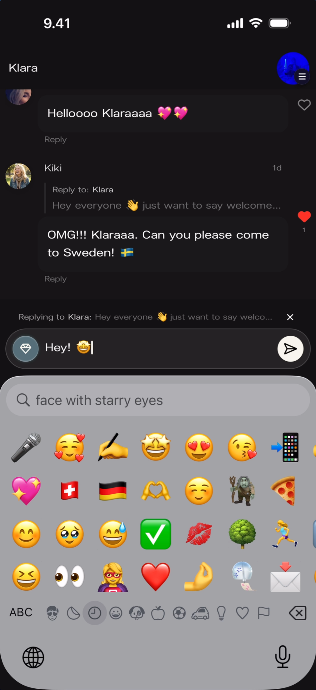

**What you'll see:** The reply bar above the input shows: "Replying to Klara: Hey everyone 👋 just want to say welco..." with an **X** close button. The input field shows "Hey! 🤩" being typed with an emoji sticker icon and purple send arrow. The emoji keyboard is open showing a search field ("Q face with starry eyes") and a grid of emoji. Messages from Taina and Kiki are visible above.

## Managing Messages

### Deleting Your Own Messages

Tap the **···** (three-dot menu) on your own message to reveal the **Delete Message** option.

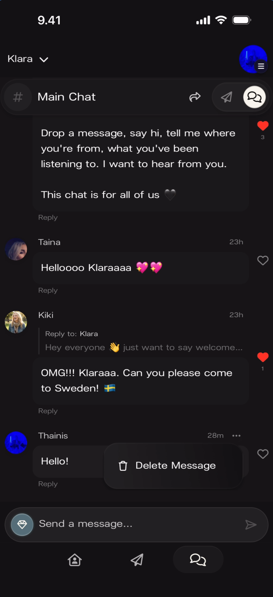

**What you'll see:** The chat feed with the artist's welcome message, "Taina", "Kiki" (threaded reply), and "Thainis" (28m ago, "Hello!"). A popup appears next to the Thainis message showing a **"Delete Message"** button with a trash icon. Bottom: emoji icon, "Send a message..." input, and send arrow.

### Moderator Message Deletion

Moderators (users with a gold shield badge) can delete other fans' messages. When a moderator taps the **···** menu on another user's message, they see the same **Delete Message** option.

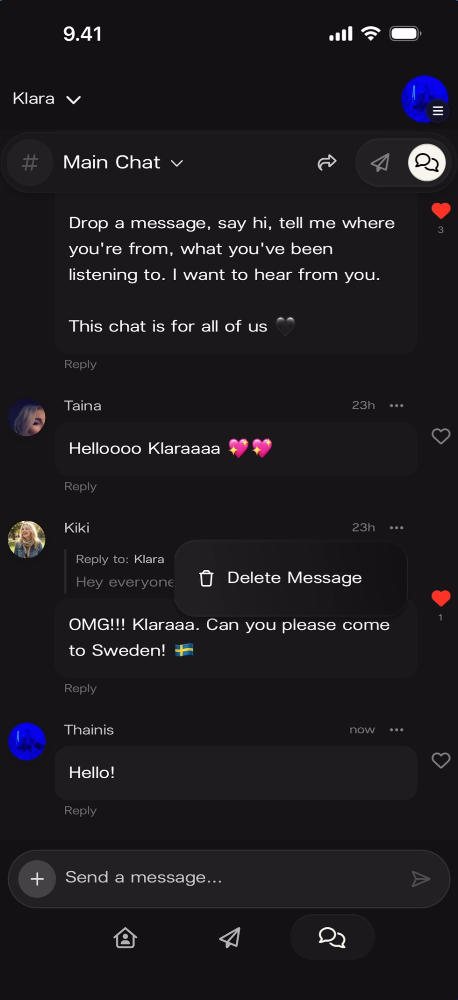

**What you'll see:** The chat feed with the artist's welcome message, "Taina", and "Kiki" (threaded reply with red heart). A popup appears next to Kiki's message showing **"Delete Message"** with a trash icon. "Thainis" (now, "Hello!") is visible below with a heart icon. Bottom: **+** button, "Send a message..." input, and send arrow.

## Member Profiles

Tap any user's **name or avatar** in the chat to view their profile card. The card appears as a bottom overlay showing the member's details.

### Artist Profile

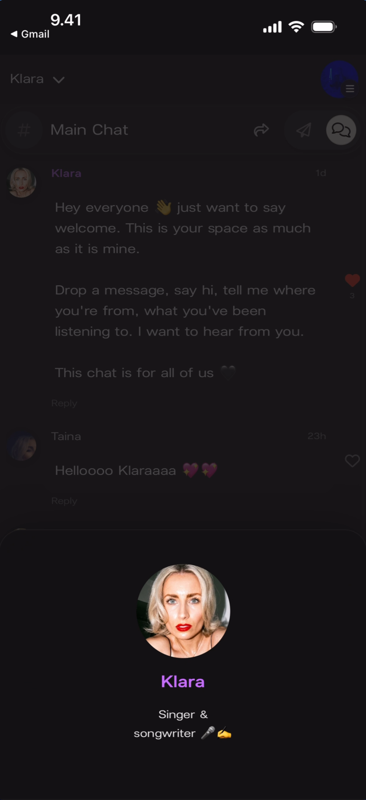

**What you'll see:** The chat feed is dimmed behind a bottom overlay. The profile card shows: large circular avatar of "Klara", the name **"Klara"**, and subtitle **"Singer & songwriter 🎤 ☁️"**. No role badge is shown — the artist is identified by their name and bio. The chat messages are partially visible behind the overlay.

### Member Profile

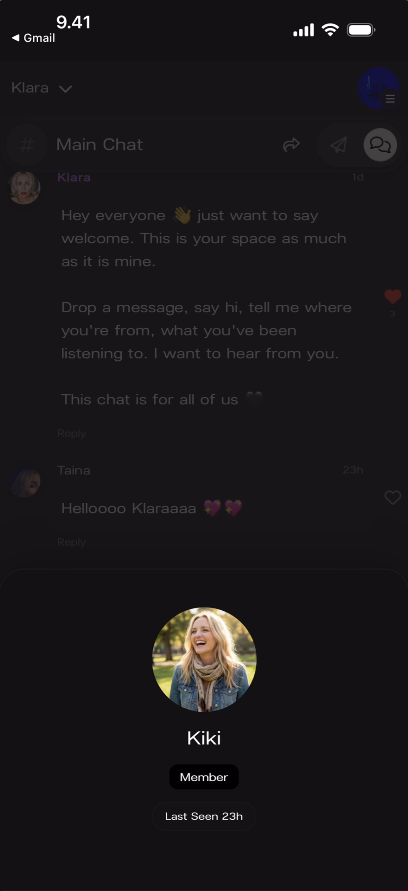

**What you'll see:** The chat feed dimmed behind a bottom overlay. The profile card shows: large circular avatar, name **"Kiki"**, a dark **"Member"** badge pill below the name, and **"Last Seen 23h"** timestamp.

### Member with Bio

Members who have set a bio in their profile show it on their profile card.

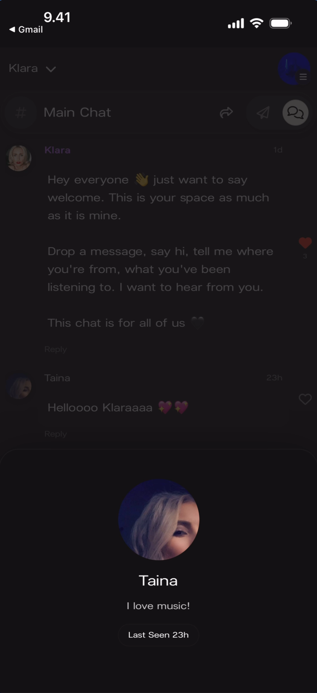

**What you'll see:** The chat feed dimmed behind a bottom overlay. The profile card shows: large circular avatar, name **"Taina"**, bio text **"I love music!"**, and **"Last Seen 23h"** timestamp. No role badge is displayed.

## Moderator Timeout (Moderator View)

Moderators see additional management options when viewing a member's profile card. A **Manage** section appears below the profile info with a **Timeout** button and duration options.

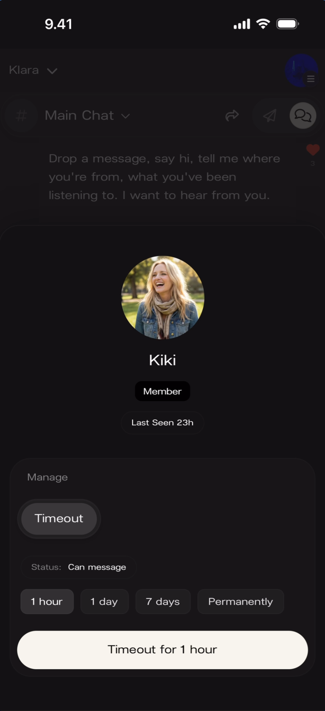

**What you'll see:** Profile card for "Kiki" showing: avatar, name, **"Member"** badge, "Last Seen 23h". Below: **"Manage"** section header. A **"Timeout"** button (outlined). "Status: **Can message**". Four duration pills: **"1 hour"**, **"1 day"**, **"7 days"**, **"Permanently"**. Bottom: a cream-colored button reading **"Timeout for 1 hour"**.

## Subscribe Modal

Certain features in Chat are subscriber-only. When tapping on a locked feature, the subscribe modal appears.

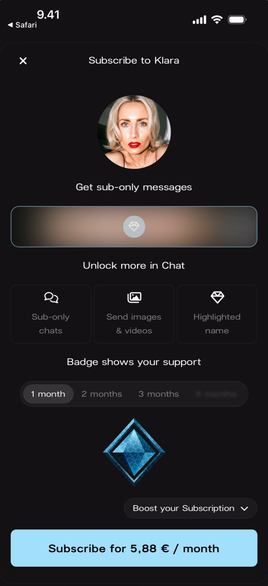

**What you'll see:** A full-screen modal with **X** close button (top-left) and title **"Subscribe to Klara"**. The artist's circular avatar is shown below. Text: **"Get sub-only messages"**. A blurred/locked preview area with text **"Unlock more in Chat"**. Three feature icons: **"Sub-only chats"** (chat icon), **"Send images & videos"** (media icon), **"Highlighted name"** (diamond icon). Text: **"Badge shows your support"**. Duration tabs: **"1 month"** (selected), "2 months", "3 months", and a greyed-out fourth option. A blue diamond icon with **"Boost your Subscription ∨"** dropdown. Bottom: a light blue button reading **"Subscribe for 5,88 € / month"**.

## Share Sheet

Tapping the **share icon** in the chat header opens the Share Sheet — the same sharing modal available across all screens.

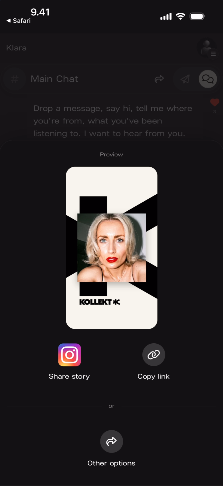

**What you'll see:** The chat feed dimmed behind a bottom sheet overlay. "Preview" label at top. A branded **Kollekt Card** showing the artist's photo on a black-and-white geometric background with the "KOLLEKT K" logo. Two action buttons: **"Share story"** (Instagram icon) and **"Copy link"** (link icon). Below: "or" divider and **"Other options"** button (share arrow icon).

## Known Limitations

- The exact subscriber-only features visible in chat (highlighted name, sub-only chat rooms, image sending) are shown in the subscribe modal but not fully demonstrated in the screenshots.
- The difference between what a regular member and a moderator can do is only partially visible — moderators can delete other users' messages and timeout members, but the full scope of moderator permissions is not documented.
- Media attachments (images, videos) sent in chat are not shown in the current screenshots.
- The room switcher dropdown (Main Chat vs. Subscribers Chat) is visible in some screenshots but the Subscribers Chat room itself is not shown from the fan perspective.

## Related Features

- [Browsing Direct Line](/for-fans/direct-line/browsing-direct-line) — Read the artist's one-way broadcast messages
- [Exploring the Artist Page](/for-fans/home/exploring-the-artist-page) — Navigate the rest of the artist's space
- [Managing Your Fan Profile](/for-fans/profile/managing-your-profile) — Set the username, avatar, and bio that appear in Chat
- [Community Chat](/for-artists/chat/community-chat) — How the artist sees and manages the same chat