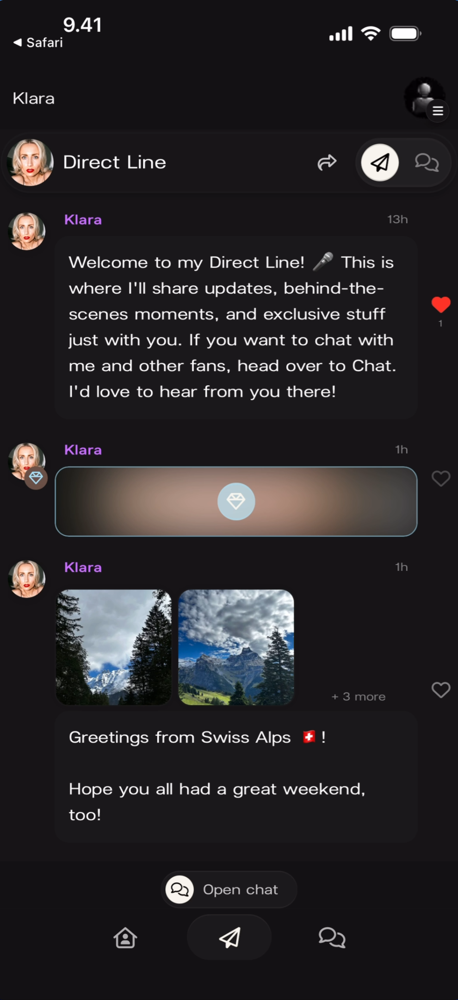
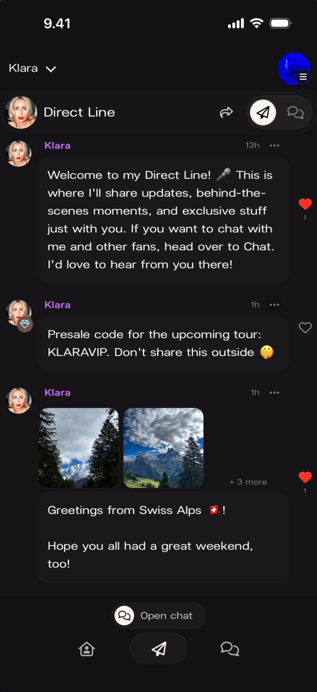
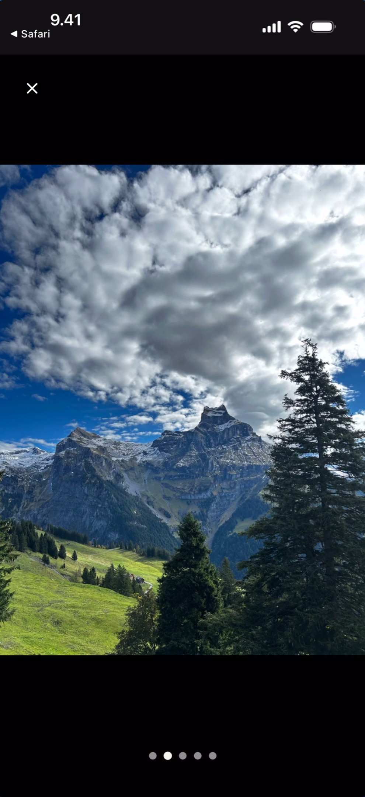
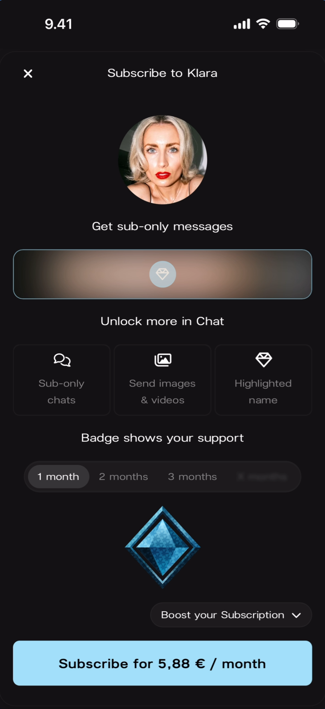
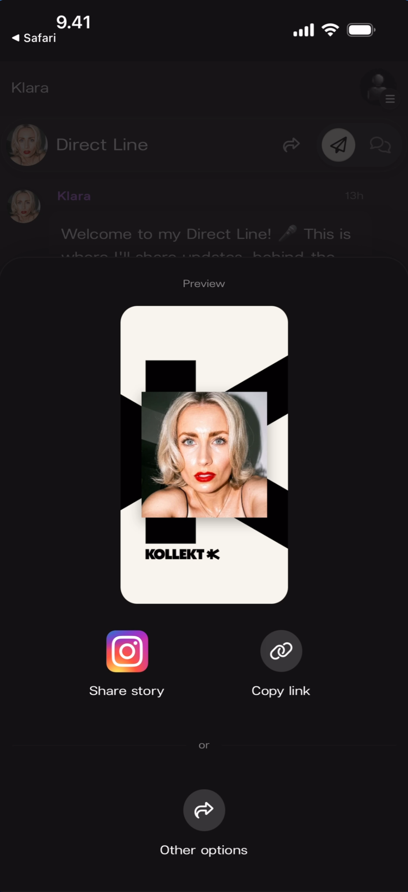

# Browsing Direct Line

The artist's personal feed inside their Kollekt page. Only the artist posts here — photos, videos, voice notes, and text updates. Fans react with hearts but don't reply directly. Some posts are exclusive to subscribers.

## Member Feed

When you follow an artist (as a free member), you can see their Direct Line posts. Some content may be locked behind a subscription.

**What you'll see:** Top-left: "< Safari" back link and "Klara" artist name. Header: artist avatar, **"Direct Line"** title, share icon, send icon, and chat icon. Three posts from "Klara" (purple name): a welcome text message ("Welcome to my Direct Line! 🎤 This is where I'll share updates, behind-the-scenes moments, and exclusive stuff just with you...") with a filled red heart. A second post (9h ago) with a **blurred/locked content area** and a lock icon — this is subscriber-only content with an empty heart. A third post (9h ago) with a photo grid showing mountain landscape images ("+ 3 more"), text "Greetings from Swiss Alps 🇨🇭❗" and "Hope you all had a great weekend, too!" with an empty heart. Bottom: **"Open chat"** button with chat icon, and navigation bar with Home, Direct Line (active), Chat.

## Subscriber Feed

Subscribers see all content unlocked, including posts that are hidden behind the paywall for free members.

**What you'll see:** Top-left: "Klara ∨" with dropdown. Header: artist avatar, **"Direct Line"** title, share, send, and chat icons. Three posts from "Klara" (purple name) with "···" three-dot menus. The welcome message (13h ago) with a filled red heart. A second post (1h ago) showing **unlocked text**: "Presale code for the upcoming tour: KLARAVIP. Don't share this outside 🤫" with an empty heart. A third post (1h ago) with the same mountain photo grid ("+ 3 more"), "Greetings from Swiss Alps 🇨🇭❗" with a filled red heart. Bottom: **"Open chat"** button and navigation bar.

## Viewing Media

Tap any photo in a post to view it full-screen. If a post has multiple images, pagination dots appear at the bottom to swipe between them.

**What you'll see:** A full-screen landscape photo of the Swiss Alps — mountains, green meadow, pine trees, and dramatic clouds. Top-left: "< Safari" back link and **X** close button. Bottom-center: **five pagination dots** (third dot active) indicating this is the third of five photos in the gallery. The background is black.

## Subscribe Modal

Tapping on locked/blurred subscriber-only content opens the subscribe modal.

**What you'll see:** A full-screen modal with **X** close button (top-left) and title **"Subscribe to Klara"**. The artist's circular avatar below. Text: **"Get sub-only messages"**. A blurred/locked preview area with text **"Unlock more in Chat"**. Three feature icons: **"Sub-only chats"** (chat icon), **"Send images & videos"** (media icon), **"Highlighted name"** (diamond icon). Text: **"Badge shows your support"**. Duration tabs: **"1 month"** (selected), "2 months", "3 months", and a greyed-out fourth option. A blue diamond icon with **"Boost your Subscription ∨"** dropdown. Bottom: a light blue button reading **"Subscribe for 5,88 € / month"**.

## Share Sheet

Tapping the **share icon** in the Direct Line header opens the Share Sheet.

**What you'll see:** The Direct Line feed dimmed behind a bottom sheet overlay. "Preview" label at top. A branded **Kollekt Card** showing the artist's photo on a black-and-white geometric background with the "KOLLEKT K" logo. Two action buttons: **"Share story"** (Instagram icon) and **"Copy link"** (link icon). Below: "or" divider and **"Other options"** button (share arrow icon).

## Known Limitations

- Fans cannot reply to Direct Line posts — reactions (hearts) are the only interaction available.
- The locked/blurred content for non-subscribers shows a lock icon but the exact content type (text, media, voice note) is not identifiable until subscribed.
- Voice note playback is not shown in the current screenshots.
- The "Open chat" button at the bottom of the feed navigates to Chat but this transition is not demonstrated.

## Related Features

- [Participating in Chat](/for-fans/chat/participating-in-chat) — Talk with the artist and other fans
- [Exploring the Artist Page](/for-fans/home/exploring-the-artist-page) — The artist's home inside Kollekt
- [Managing Your Fan Profile](/for-fans/profile/managing-your-profile) — Set your username and avatar
- [Sharing Your Kollekt Page](/for-artists/sharing/sharing-your-page) — How the Share Sheet works from the artist side