This is the path from tapping an artist's link to being inside their Kollekt space. It's free, it takes about a minute, and it works from any link the artist has shared. Their Instagram bio, a Story, a website, anywhere.

## Step 1. Open the artist's link

The artist's link looks like `kollekt.io/artistname`. Tap it. The artist's page opens in your phone browser.

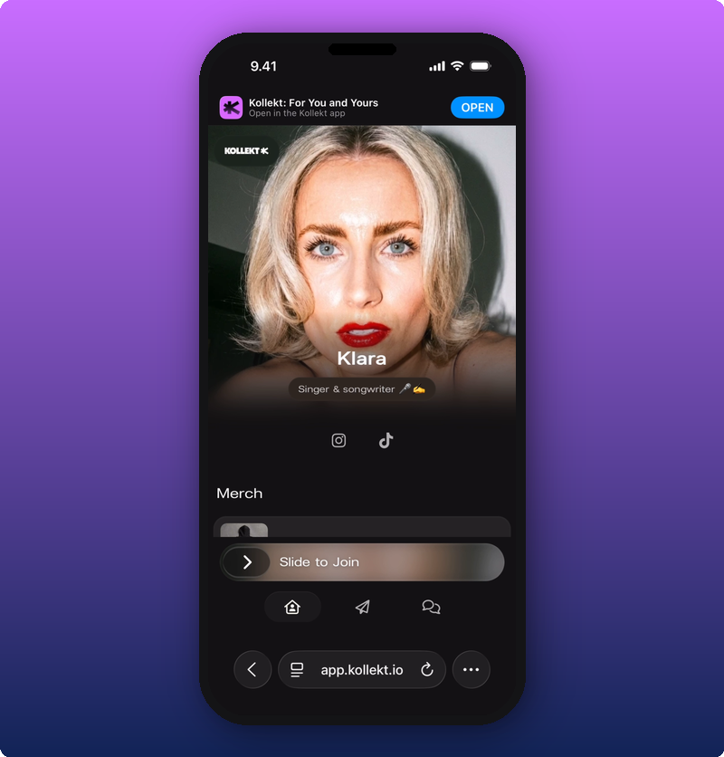

You can scroll, look at their cover photo, tap their social icons, and check out their link groups. To go further, slide the **Slide to Join** bar at the bottom.

## Step 2. Slide to join

Slide the bar to the right. A sheet appears asking for your email.

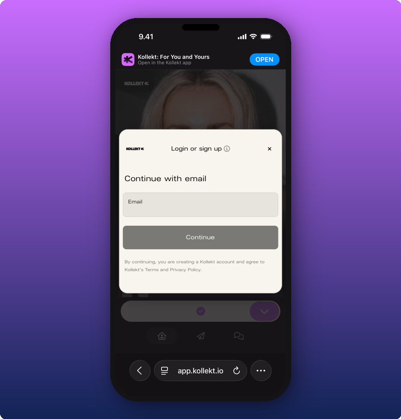

## Step 3. Type your email

Type your email and tap **Continue**.

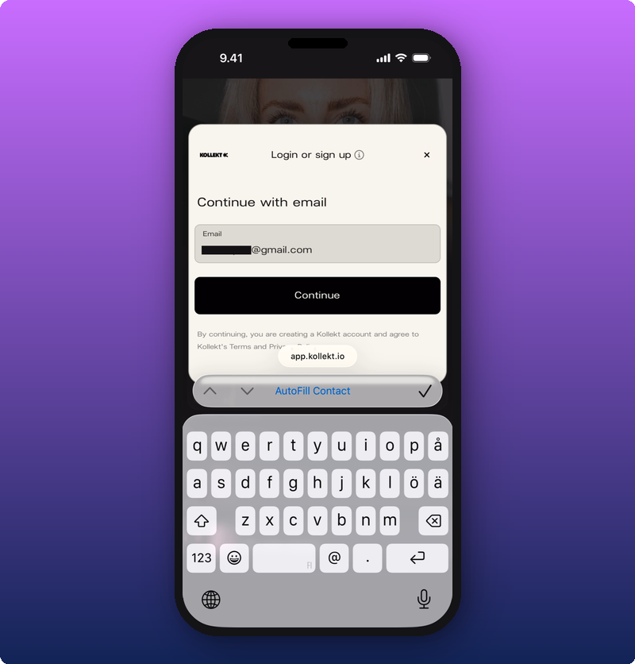

## Step 4. Check your email

Kollekt sends you a magic link and shows a confirmation screen.

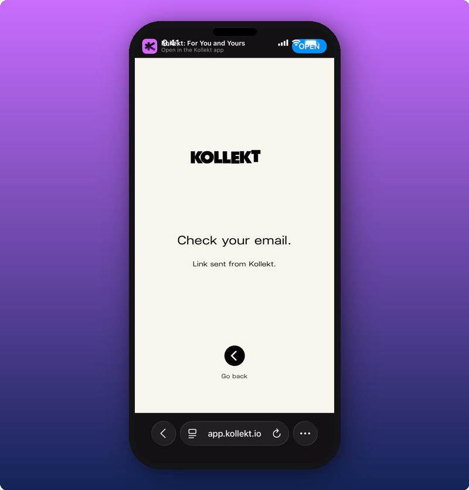

Open your email app and find the message from Kollekt.

## Step 5. Tap Enter in the email

The Kollekt email has a purple **Enter** button. Tap it.

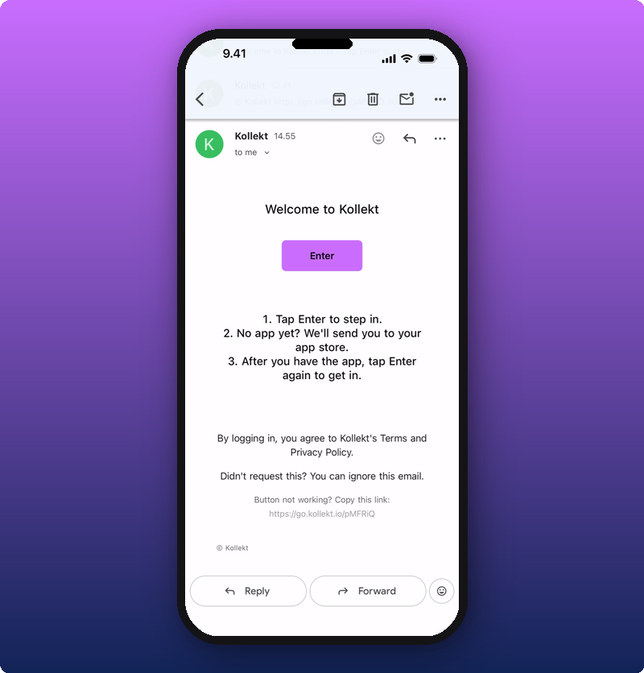

If your phone asks which app to open the link with, pick your usual browser.

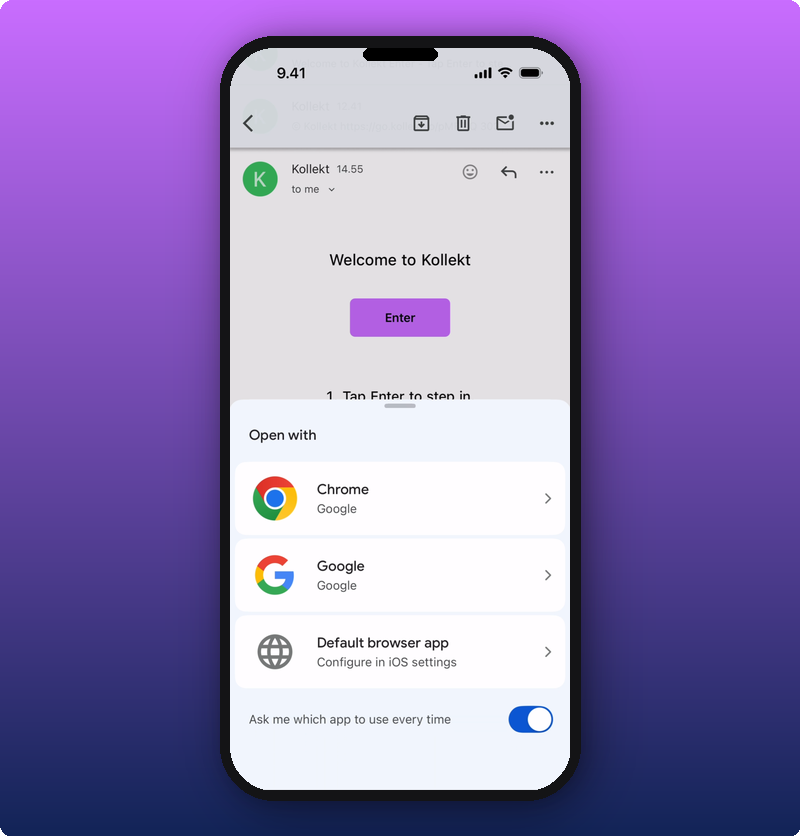

## If you don't have the Kollekt app yet

The first time you tap Enter, your phone takes you to the App Store (or Google Play) to download Kollekt.

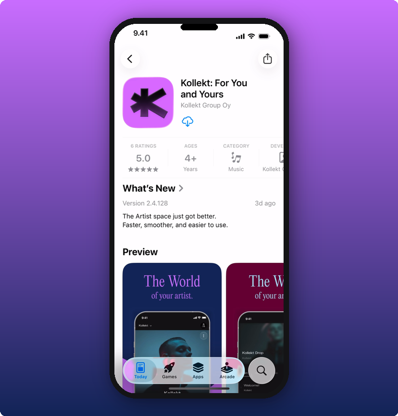

Tap the download icon. Once it's installed, the icon turns into an **Open** button.

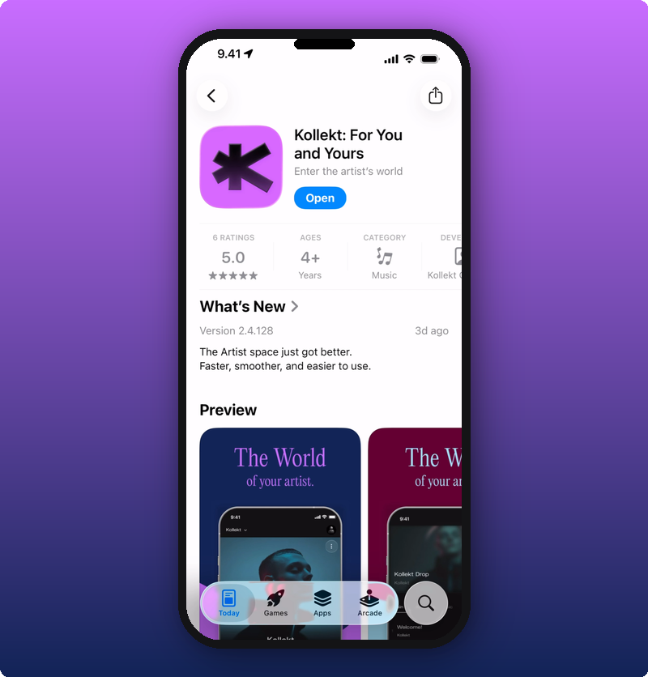

Tap **Open** to launch Kollekt.

## Step 6. Tap Enter again

Open the Kollekt email again and tap **Enter** one more time. The app opens to a Welcome screen.

The screen asks you to open your email and tap Enter to finish logging in. Tap Enter in the email and you're in.

If you ever open the app without a fresh magic link, you'll see the same Welcome screen. From here you can start over with the **Login or Sign Up** button.

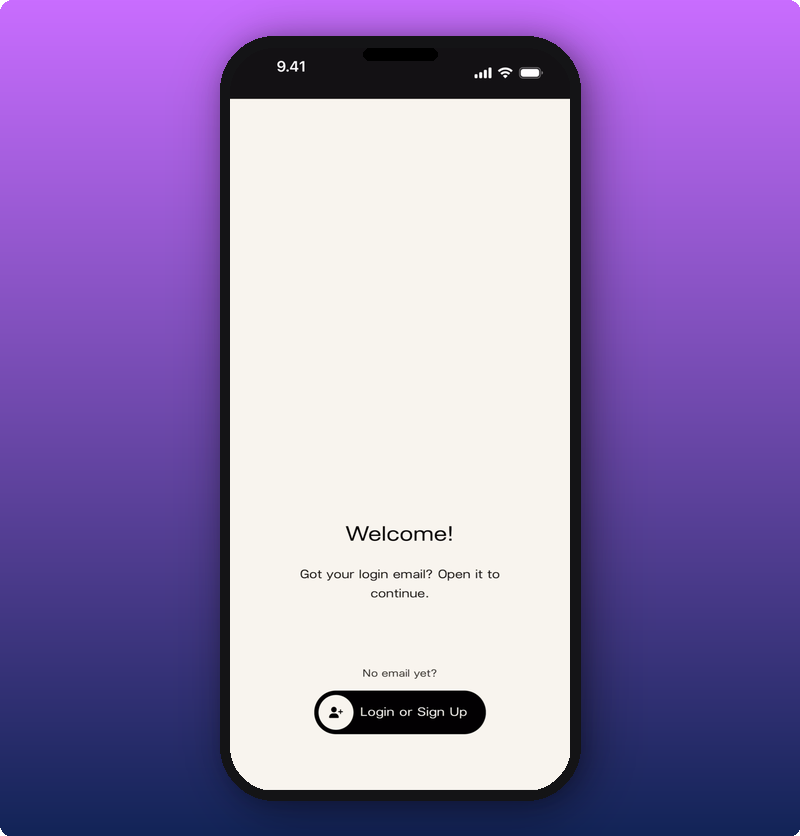

## You're in

After the magic link finishes signing you in, the app opens to your fan home with the artist already added.

From here you can:

- Tap the artist's card to open their full page.
- Read their Direct Line.
- Talk in chat.
- Subscribe if they've turned subscriptions on.

Now's also a good moment to [turn on notifications](/for-fans/your-account/enable-notifications) so you don't miss what they post next.

## Looking around before you join

You don't have to join straight away. Before you slide to join, you can scroll the artist's page, tap the Direct Line, and tap into the chat. Some bits will be read-only.

### The artist's page

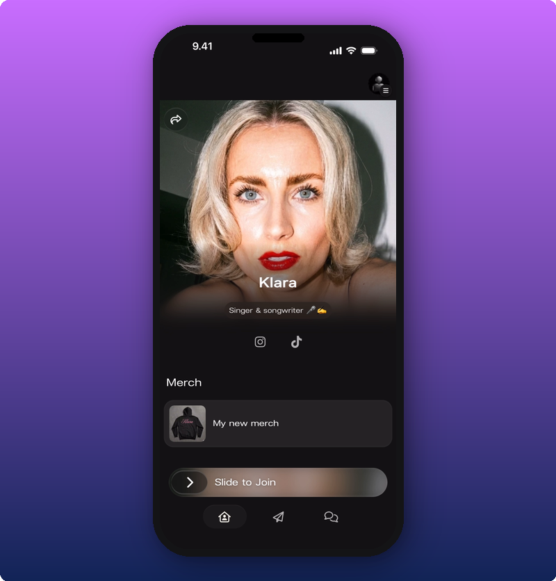

You can see their cover photo, their socials, and their link groups. To do anything else, slide the bar at the bottom.

### Chat

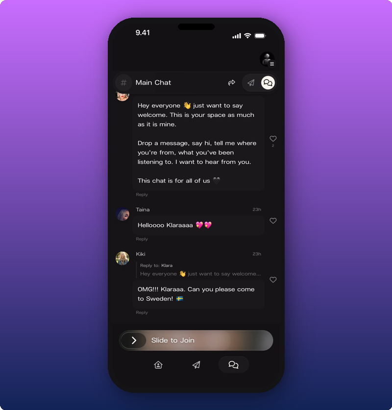

You can read what other fans are saying. To post your own message, slide to join.

### Direct Line

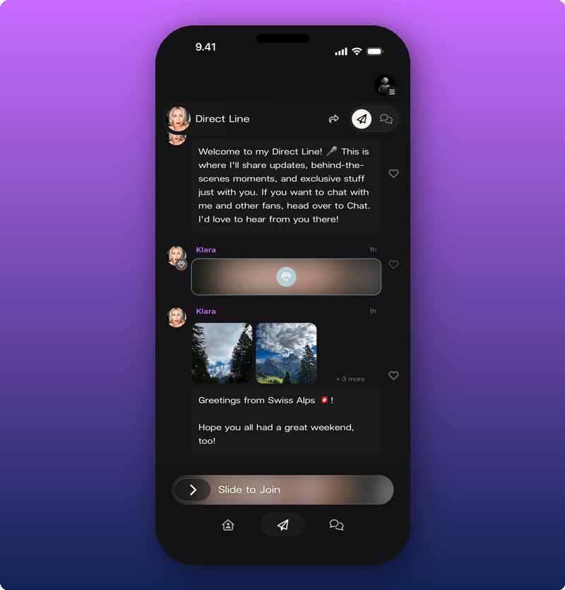

You can scroll posts and see thumbnails. Subscriber-only posts are blurred with a lock. To open photos full-screen or play voice notes, slide to join.

## Finding new artists

If you've already joined Kollekt and want to find another artist, you have two ways:

- **Inside the app.** Tap the **Find Yours** button on your fan home, or open the side menu (top right) and use the search field.
- **In your browser.** Go to [kollekt.io](https://kollekt.io) and search for the artist by name.

## Related

- [Look around the artist's page](/for-fans/inside-kollekt/exploring-the-artist-page). Find your way around once you're in.
- [Browsing the Direct Line](/for-fans/inside-kollekt/browsing-direct-line). Read what the artist just sent.
- [Joining the chat](/for-fans/inside-kollekt/participating-in-chat). Talk with other fans.
- [Your user profile](/for-fans/your-account/managing-your-profile). Set your name, photo, and bio.
- [Turn on notifications](/for-fans/your-account/enable-notifications). Get a push when the artist posts.
