Your home inside Kollekt — find artists, browse their pages, switch between communities, and share your favourites. This is the fan's starting point for everything.

## Empty State

When you first open Kollekt without following any artists, you see the empty home screen with a prompt to find your first artist.

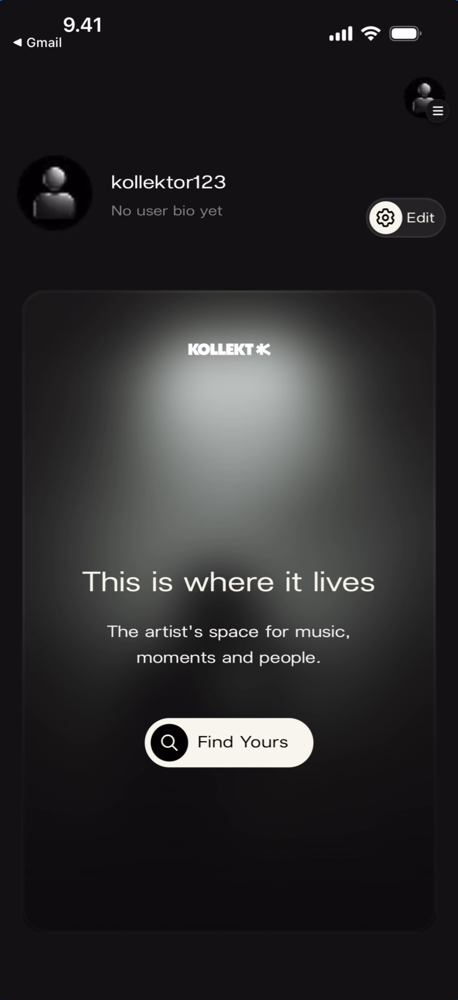

**What you'll see:** Top-left: "< Gmail" back link. Your profile section showing "kollektor123" with "No user bio yet" and a **gear/Edit** button on the right. Below: a dark card with the **KOLLEKT K** logo, a spotlight glow, and the text **"This is where it lives"** followed by "The artist's space for music, moments and people." At the bottom of the card: a black **"Find Yours"** button with a search icon.

## Finding an Artist

Tap **Find Yours** from the empty state (or use the search in the side menu) to search for artists by name.

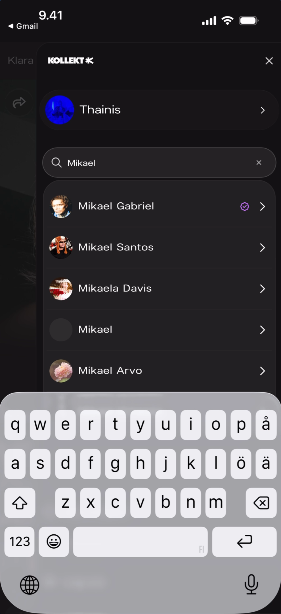

**What you'll see:** A search overlay with the **KOLLEKT K** logo at the top and an **X** close button. Your profile "Thainis" with a right arrow is shown above the search. A search field with "Q Mikael" typed and a clear (x) button. Below: search results listing **"Mikael Gabriel"** (with a green checkmark indicating already followed), **"Mikael Santos"**, **"Mikaela Davis"**, **"Mikael"**, and **"Mikael Arvo"** — each with an avatar and right arrow. The keyboard is open.

## Fan Feed

After following one or more artists, the home screen becomes your fan feed showing artist cards you can swipe through.

### Single Artist

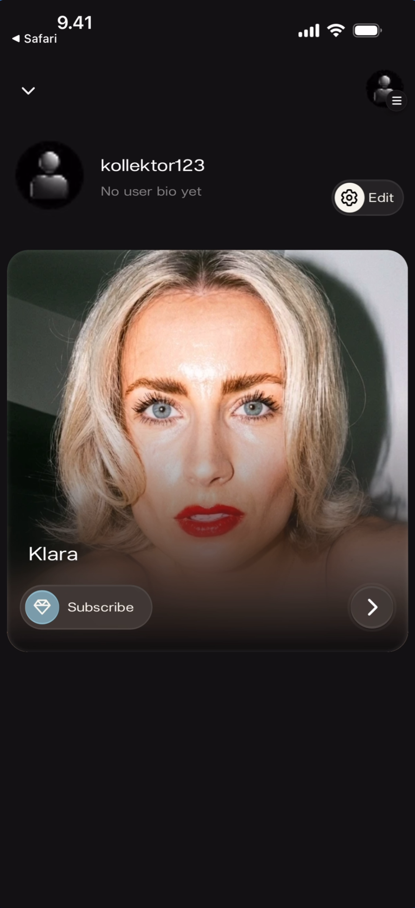

**What you'll see:** Top-left: "< Safari" back link and down chevron. Your profile "kollektor123" with "No user bio yet" and **gear/Edit** button. Below: a large artist card for **"Klara"** with her cover photo, name overlay at the bottom-left, a **Subscribe** button (with heart icon) at the bottom-left, and a **right arrow** to enter the artist's page.

### Multiple Artists

**What you'll see:** Top-left: "< Gmail" back link and down chevron. Top-right: blue profile icon and hamburger menu. Your profile "Thainis" with bio "I love music 💖" and **gear/Edit** button. Below: a large artist card for **"Klara"** with cover photo, name, Subscribe button, and right arrow. A second artist card is partially visible below (different artist with darker photo).

### Multiple Artists (Scrolled)

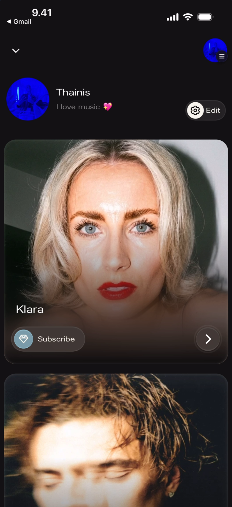

**What you'll see:** Same layout as above. The "Klara" card is fully visible with Subscribe button and right arrow. Below it, a second artist card is partially visible showing a different cover photo, confirming that the feed is scrollable with multiple artist cards stacked vertically.

### Artist Name Tooltip

When hovering or long-pressing on an artist card, the artist name appears as a tooltip.

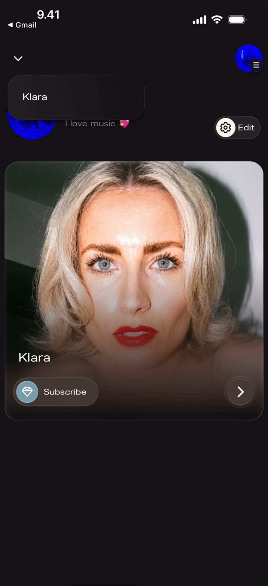

**What you'll see:** Top-left: "< Gmail" back link and down chevron. Top-right: blue profile icon and hamburger menu. Your profile "Thainis" with bio. A tooltip pill showing **"Klara"** appears above the artist card, which shows the cover photo with name, Subscribe button, and right arrow.

## Artist Page

Tap the **right arrow** on an artist card to enter their full page.

### Top of Page

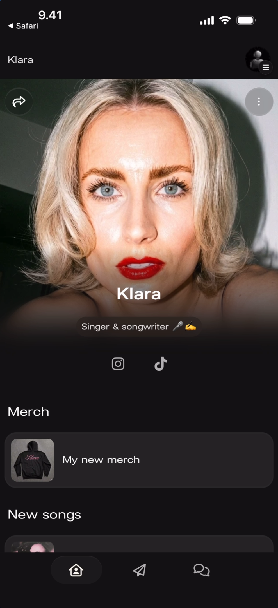

**What you'll see:** Top-left: "< Safari" back link and "Klara" artist name. Top-right: profile avatar. Share icon (curved arrow) on the left and three-dot menu on the right over the cover photo. Large artist photo with name **"Klara"** and subtitle **"Singer & songwriter 🎤 ☁️"** centered below. Social icons: **Instagram** and **TikTok**. Section header **"Merch"** with a card showing "My new merch" (hoodie thumbnail). Section header **"New songs"** partially visible. Bottom navigation: Home (active, yellow), Direct Line, Chat, Profile.

### Scrolled Down

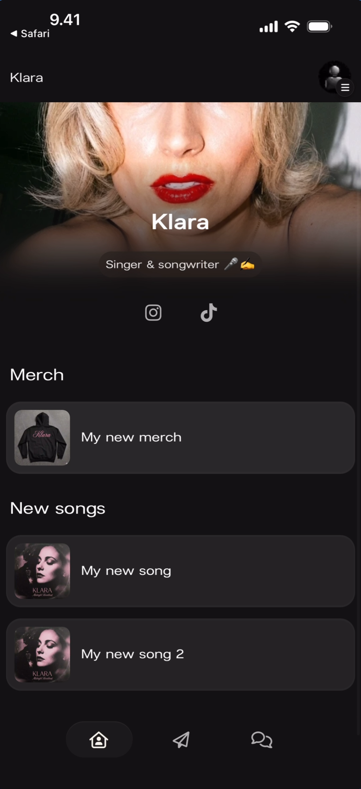

**What you'll see:** The page scrolled down past the full cover photo. The artist photo is partially visible at top with name "Klara" and subtitle "Singer & songwriter 🎤 ☁️". Social icons: Instagram and TikTok. **"Merch"** section with "My new merch" card. **"New songs"** section with two cards: **"My new song"** and **"My new song 2"**, each with album art thumbnails. Bottom navigation: Home (active, yellow), Direct Line, Chat, Profile.

### Unfollow Menu

Tap the **three-dot menu** (⋮) in the top-right of the artist page to reveal the unfollow option.

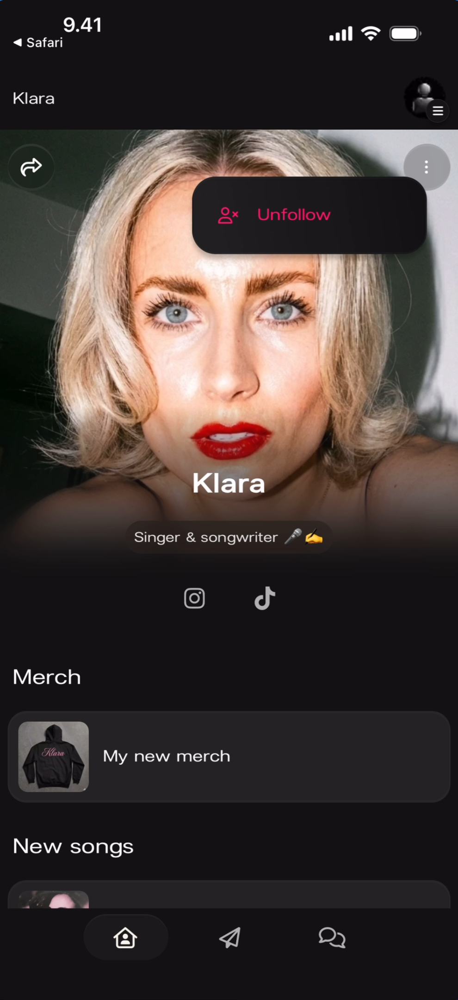

**What you'll see:** The artist page with Klara's cover photo and details visible. A dark dropdown popover appears near the top showing a people icon and red **"Unfollow"** text. The share icon is visible on the left. Below: "Merch" and "New songs" sections. Bottom navigation bar.

## Side Menu

Tap the **hamburger menu** icon (top-right) to open the side menu. This is your navigation hub for switching between artists, searching, getting help, and logging out.

### Single Artist

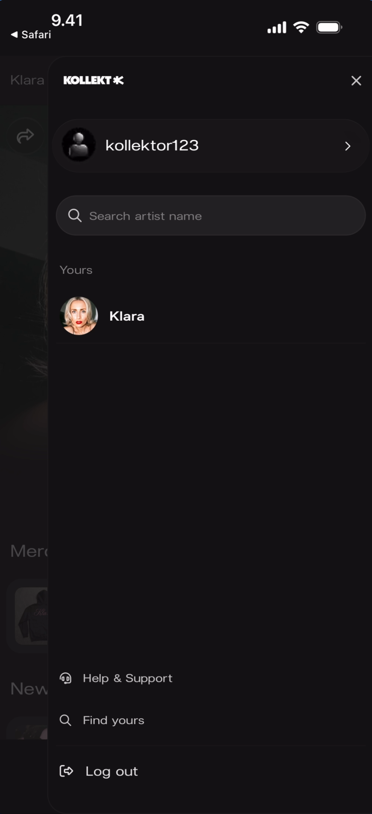

**What you'll see:** A slide-over panel from the right with the **KOLLEKT K** logo at top and **X** close button. Your profile "kollektor123" with right arrow. A search field: **"Search artist name"**. Under **"Yours"** heading: **"Klara"** with avatar. At the bottom: **"Help & Support"** (with info icon), **"Find yours"** (with search icon), and **"Log out"** (with exit icon).

### Multiple Artists

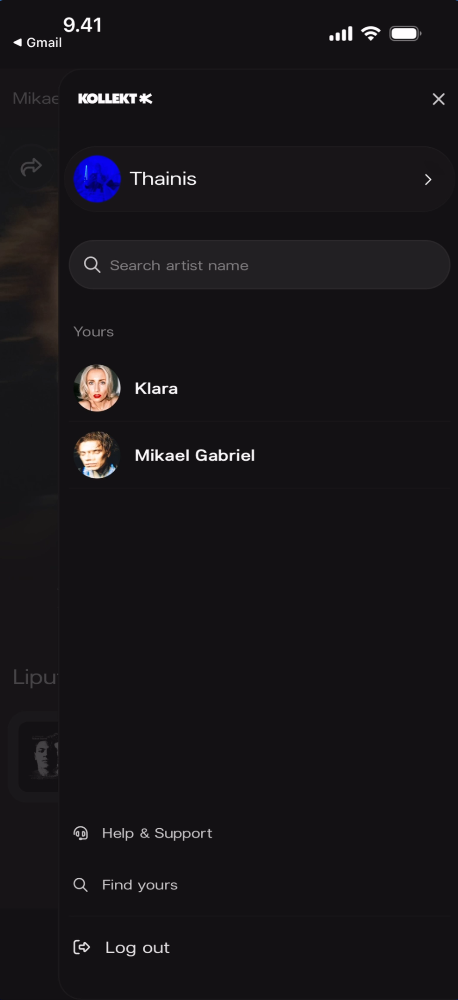

**What you'll see:** Same side menu layout. Profile "Thainis" with right arrow. Search field: "Search artist name". Under **"Yours"**: **"Klara"** and **"Mikael Gabriel"** — each with avatars. Bottom: Help & Support, Find yours, and Log out links.

### Searching for Artists

The search field in the side menu lets you search for new artists to follow.

**What you'll see:** The side menu with **KOLLEKT K** logo and X close. Profile "Thainis" with right arrow. Search field with "Q Mikael" typed and clear (x) button. Results: **"Mikael Gabriel"** (green checkmark — already followed), **"Mikael Santos"**, **"Mikaela Davis"**, **"Mikael"**, **"Mikael Arvo"** — each with avatars and right arrows. The keyboard is open.

### Help & Support

Tap **Help & Support** in the side menu to open the Kollekt help center.

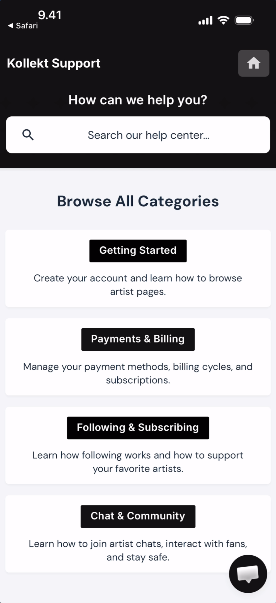

**What you'll see:** A white-background page with **"Kollekt Support"** header and a home icon (top-right). Heading: **"How can we help you?"** A search bar: **"Search our help center..."** Below: **"Browse All Categories"** with category pills — **"Getting Started"** ("Create your account and learn how to browse artist pages."), **"Payments & Billing"** ("Manage your payment methods, billing cycles, and subscriptions."), **"Following & Subscribing"** ("Learn how following works and how to support your favorite artists."), **"Chat & Community"** ("Learn how to join artist chats, interact with fans, and stay safe."). A chat widget icon appears in the bottom-right.

## Sharing

Tap the **share icon** (curved arrow) on the artist page to open the Share Sheet.

### Share Sheet

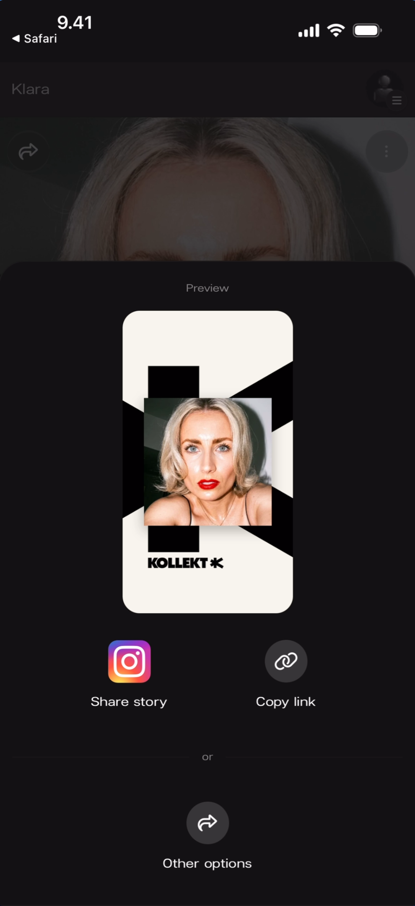

**What you'll see:** The artist page dimmed behind a bottom sheet overlay. "Preview" label at top. A branded **Kollekt Card** showing the artist's photo on a black-and-white geometric background with the "KOLLEKT K" logo. Two action buttons: **"Share story"** (Instagram icon) and **"Copy link"** (link icon). Below: "or" divider and **"Other options"** button (share arrow icon).

### Native Share Sheet (Other Options)

Tapping **Other options** opens the device's native share sheet.

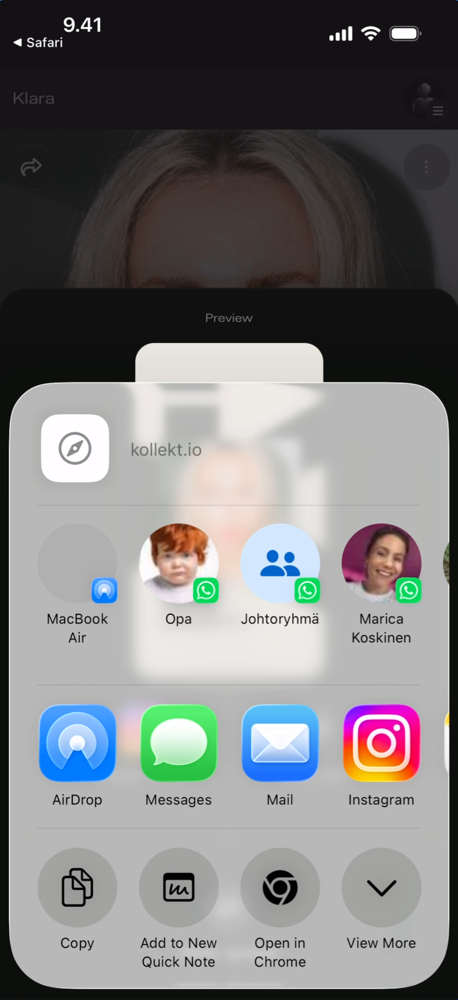

**What you'll see:** The Kollekt Share Sheet dimmed behind the iOS native share sheet. At the top: a link icon with **"kollekt.io"** URL preview. Contact/device suggestions: "MacBook Air", "Opa", "Johtoryhmä", "Marica Koskinen". App row: **AirDrop**, **Messages**, **Mail**, **Instagram**. Action row: **Copy**, **Add to New Quick Note**, **Open in Chrome**, **View More**.

### Sharing to Instagram Stories

Tap **Share story** to post the Kollekt Card directly to Instagram Stories.

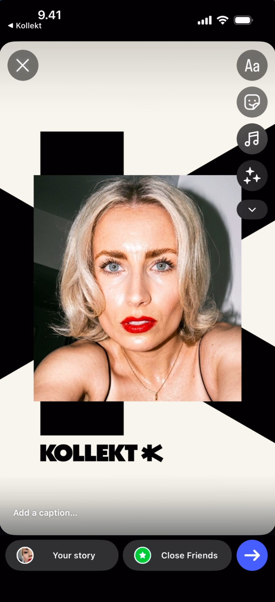

**What you'll see:** Instagram Stories editor. Top-left: "< Kollekt" back link and X close button. Top-right: text (Aa), sticker, effects, music, and more icons. Center: the Kollekt Card with the artist photo and "KOLLEKT K" branding on the geometric background. Bottom: "Add a caption..." text field. Footer: "Your story" and "Close Friends" share targets with a blue arrow send button.

### Adding the Link Sticker

Tap the sticker icon in Instagram and select the **Link** sticker. Paste the Kollekt URL.

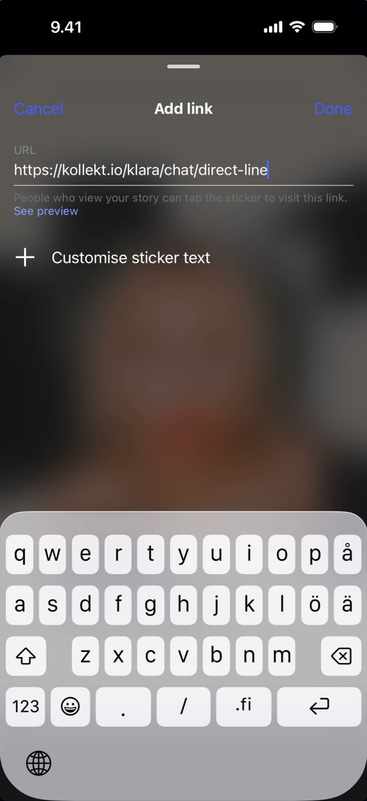

**What you'll see:** Instagram "Add link" screen. Top bar: "Cancel" (left), "Add link" title (center), "Done" (right). URL field contains `https://kollekt.io/klara/chat/direct-line`. Helper text: "People who view your story can tap the sticker to visit this link." Below: "+ Customise sticker text" option. The keyboard is open.

### Final Story with Link

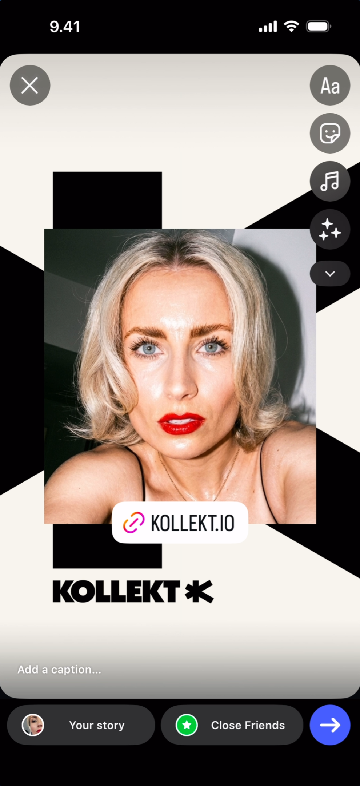

**What you'll see:** Instagram Stories editor with the Kollekt Card displayed. A white **link sticker** reading "🔗 KOLLEKT.IO" is placed over the artist photo. Top-right: text, sticker, effects, music, and more icons. Bottom: "Add a caption..." text field. Footer: "Your story" and "Close Friends" share targets with a blue arrow send button.

## Known Limitations

- The empty state "Find Yours" button and the side menu "Find yours" link appear to lead to the same search — the exact flow difference is not documented.
- Custom links the artist adds (Merch, New songs) open in the browser, but the external browser view is not shown in the current screenshots.
- The Subscribe button on artist cards in the feed is visible but the subscription flow from this entry point is not demonstrated — the subscribe modal is documented in the Chat and Direct Line docs.
- The green checkmark on already-followed artists in search results is visible but not explicitly explained in the UI.
- Profile editing (tapping the gear/Edit button) is not covered in this doc.

## Related Features

- [Browsing Direct Line](/for-fans/direct-line/browsing-direct-line) — Read the artist's one-way broadcast messages
- [Participating in Chat](/for-fans/chat/participating-in-chat) — Talk with the artist and other fans
- [Managing Your Fan Profile](/for-fans/profile/managing-your-profile) — Set your username, avatar, and bio
- [Share your Kollekt link](/for-artists/sharing/sharing-your-page) — How the Share Sheet works from the artist side
