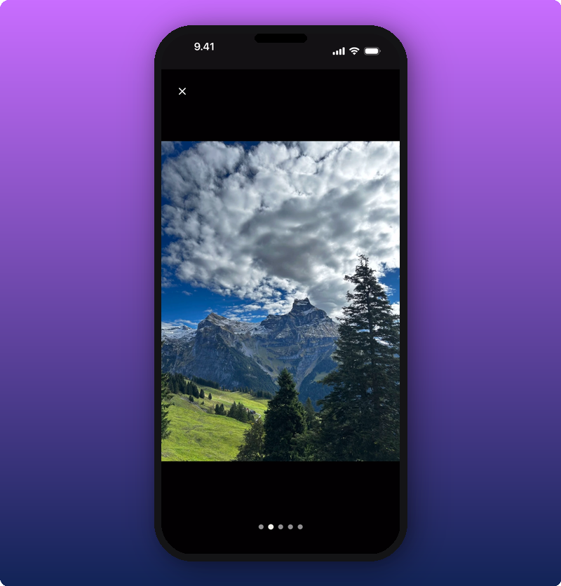

The Direct Line is the artist's feed inside their Kollekt space. Only the artist (and their team) can post here. You read, react, and tap photos to view them full-screen. Some posts are open to everyone. Some are subscriber-only.

## What the feed looks like as a free member

Once you've joined, you see all the artist's public posts. Subscriber-only posts show up too, but they're blurred and locked.

You can:

- **Read posts** the artist shared with everyone.
- **Tap the heart** to react.
- **Tap a photo** to open it full-screen.
- **See locked posts** blurred, with a lock icon, so you know there's more if you subscribe.

## What the feed looks like as a subscriber

When you subscribe, every post unlocks. The blur is gone, the locks are gone, and the subscriber-only posts read like any other.

You'll often find tour presale codes, behind-the-scenes photos, voice notes, and posts the artist only wants their close fans to see.

## Viewing photos full-screen

Tap any photo in a post to open it big. If a post has more than one photo, dots appear at the bottom and you can swipe to flip through them.

Tap the **X** in the top corner to close it.

## Unlocking a subscriber-only post

Tap the locked post. The subscribe screen opens.

It shows what you'll get, the price, and how many months you want to subscribe for. Tap the **Subscribe** button at the bottom and confirm payment. The post unlocks straight away.

If you want the full breakdown of pricing and what subscribing gets you, see [Subscribing to an artist](/for-fans/subscribing/subscribing-to-an-artist).

## Sharing the Direct Line

Tap the share icon in the Direct Line header to send the link to a friend.

You can post the Kollekt card straight to your Instagram Story, copy the link, or pick another app from your phone's share menu. The link opens the Direct Line for whoever taps it. They can scroll, but they'll need to join to see it properly.

## Related

- [Joining the chat](/for-fans/inside-kollekt/participating-in-chat). Talk with other fans and the artist.
- [Get to know Kollekt](/for-fans/inside-kollekt/exploring-the-artist-page). The artist's home inside Kollekt.
- [Subscribing to an artist](/for-fans/subscribing/subscribing-to-an-artist). Unlock everything.
- [Your user profile](/for-fans/your-account/managing-your-profile). Set your name, photo, and bio.
