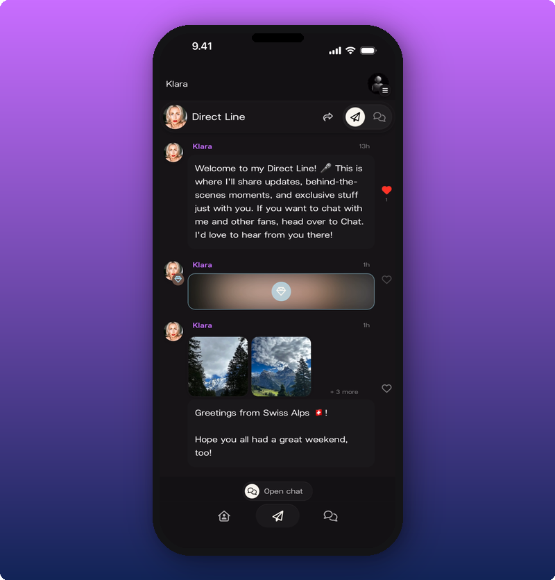
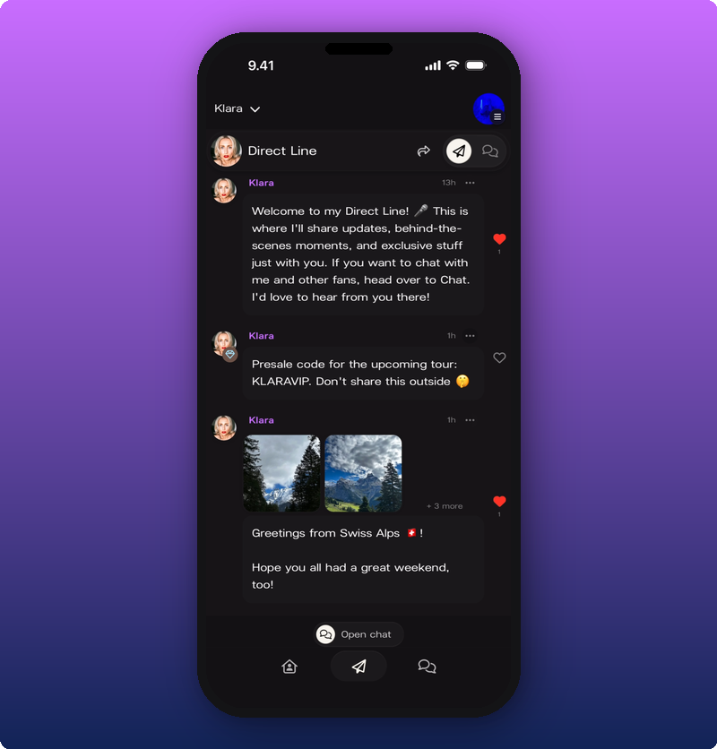
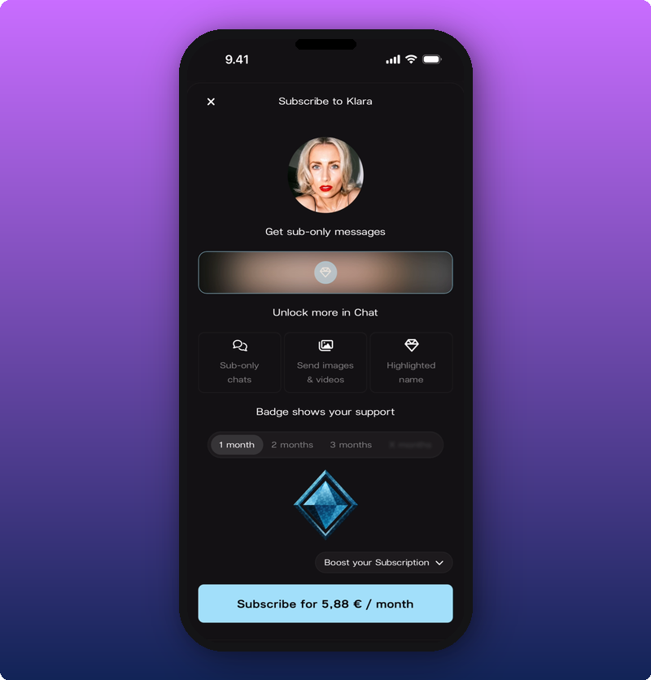
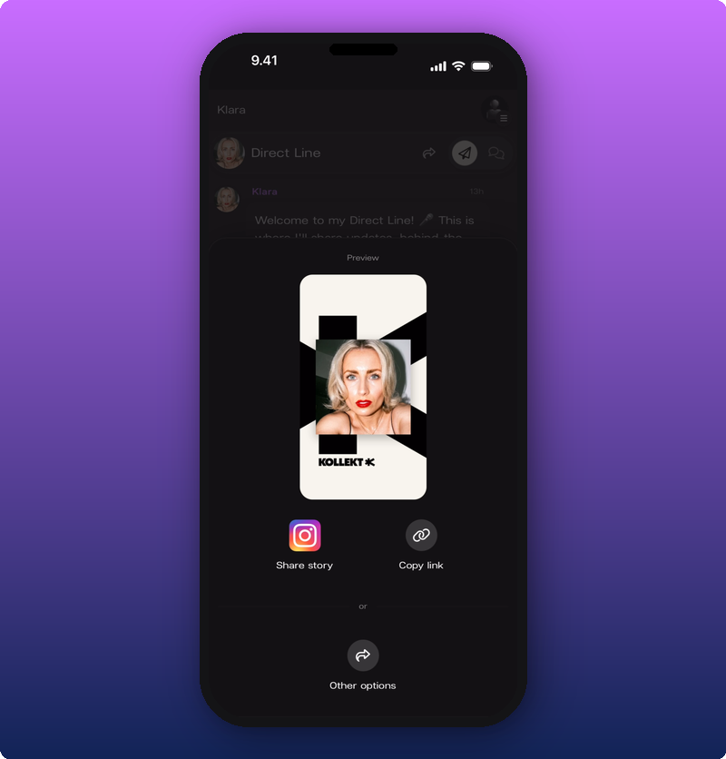

  <svg width="20" height="20" viewBox="0 0 24 24" fill="none" stroke="#c96dff" strokeWidth="2" strokeLinecap="round" strokeLinejoin="round" style={{flexShrink: 0, marginTop: "2px"}}>
    <path d="M9 18h6"/>
    <path d="M10 22h4"/>
    <path d="M15.09 14c.18-.98.65-1.74 1.41-2.5A4.65 4.65 0 0 0 18 8 6 6 0 0 0 6 8c0 1 .23 2.23 1.5 3.5A4.61 4.61 0 0 1 8.91 14"/>
  </svg>
  

    Are you an artist? Click <a href="/for-artists/your-space/direct-line" style={{color: "#5a1d8c"}}>here</a>.
  

## If you haven't subscribed

Once you've joined, you see all the artist's public posts. Subscriber-only posts show up too, but they're blurred and locked.

You can:

- **Read posts** the artist shared with everyone.
- **Tap the heart** to react.
- **Tap a photo** to open it full-screen.
- **See locked posts** blurred, with a lock icon, so you know there's more if you subscribe.

Note: not every artist posts subscriber-only messages. If you don't see any locked posts on an artist's Direct Line, that artist hasn't sent any. That's normal.

## If you've subscribed

When you subscribe, every post unlocks. The blur is gone, the locks are gone, and the subscriber-only posts read like any other.

## Viewing photos and videos fullscreen

Tap any photo or video in a post to open it big. If a post has more than one photo, dots appear at the bottom and you can swipe to flip through them.

Tap the **X** in the top corner to close it.

## Unlocking a subscriber-only post

Tap the locked post. The subscribe screen opens.

It shows what you'll get, the price, and how many months you want to subscribe for. Tap the **Subscribe** button at the bottom and confirm payment. The post unlocks straight away.

If you want the full breakdown of pricing and what subscribing gets you, see [Subscribing to an artist](/for-fans/subscribing/subscribing-to-an-artist).

## Sharing the Direct Line

Tap the share icon in the Direct Line header to send the link to a friend.

You can post the Kollekt card straight to your Instagram Story, copy the link, or pick another app from your phone's share menu. The link opens the Direct Line for whoever taps it. They can scroll, but they'll need to join to see it properly.

## Related

- [Joining the chat](/for-fans/inside-kollekt/participating-in-chat). Talk with other fans and the artist.
- [Get to know Kollekt](/for-fans/inside-kollekt/exploring-the-artist-page). The artist's home inside Kollekt.
- [Subscribing to an artist](/for-fans/subscribing/subscribing-to-an-artist). Unlock everything.
- [Your user profile](/for-fans/your-account/managing-your-profile). Set your name, photo, and bio.
