## When you haven't joined anyone yet

If you've just downloaded Kollekt and haven't joined an artist, your home is empty. There's a card in the middle prompting you to find your first artist.

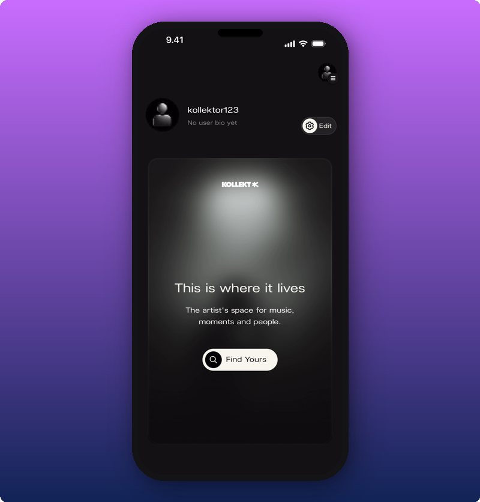

Tap **Find Yours** to search for an artist by name. Kollekt looks them up and shows the matches. Tap the one you want.

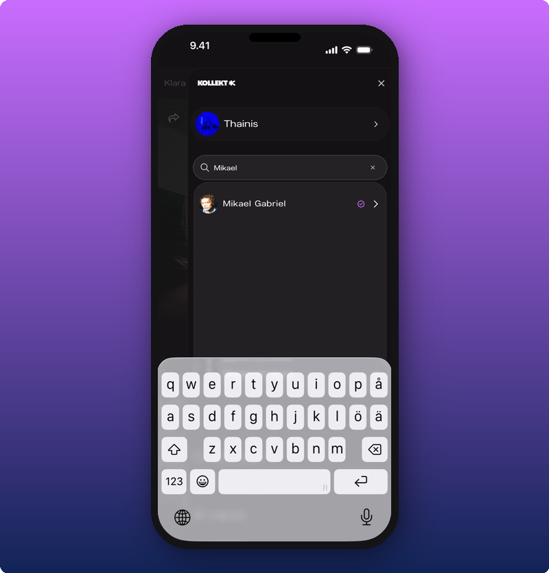

Tap the artist in the list. You're taken to their page. From there you can slide to join.

## Once you've joined someone

After you've joined an artist, your home shows their card. If you've joined more than one, you can scroll between cards.

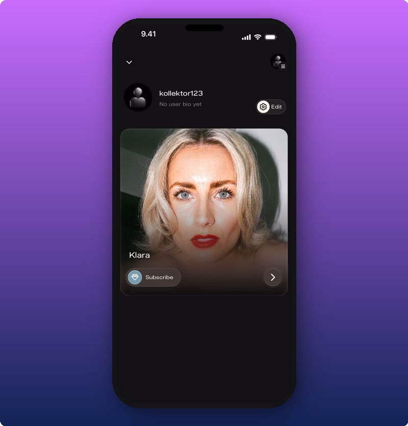

Each artist card shows their cover photo, their name, and a **Subscribe** button. Tap the card to enter the artist's page.

If you follow more than one artist, you can scroll between cards.

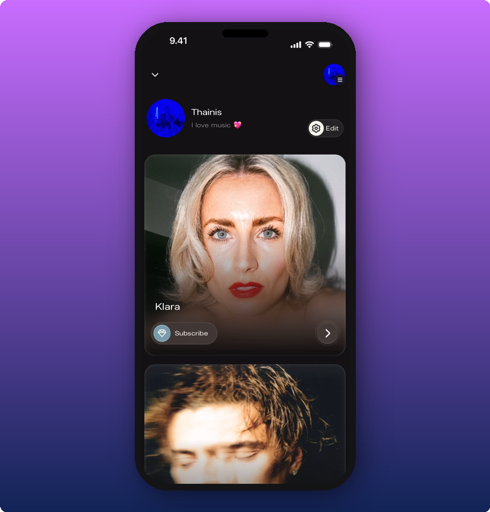

## Inside the artist's page

Tap the artist card to open the artist page.

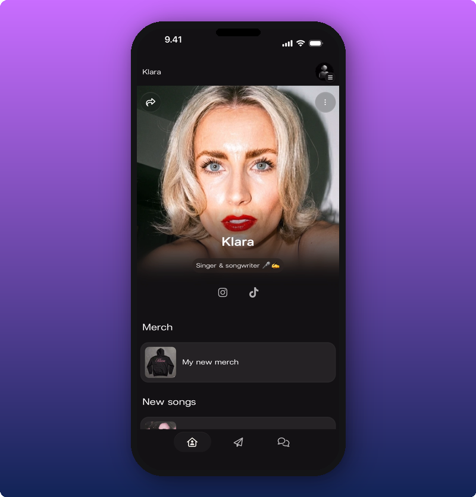

You see:

- The artist's cover photo and name.
- Social icons. Tap one to open the artist's Instagram, TikTok, or wherever else they've added.
- Artist's custom links.

Scroll down to see all the artist's link groups in order.

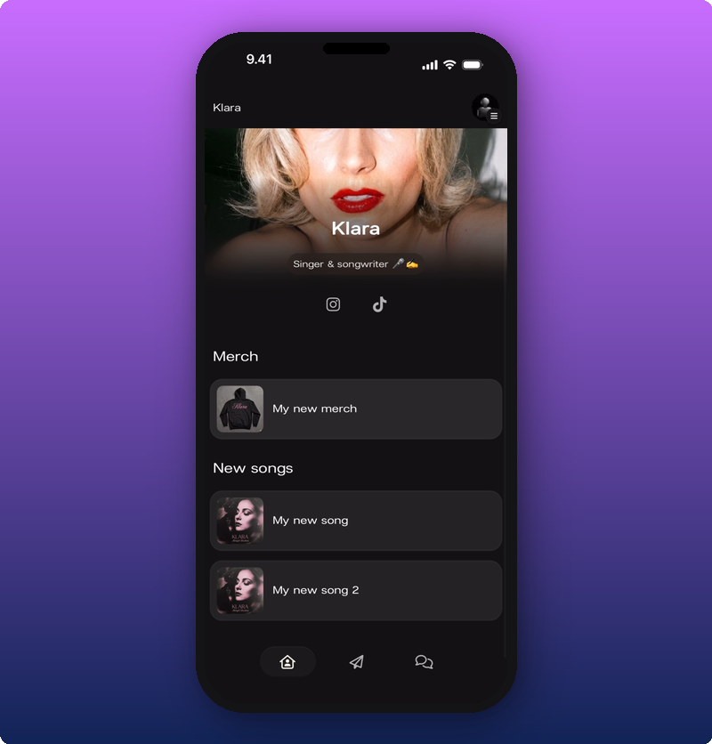

Tap a link to open it. Most links open in your phone's browser.

### Unfollowing an artist

If you want to leave an artist's space, tap the three-dot menu in the top right of their page. The **Unfollow** option appears.

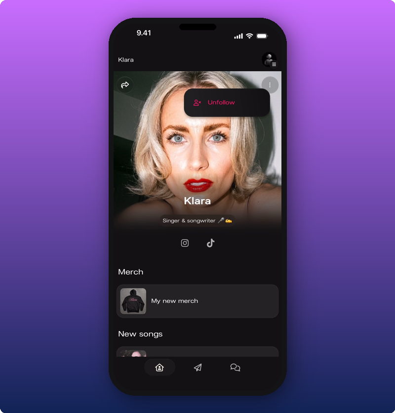

Tap **Unfollow** and you're out of the space. You can always come back by searching for the artist again.

## The side menu

Tap the icon with the hamburger menu to open the side menu. This is where you switch between artists, search for new ones, get help, or log out.

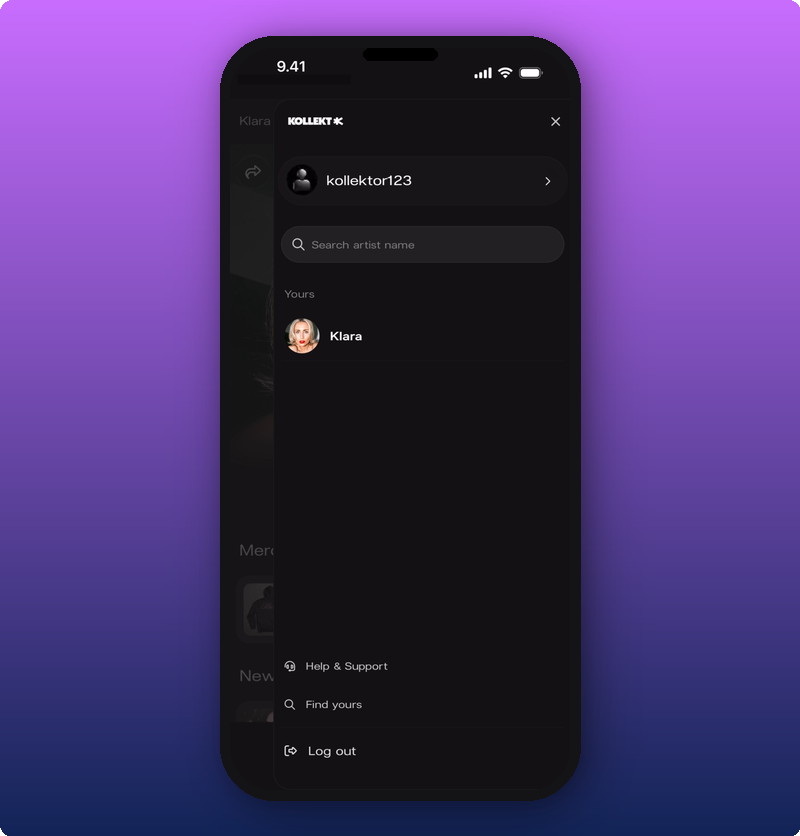

What's in there:

- **Your user profile** at the top.
- A **Search** field for finding new artists.
- **Yours**, the list of every artist you've joined. Tap any name to jump to their page.
- **Help & Support**, **Find yours**, and **Log out** at the bottom.

If you've joined more than one artist, all of them show under **Yours**.

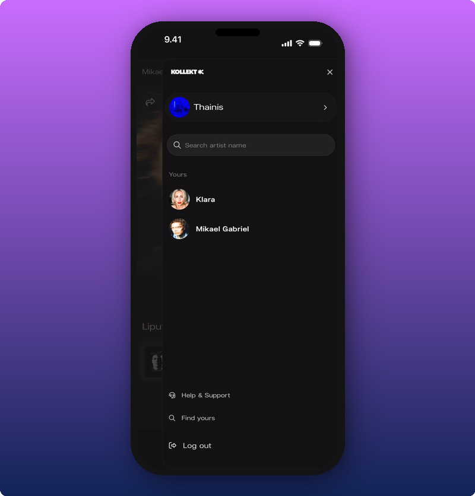

### Look around the artist pages

Type a name in the search field. Matches show up under it. A purple check shows the artist has already claimed their page.

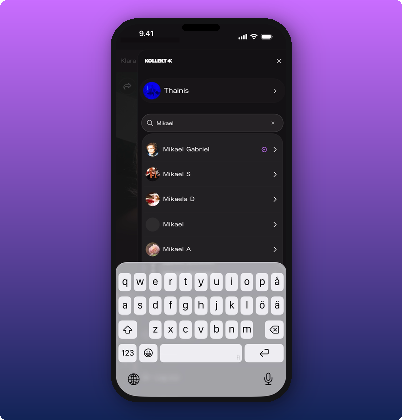

Tap any result to open that artist's page.

### Help & Support

Tap **Help & Support** to open the Kollekt help center in your browser.

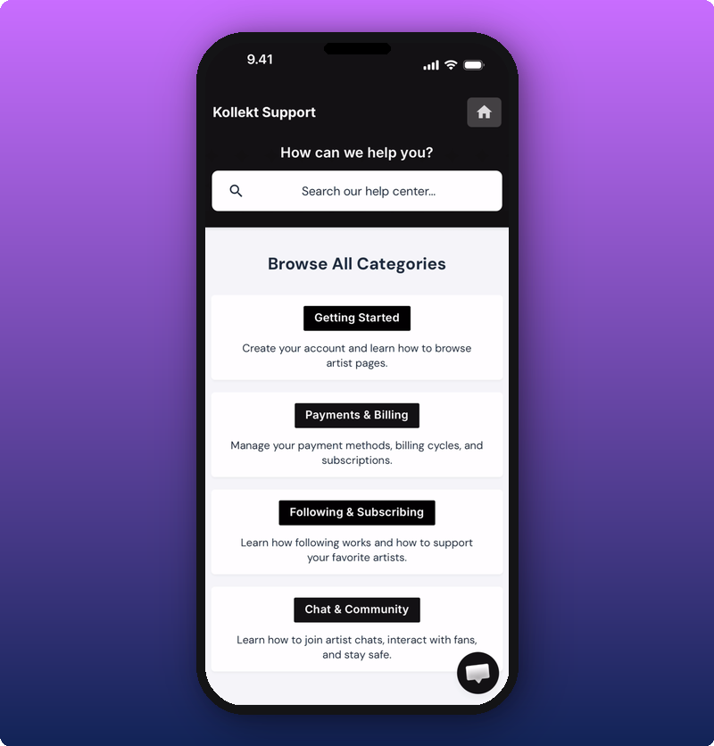

You can search for an answer, browse the categories, or chat with the support team using the bubble in the bottom right.

## Sharing an artist with a friend

Tap the share icon (the curved arrow) on any artist's page to bring up the share sheet.

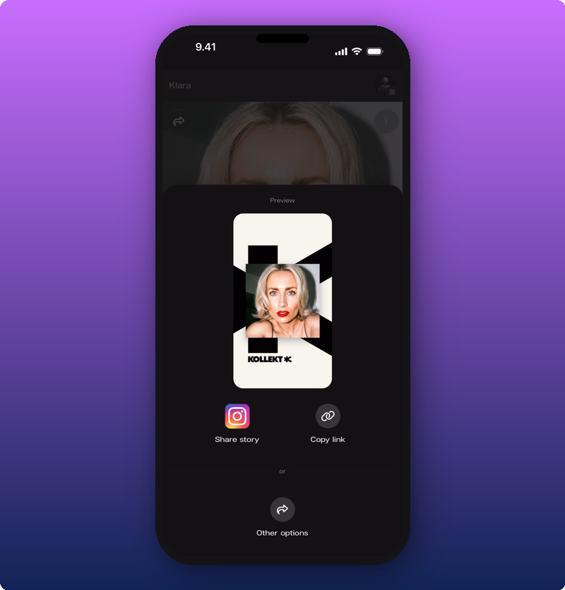

You have three options:

- **Share story.** Sends a Kollekt-branded image to Instagram Stories. You'll add the link sticker yourself in Instagram (more on that below).
- **Copy link.** Copies the artist's Kollekt link to your clipboard.
- **Other options.** Opens your phone's normal share menu, where you can pick WhatsApp, Messages, AirDrop, anywhere.

### Sharing to Instagram Stories

Tap **Share story**. Instagram opens with the Kollekt card already in place.

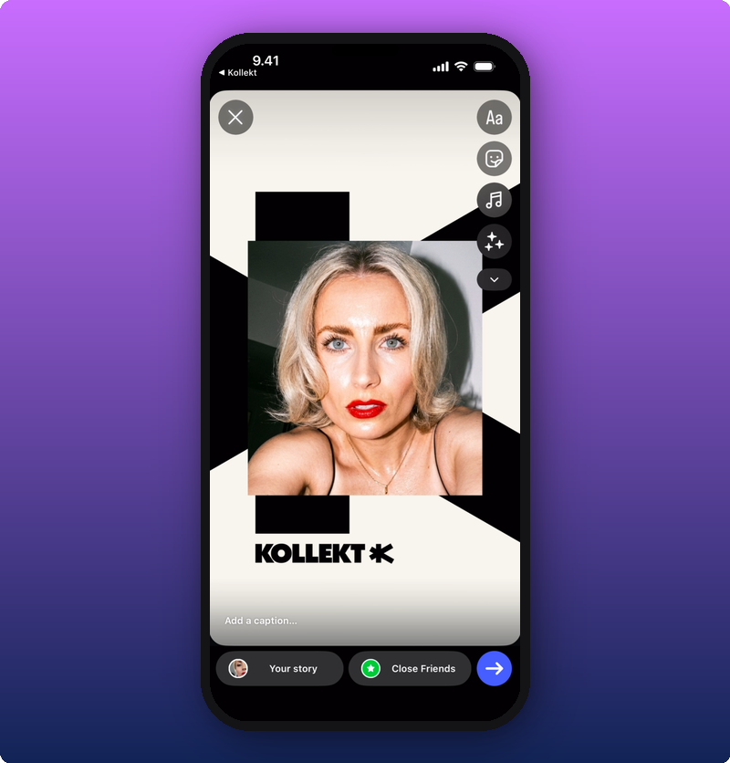

Now add the link sticker. Tap the sticker icon in Instagram, pick **Link**, and paste the Kollekt URL (your phone copied it for you).

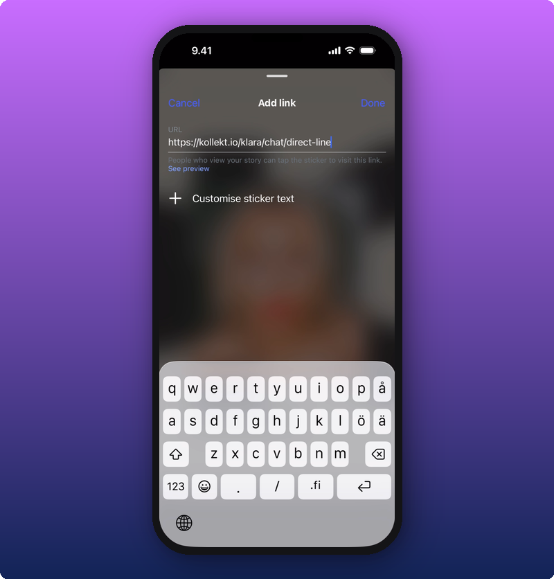

Tap **Done**. The link sticker lands on top of the card. Drag it where you want and post.

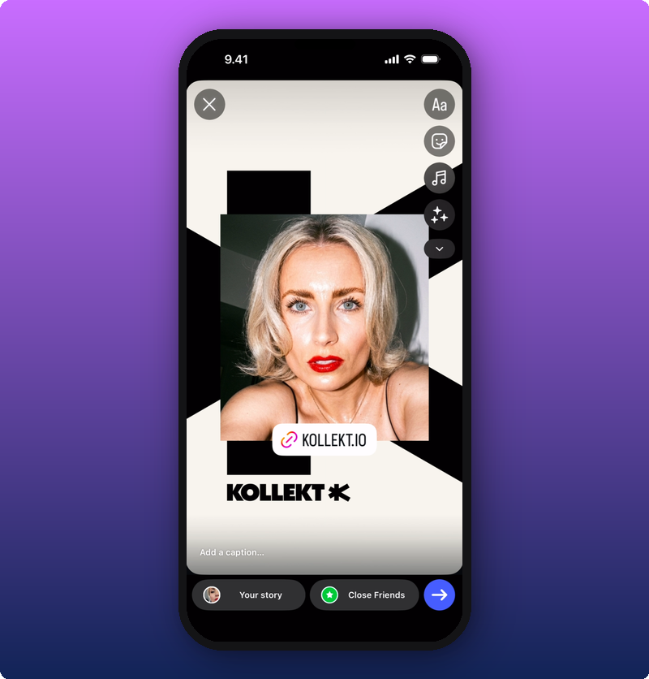

## Related

- [Explore the Artist's Direct Line](/for-fans/inside-kollekt/browsing-direct-line). Read what the artist just sent.
- [Joining the chat](/for-fans/inside-kollekt/participating-in-chat). Talk with other fans.
- [Your user profile](/for-fans/your-account/managing-your-profile). Set your name, photo, and bio.
- [Subscribing to an artist](/for-fans/subscribing/subscribing-to-an-artist). Unlock the locked posts and the Subscribers Chat.
