Chat is where the fans hang out. Every artist's space has a Main Chat that any member can talk in, and a Subscribers Chat for the people who back the artist. You can react with hearts, reply to a specific message in a thread, and tap any name to see who's posting.

## Looking around before you've joined the chat

Even before you join, you can scroll through the chat and read what's happening. The bottom of the screen shows a join button instead of the message box.

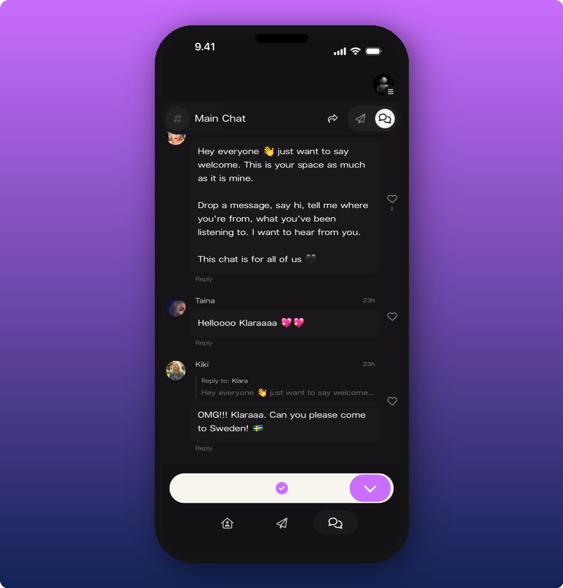

Scroll up to see older messages. You'll see fan-to-fan replies, hearts, the artist's welcome message, the lot.

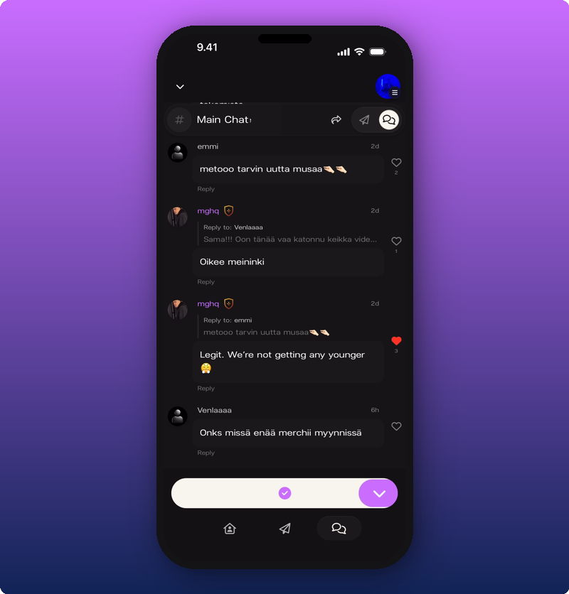

Tap the join button to come in.

## After you've joined

Once you're in, the message box appears at the bottom and you can post.

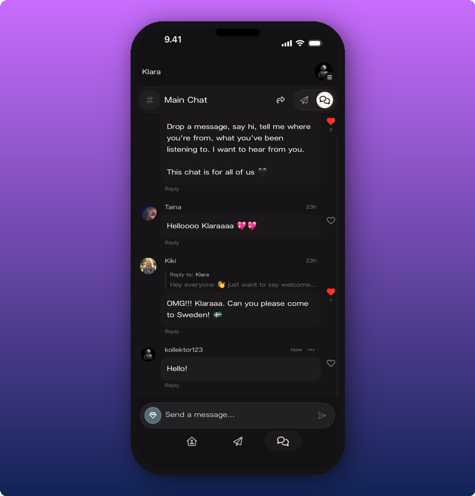

## Sending a message

Tap the message box. Your keyboard opens. Type and tap the send arrow.

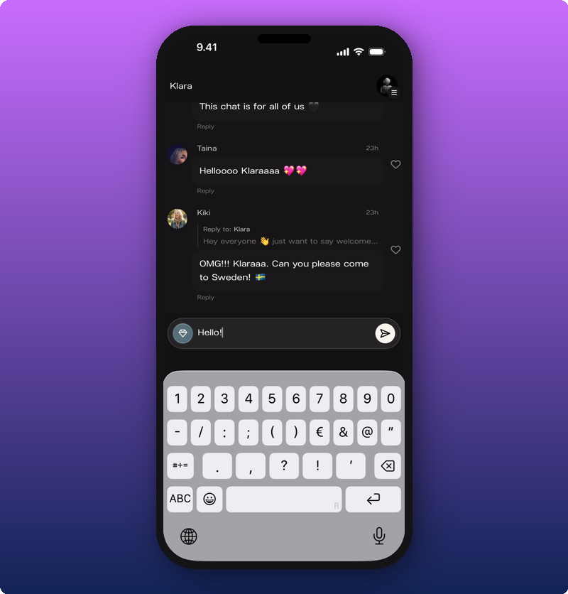

Tap the **+** to the left of the box if you want to attach something.

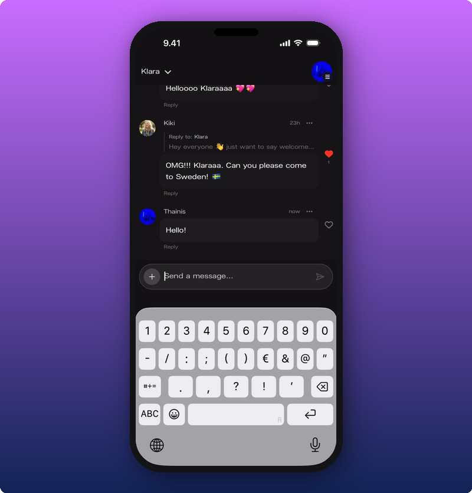

Note: free members can send text in chat. Sending images and videos is a subscriber perk. If you tap **+** as a free member and try to attach a photo, the subscribe screen comes up.

## Reacting with a heart

Tap the heart next to any message. The heart fills in red and the count goes up.

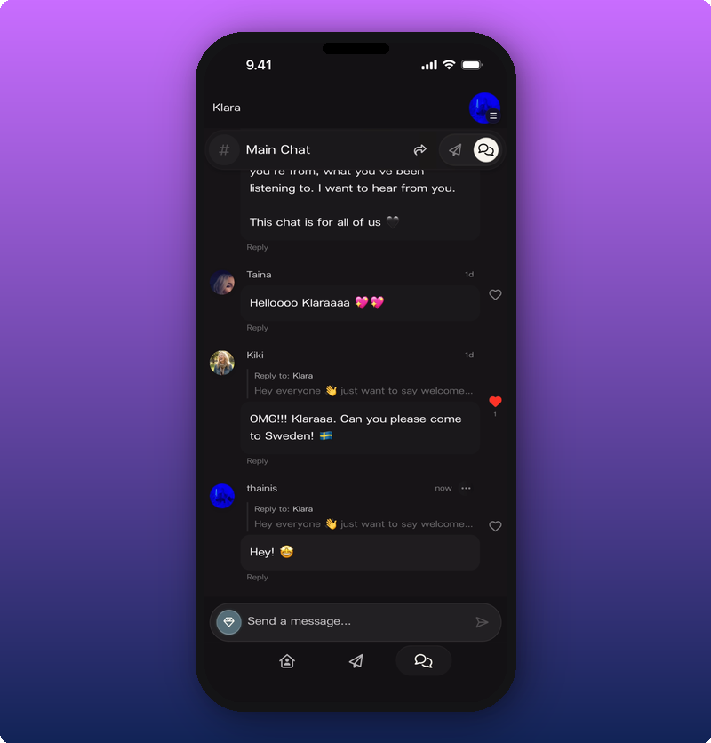

Tap it again to take your heart back.

## Replying in a thread

If you want to answer a specific message, tap **Reply** under it. A bar shows up above the message box reminding you who you're replying to.

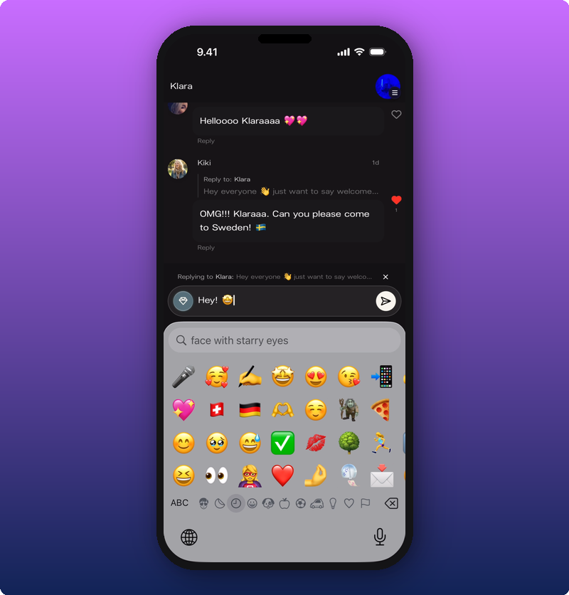

Type your reply and send. Your reply appears in a thread under the original message, so the conversation doesn't get tangled with everything else.

## Deleting your own message

Tap the three-dot menu on your own message. **Delete Message** appears.

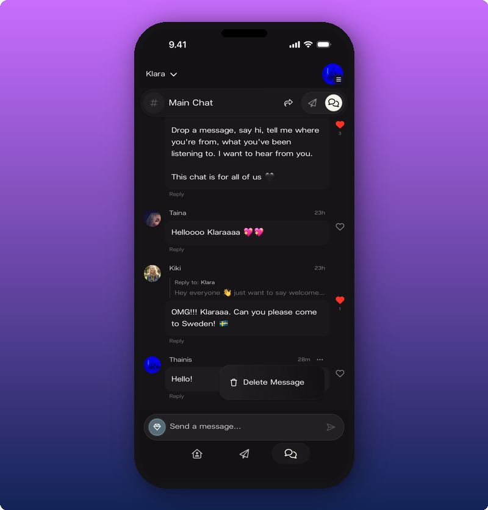

Tap it. The message is gone.

## Tapping someone's name

Tap any name or photo in chat to see their profile card. It pops up from the bottom.

The artist's card shows their name and bio.

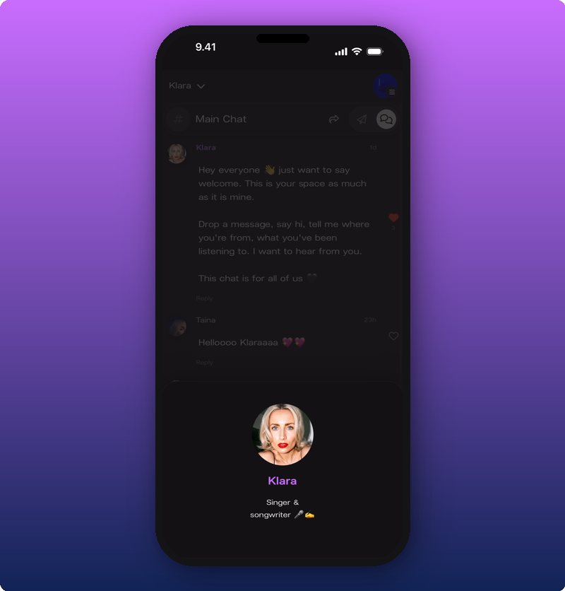

A regular fan's card shows their name, the **Member** badge, and when they were last seen.

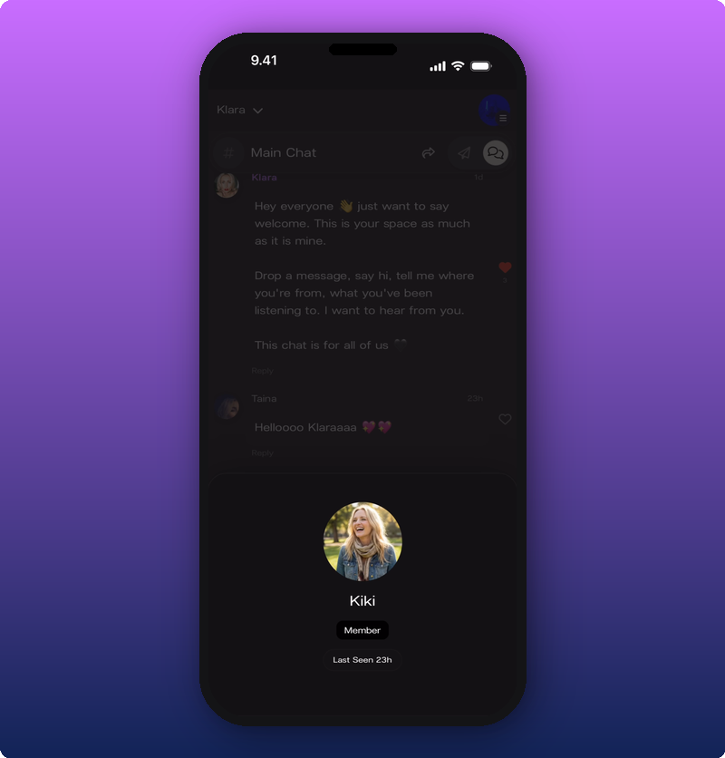

If they've added a bio, you'll see that too.

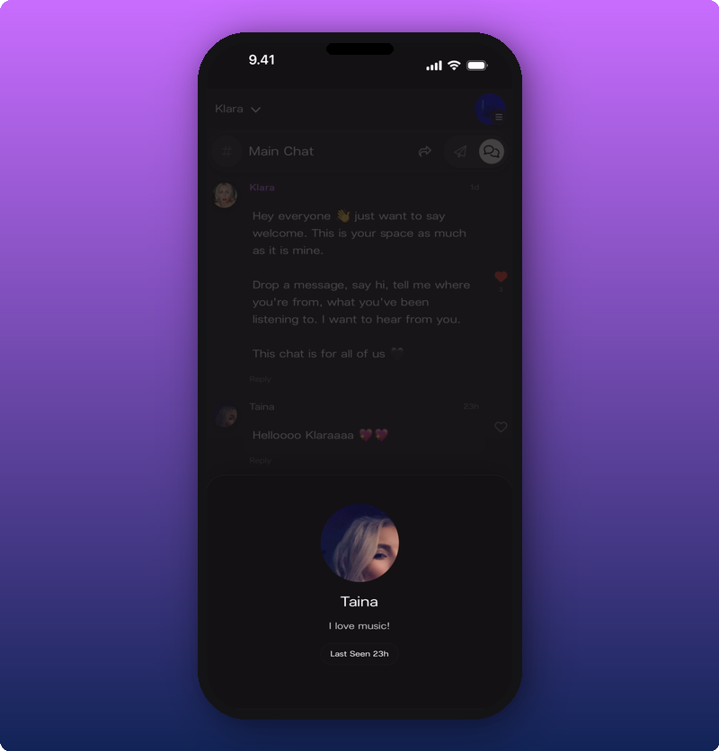

## If you're a moderator

Some artists promote their most active fans to moderator. Moderators have a small shield badge next to their name and can help keep chat tidy.

When a moderator opens another fan's profile card, they see a **Manage** section underneath. From there they can put a fan in timeout for an hour, a day, 7 days, or permanently.

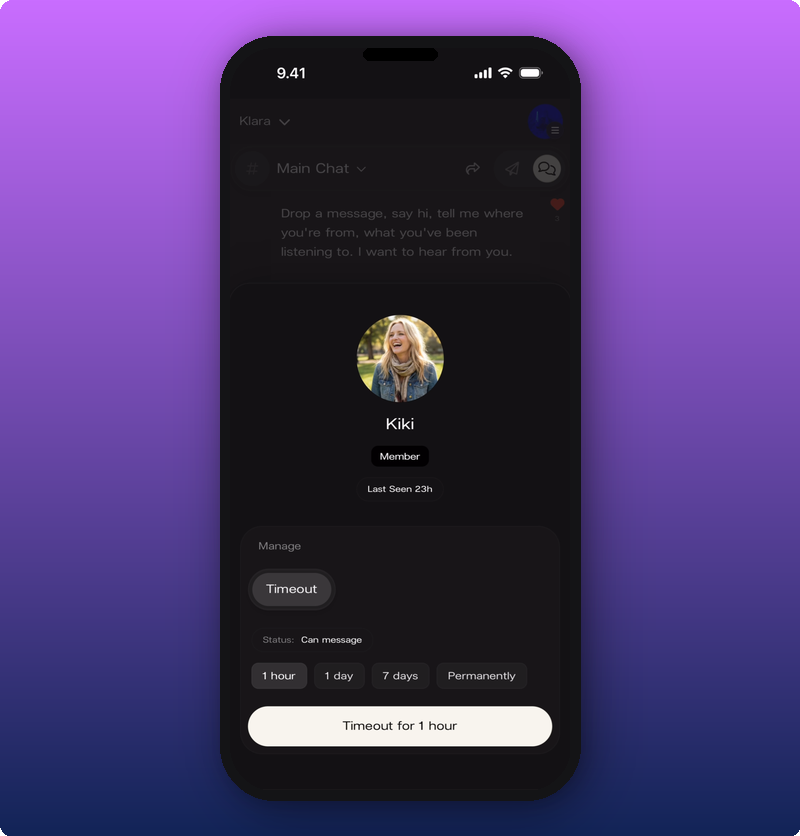

Moderators can also remove messages they think shouldn't be there.

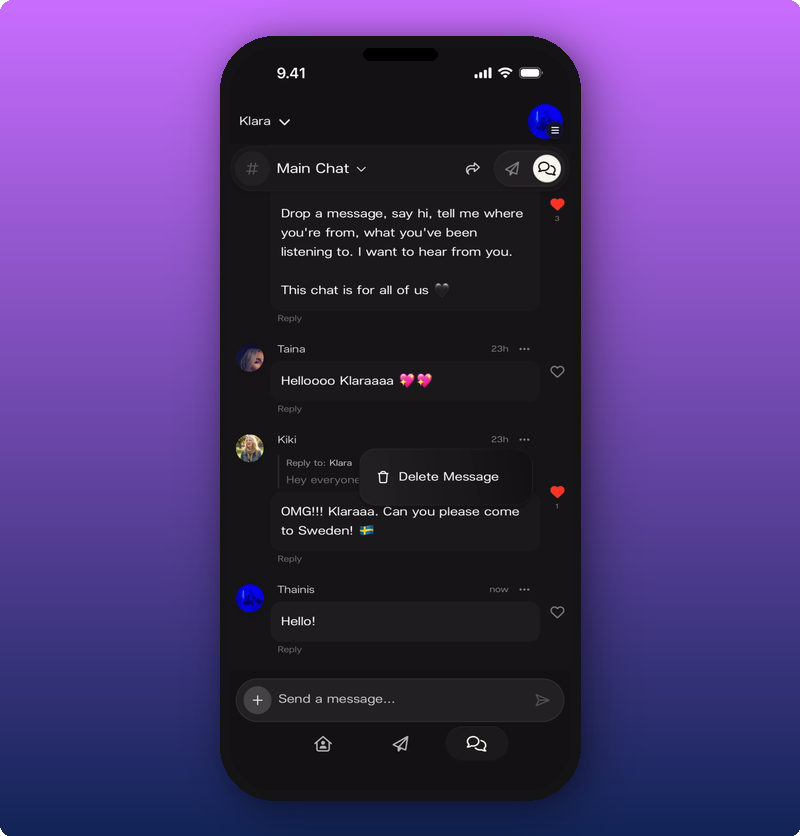

## Subscribers Chat

Every artist's space has a second chat room: Subscribers Chat. It's only for paying subscribers and it's quieter, closer, and more personal. Tap the chat name at the top of the screen to switch between Main Chat and Subscribers Chat.

If you're not a subscriber yet, tapping into Subscribers Chat opens the subscribe screen instead.

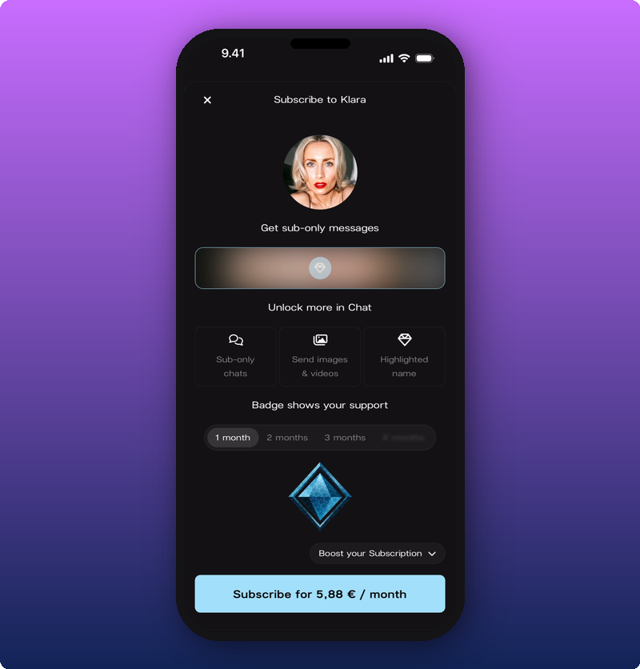

It shows what you'll get, the price, and a Subscribe button at the bottom. For the full breakdown, see [Subscribing to an artist](/for-fans/subscribing/subscribing-to-an-artist).

## Sharing the chat

Tap the share icon at the top of chat to send the link to a friend.

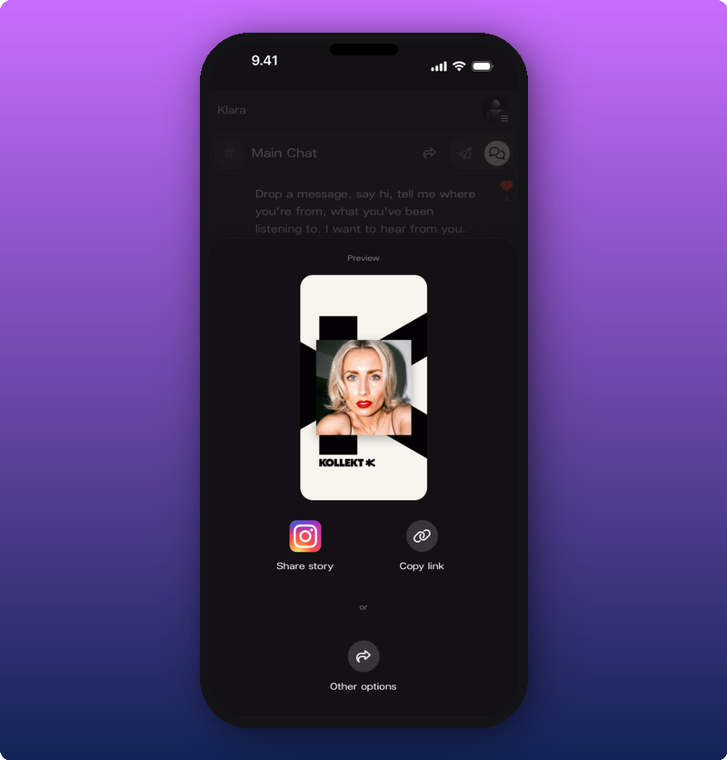

You can post the Kollekt card straight to your Instagram Story, copy the link, or pick another app from your phone's share menu. The link opens the chat for whoever taps it. They'll need to join the artist before they can post.

## Related

- [Browsing the Direct Line](/for-fans/inside-kollekt/browsing-direct-line). Read the artist's posts.
- [Look around the artist's page](/for-fans/inside-kollekt/exploring-the-artist-page). Find your way around the rest of the artist's space.
- [Your user profile](/for-fans/your-account/managing-your-profile). Set the name, photo, and bio that show in chat.
- [Subscribing to an artist](/for-fans/subscribing/subscribing-to-an-artist). Get into the Subscribers Chat and unlock images.
