The steps a fan takes from tapping an artist's link to being fully inside their space in the Kollekt app. Joining is free, takes about a minute, and works from any link the artist has shared — Instagram bio, story, website, anywhere.

## Web Join Flow

### Step 1: Open the Artist's Link

The artist shares a link like `kollekt.io/artistname`. Tapping it opens their space in your mobile browser. You can scroll around and see the page before joining.

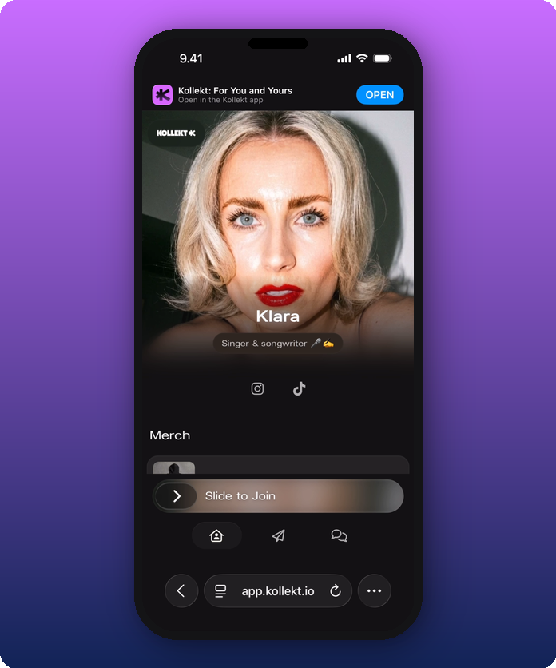

**What you'll see:** Top: a smart banner reading **"Kollekt: For You and Yours"** with a blue **"OPEN"** button (to open in the app if already installed). The **KOLLEKT K** logo in the top-left. The artist's cover photo with name **"Klara"**, subtitle "Singer & songwriter 🎤 ☁️", and social icons (Instagram, TikTok). Below: **"Merch"** section with "My new merch" card. At the bottom: a gradient **"Slide to Join"** bar with a right arrow. Navigation tabs: Home, Direct Line, Chat. Browser address bar shows **app.kollekt.io**.

### Step 2: Slide to Join

Slide the **Slide to Join** bar to the right. A login/signup sheet appears.

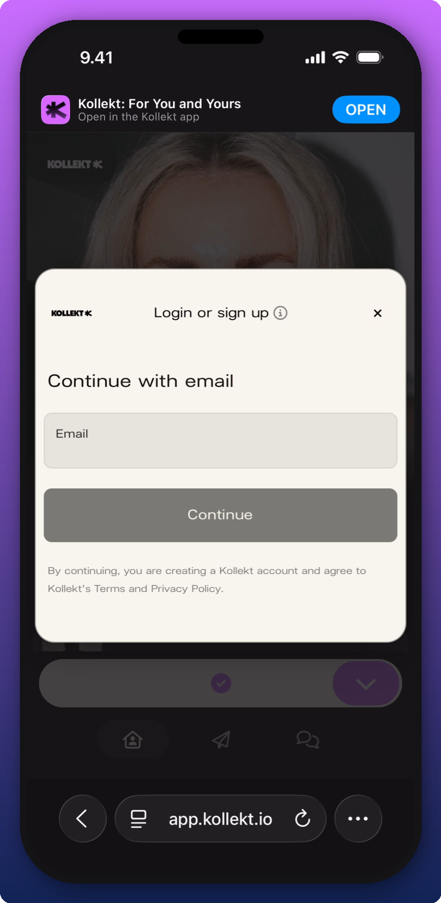

**What you'll see:** A white modal over the artist page. **KOLLEKT K** logo at top-left, "Login or sign up" title with an info (i) icon, and **X** close button. Heading: **"Continue with email"**. An **"Email"** input field (empty). A cream **"Continue"** button. Fine print: "By continuing, you are creating a Kollekt account and agree to Kollekt's Terms and Privacy Policy." The Slide to Join bar and join/arrow buttons are faintly visible behind the modal.

### Step 3: Enter Your Email

Type your email address and tap **Continue**.

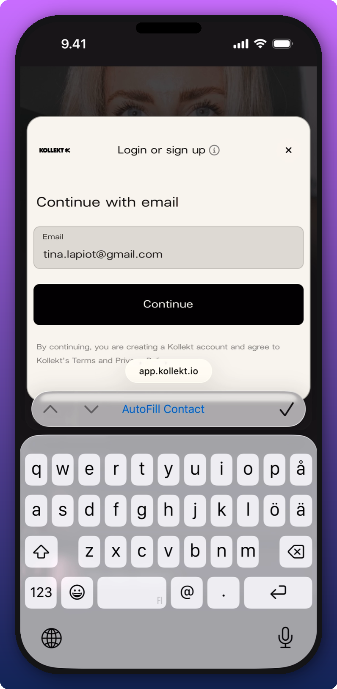

**What you'll see:** The same login modal with the email field now showing **"tina.lapiot@gmail.com"**. The **"Continue"** button below. An iOS **"AutoFill Contact"** suggestion bar appears above the keyboard. The keyboard is open.

### Step 4: Check Your Email

After submitting, Kollekt shows a confirmation screen and sends a magic link to your inbox.

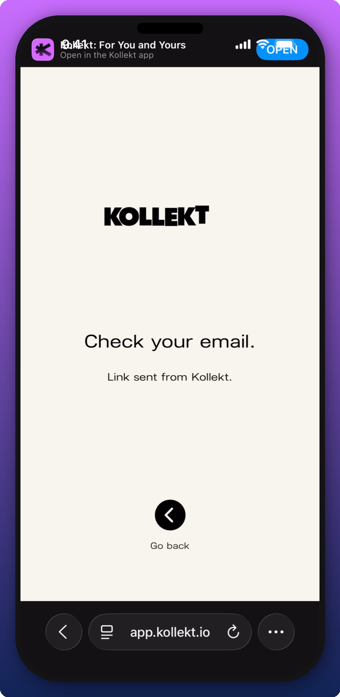

**What you'll see:** A cream/white full-screen page. The smart banner ("Kollekt: For You and Yours" with "OPEN") at top. The **KOLLEKT** logo centered. Text: **"Check your email."** and "Link sent from Kollekt." Below: a black circular **back arrow** button with "Go back" label. Browser address bar shows **app.kollekt.io**.

### Step 5: Open the Magic Link

Open your email inbox and find the message from Kollekt. Tap the purple **Enter** button.

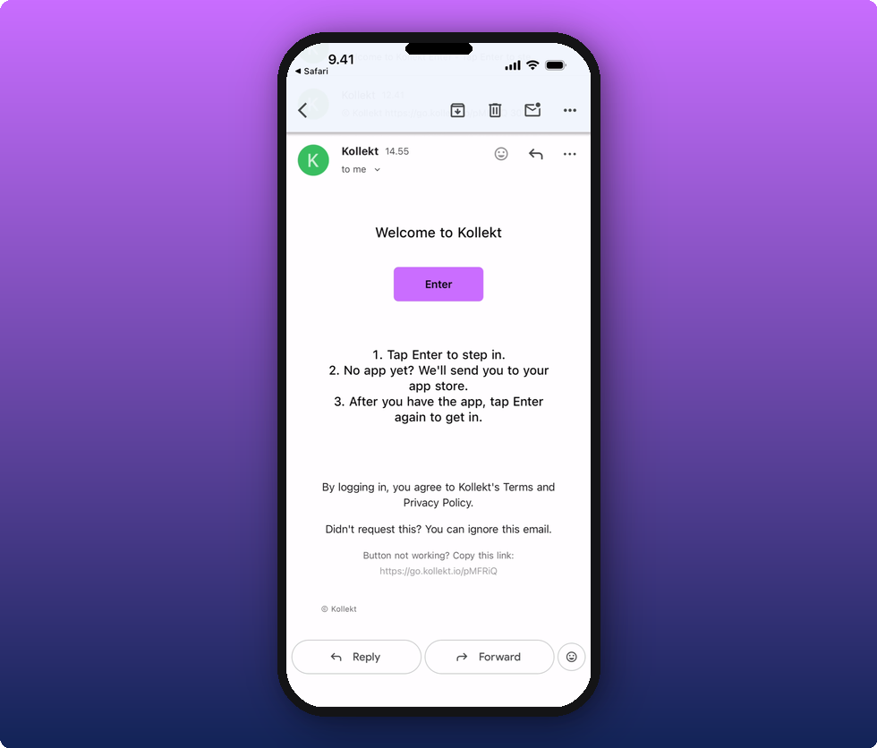

**What you'll see:** An email from **"Kollekt"** (14.55) in the iOS Mail app. Heading: **"Welcome to Kollekt"**. A purple **"Enter"** button. Three numbered instructions: "1. Tap Enter to step in. 2. No app yet? We'll send you to your app store. 3. After you have the app, tap Enter again to get in." Fine print: "By logging in, you agree to Kollekt's Terms and Privacy Policy." and "Didn't request this? You can ignore this email." A fallback link: "Button not working? Copy this link: https://go.kollekt.io/pMFRiQ". Bottom: Reply and Forward buttons.

### Browser Picker (Optional)

On some devices, tapping the Enter button may show a browser picker asking which app to open the link with.

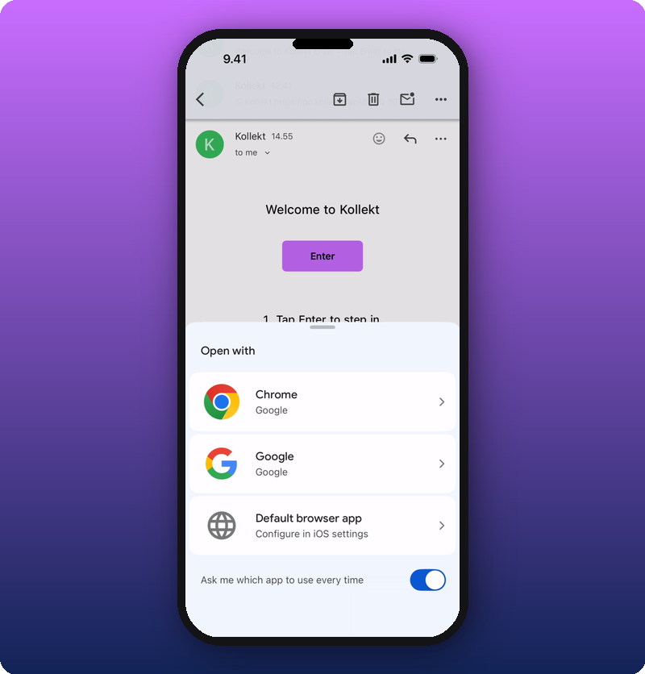

**What you'll see:** The magic link email visible behind a bottom sheet titled **"Open with"**. Three options: **"Chrome"** (Google), **"Google"** (Google), and **"Default browser app"** (Configure in iOS settings). A toggle: "Ask me which app to use every time" (enabled, blue).

## Installing the App

### App Store Download

If you don't have Kollekt installed, the magic link sends you to the App Store.

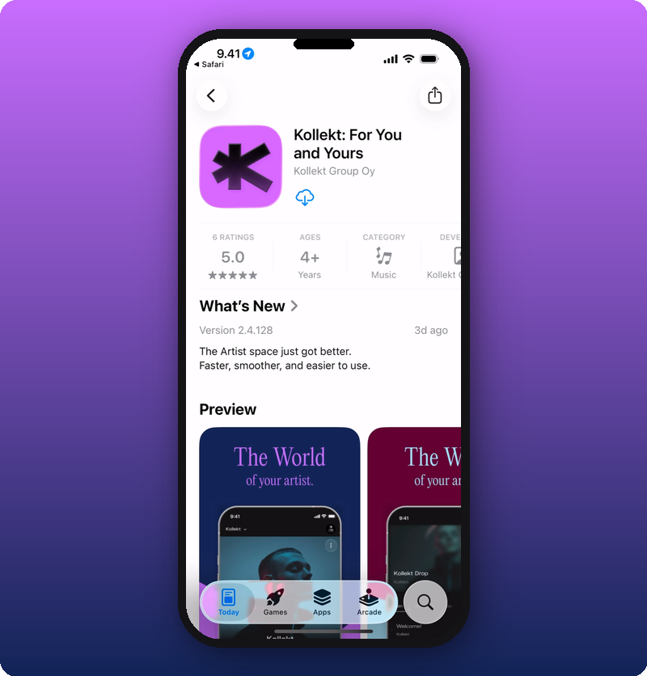

**What you'll see:** The iOS App Store page for **"Kollekt: For You and Yours"** by Kollekt Group Oy. A download/cloud icon button. Stats: 6 Ratings, 5.0 stars, Ages 4+, Category Music, Developer Kollekt. **"What's New"** section: Version 2.4.128 (3d ago) — "The Artist space just got better. Faster, smoother, and easier to use." **"Preview"** section with app screenshots showing "The World of your artist." Bottom tabs: Today, Games, Apps, Arcade, Search.

### App Store Open

After installing, the download button changes to an **Open** button.

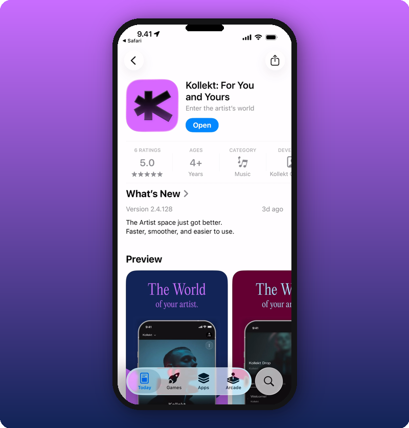

**What you'll see:** The same App Store page. The subtitle now reads "Enter the artist's world". The download button is replaced by a blue **"Open"** button. All other details remain the same.

## Welcome Screen

When you first open the Kollekt app, you see the Welcome screen. This screen appears in two scenarios.

### After Magic Link (Logged In)

If you arrived via the magic link and the app recognises your session, you see the Welcome screen prompting you to go back to your email and tap Enter again to complete the login.

**What you'll see:** A cream/white full-screen page. Top-left: "< Safari" back link. Centered text: **"Welcome!"** and "Got your login email? Open it to continue." Below: **"No email yet?"** text and a black **"Login or Sign Up"** button with a person+ icon.

### Logged Out / No Email

If you open the app without a magic link session, you see the same Welcome screen with the option to start fresh.

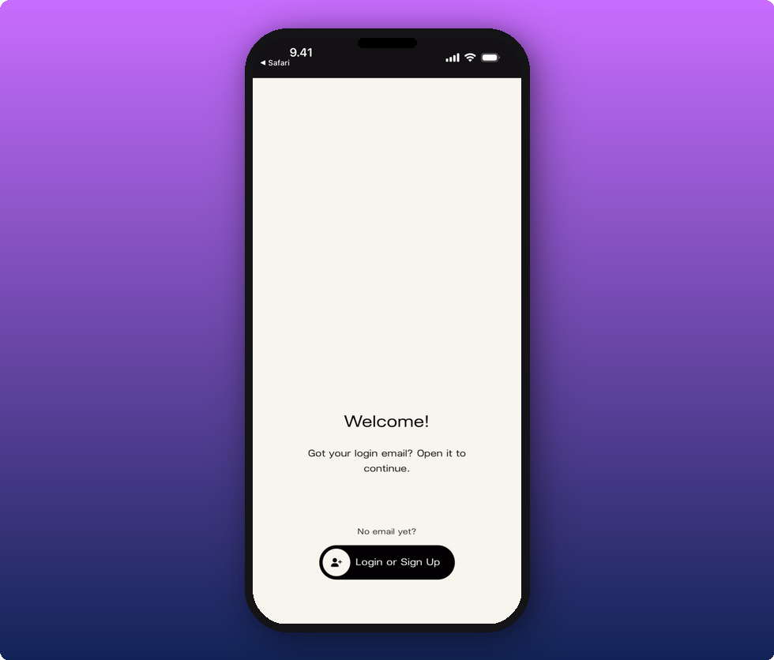

**What you'll see:** Identical to the logged-in welcome screen: cream background, "< Safari" back link, **"Welcome!"** heading, "Got your login email? Open it to continue.", **"No email yet?"**, and the black **"Login or Sign Up"** button.

## After Joining

Once the magic link completes, the app opens and drops you into your fan home feed with the artist already joined.

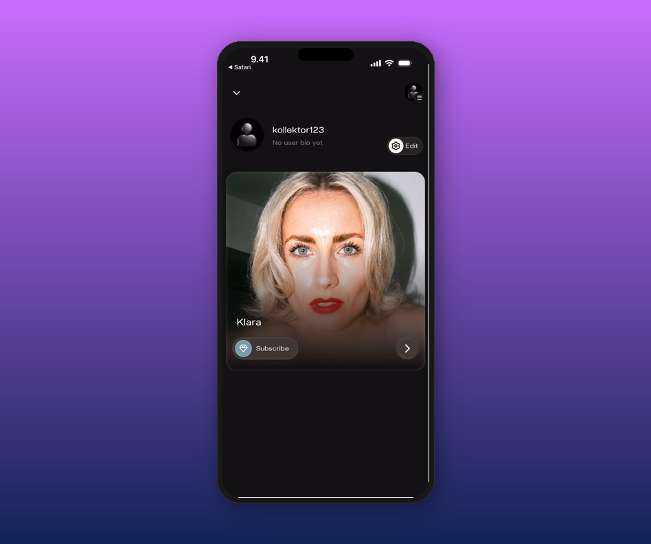

**What you'll see:** Top-left: "< Safari" back link and down chevron. Your profile: **"kollektor123"** with "No user bio yet" and **gear/Edit** button. Below: a large artist card for **"Klara"** with cover photo, name, **Subscribe** button (with heart icon), and **right arrow** to enter the artist's page.

## Before joining

Before you join, you can still browse the artist's page, Direct Line, and Chat. Some content will be read-only until you're in.

### Home

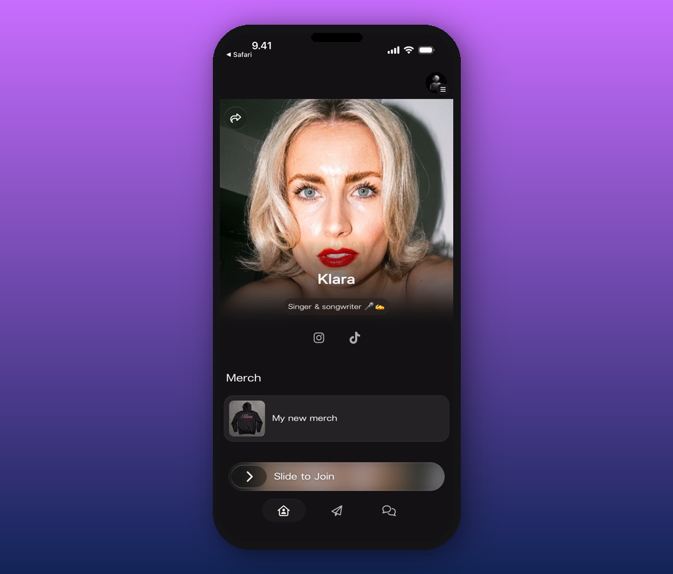

**What you'll see:** Top-left: "< Safari" back link and "Klara" name. Share icon (curved arrow) and three-dot menu over the cover photo. Artist photo with name **"Klara"**, subtitle "Singer & songwriter 🎤 ☁️". Social icons: Instagram, TikTok. **"Merch"** section with "My new merch" card. Bottom: gradient **"Slide to Join"** bar. Navigation: Home (active), Direct Line, Chat.

### Chat

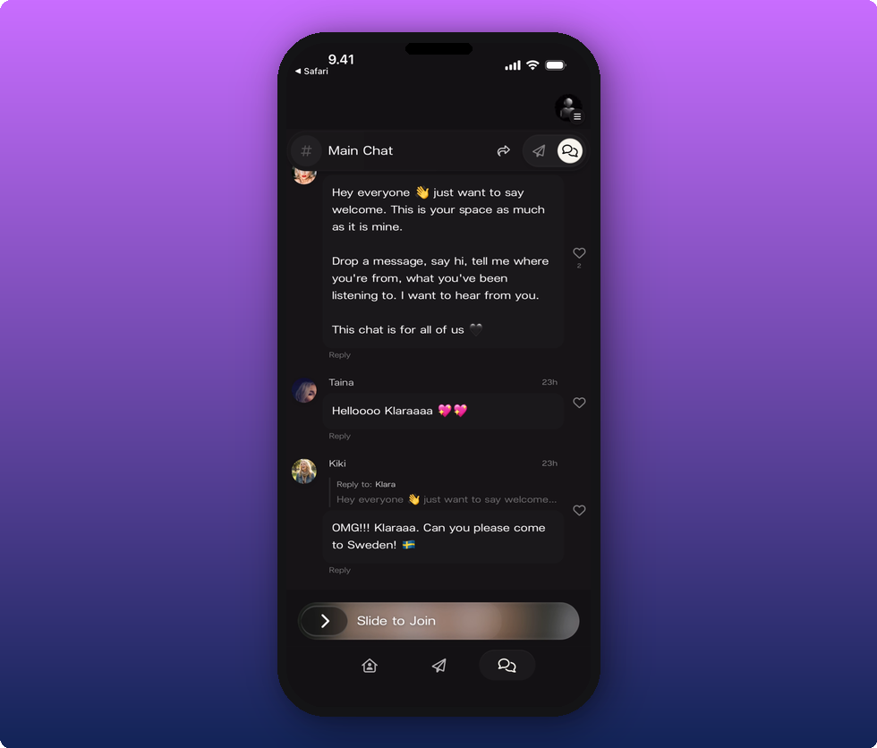

**What you'll see:** Top-left: "< Safari" back link. Header: "# Main Chat" with share, send, and members icons. Chat messages visible: artist's welcome message from "Klara", "Taina" ("Helloooo Klaraaaa 💖💛"), and "Kiki" (threaded reply to Klara: "OMG!!! Klaraaa. Can you please come to Sweden! 🇸🇪"). Bottom: gradient **"Slide to Join"** bar. Navigation: Home, Direct Line, Chat (active).

### Direct Line

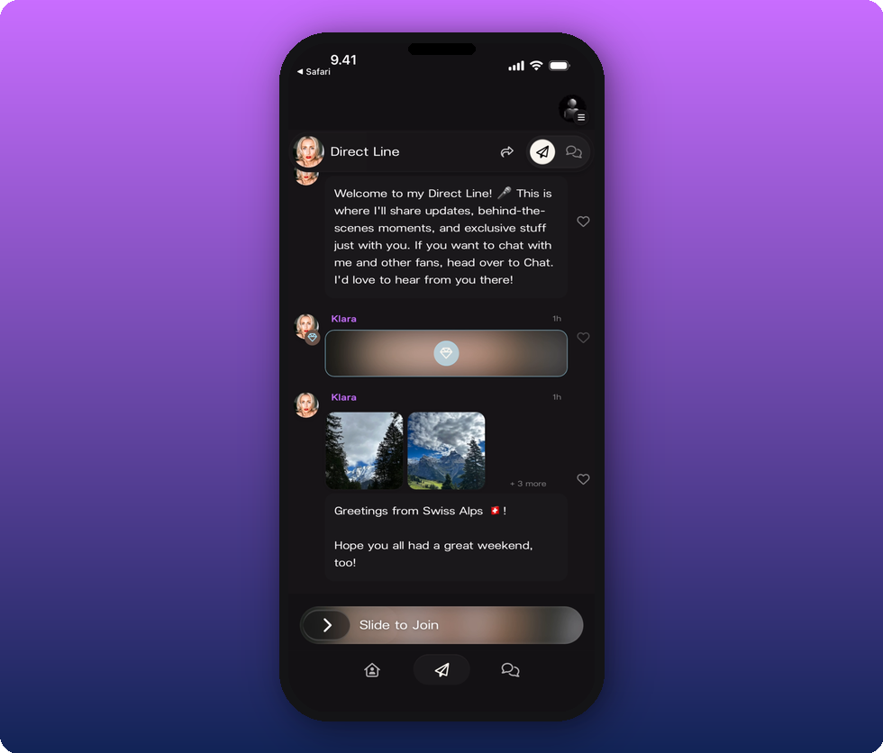

**What you'll see:** Top-left: "< Safari" back link. Header: artist avatar and **"Direct Line"** with share, send, and chat icons. Posts from "Klara" (purple name): welcome message, a blurred/locked subscriber-only post (lock icon), and a photo post with mountain images ("Greetings from Swiss Alps 🇨🇭❗"). Bottom: gradient **"Slide to Join"** bar. Navigation: Home, Direct Line (active), Chat.

## Finding Artists

### In-App Search

From the side menu or the "Find Yours" button, you can search for artists by name.

### Web Search

On the Kollekt website, you can also search for artists before downloading the app.

## Known Limitations

- The "Slide to Join" interaction (the actual sliding gesture) is not captured in screenshots — only the bar in its resting state is visible.
- The difference between the two Welcome screen states (logged-in vs logged-out) is not visually distinguishable — they appear identical in the screenshots.
- The Google Play / Android onboarding flow is not documented — all screenshots show iOS.
- What happens when a returning user taps the magic link (already has the app and an account) is not shown separately from the first-time flow.

## Related Features

- [Exploring the Artist Page](/for-fans/home/exploring-the-artist-page) — Navigate the artist's space after joining
- [Browsing Direct Line](/for-fans/direct-line/browsing-direct-line) — Read the artist's latest messages
- [Participating in Chat](/for-fans/chat/participating-in-chat) — Talk with the artist and other fans
- [Managing Your Fan Profile](/for-fans/profile/managing-your-profile) — Personalize your avatar, username, and bio
- [Notifications](/for-fans/notifications/enable-notifications) — Enable push notifications after joining
