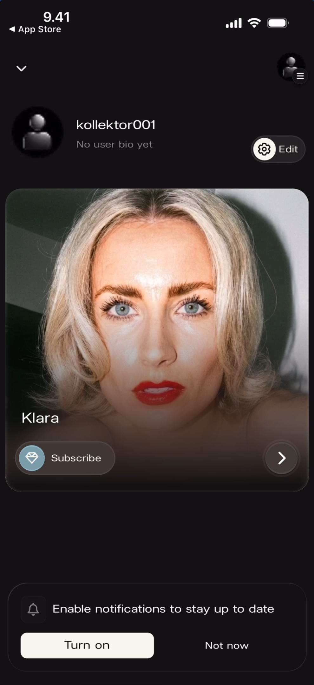
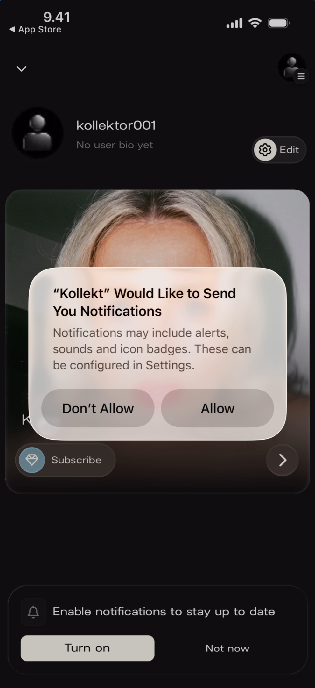

# Enable Notifications

Push notifications keep you updated when an artist posts new Direct Line messages, chat activity happens, or other important events occur. Kollekt prompts you to enable notifications with a banner at the bottom of the screen.

## Notification Banner

When you first join an artist's space after downloading the app, a banner appears at the bottom of the home screen prompting you to enable notifications. If you previously dismissed the banner or turned off notifications, it will reappear the next time you use the app.

**What you'll see:** The fan home feed with the artist card (Klara) visible. At the bottom of the screen, above the edge: a **bell icon** with the text **"Enable notifications to stay up to date"**. Two buttons: **"Turn on"** (outlined, left) and **"Not now"** (right).

## Enabling Notifications

Tapping **Turn on** triggers the iOS system permission dialog asking for notification access.

**What you'll see:** The same home screen with the notification banner still visible at the bottom. An iOS system dialog overlays the screen: **"Kollekt Would Like to Send You Notifications"** with the description "Notifications may include alerts, sounds and icon badges. These can be configured in Settings." Two buttons: **"Don't Allow"** (left) and **"Allow"** (right).

Tapping **Allow** enables push notifications and the banner disappears. Tapping **Don't Allow** denies permission at the system level — the banner will reappear on future app sessions to encourage enabling notifications.

## Dismissing the Banner

Tapping **Not now** on the Kollekt banner dismisses it for the current session without triggering the system dialog. The banner will reappear on a future session if notifications are still not enabled.

## Known Limitations

- The notification banner behaviour on Android is not documented — the screenshots show iOS only.
- The specific notification types (Direct Line posts, chat messages, etc.) and their appearance are not shown in the current screenshots.
- If a user taps "Don't Allow" on the iOS system dialog, they must re-enable notifications manually through the device's Settings app — Kollekt cannot trigger the system dialog again.

## Related Features

- [Browsing Direct Line](/for-fans/direct-line/browsing-direct-line) — Direct Line posts trigger push notifications
- [Participating in Chat](/for-fans/chat/participating-in-chat) — Chat activity may trigger notifications
- [Exploring the Artist Page](/for-fans/home/exploring-the-artist-page) — The home screen where the notification banner appears