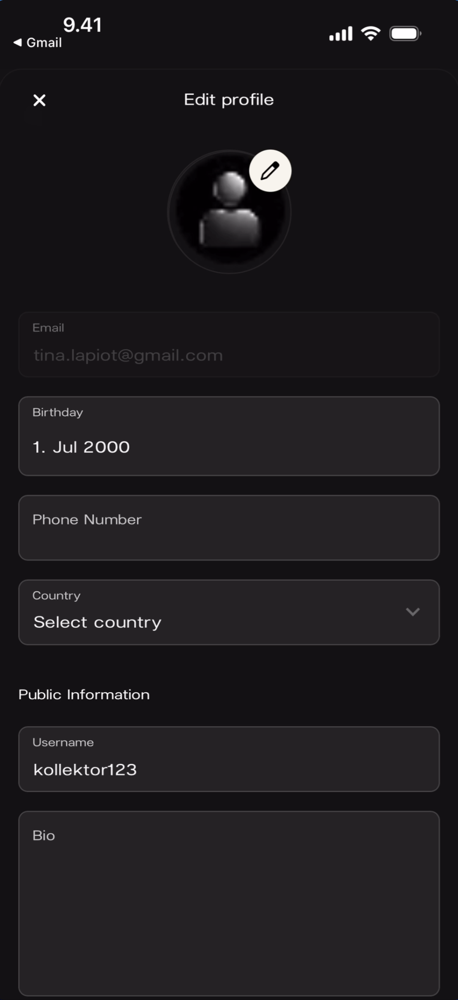
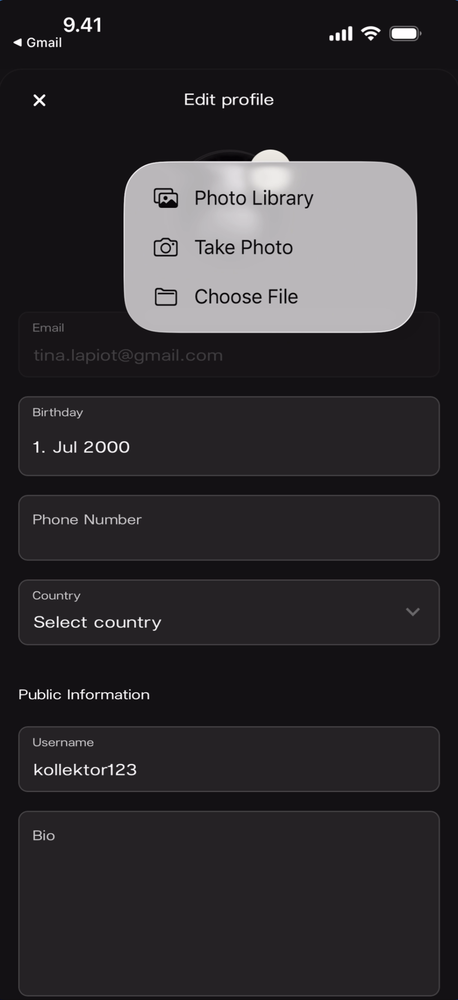
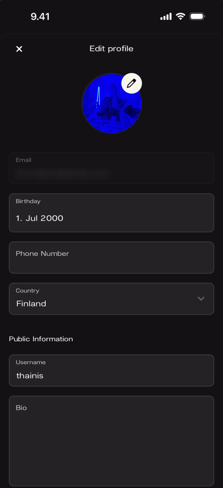
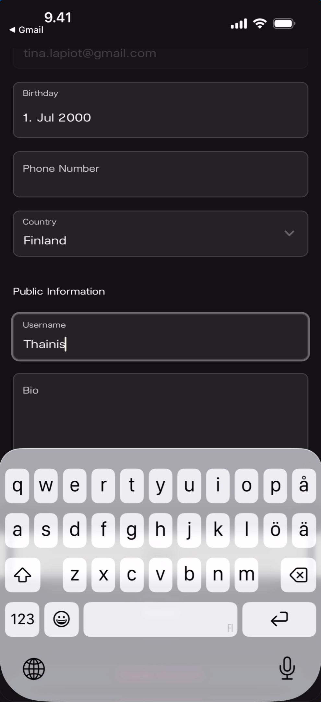
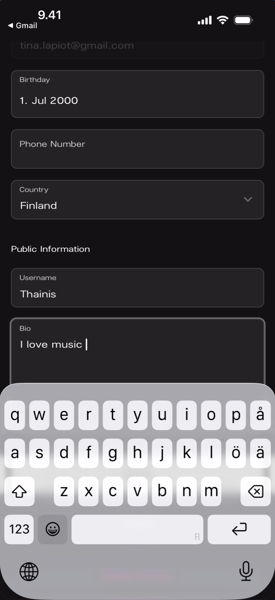
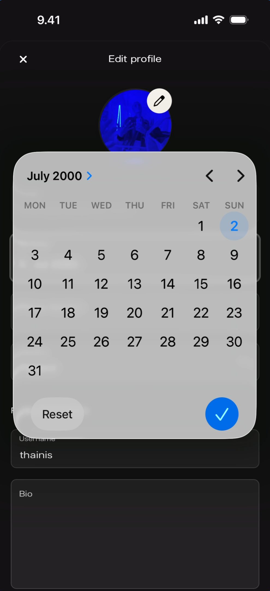
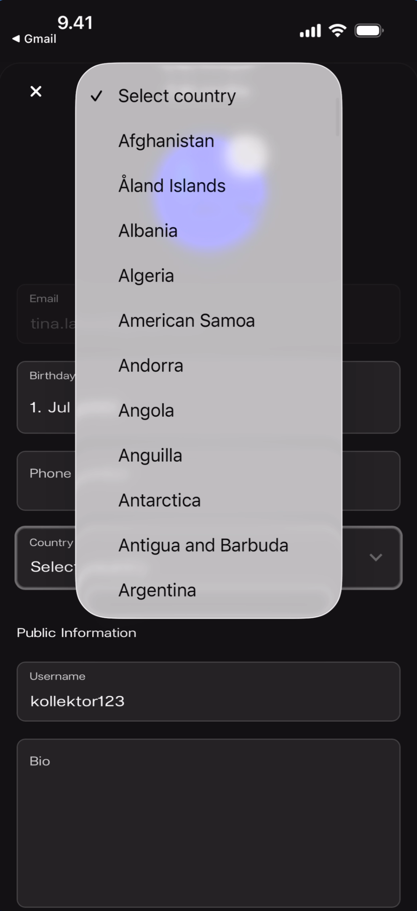
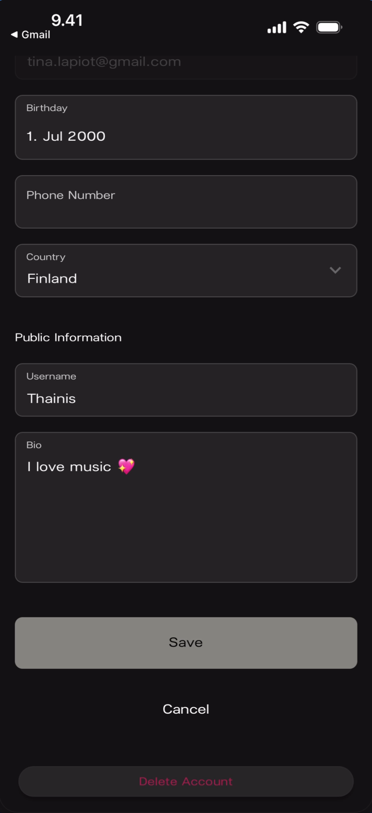
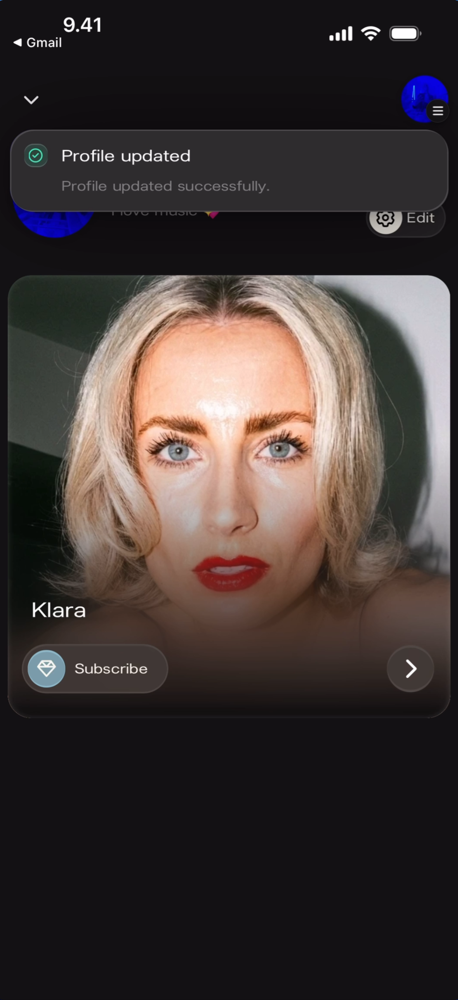
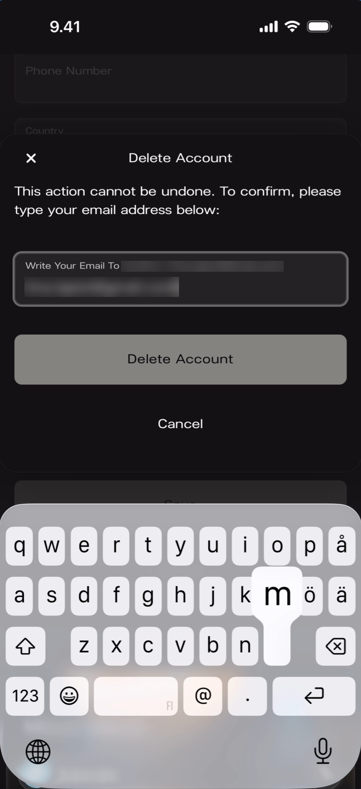

# Managing Your Fan Profile

Your Kollekt profile is how you show up inside artist communities — in chat, reactions, and member lists. When you first sign up, Kollekt gives you a temporary username like "kollektor123". You can change your avatar, username, bio, and personal details at any time.

## Edit Profile

Tap the **gear/Edit** button next to your profile on the home screen to open the Edit profile page.

### Empty State

**What you'll see:** Top bar: **X** close button (left) and **"Edit profile"** title (center). A default placeholder avatar with a **pencil icon** overlay. Below: **Email** field (read-only, showing "tina.lapiot@gmail.com"). Editable fields: **Birthday** ("1. Jul 2000"), **Phone Number** (empty), **Country** ("Select country" with dropdown arrow). Section header: **"Public Information"**. Fields: **Username** ("kollektor123") and **Bio** (empty).

## Avatar

### Choosing a Photo

Tap the **pencil icon** on the avatar to open the photo source picker.

**What you'll see:** The Edit profile page with a white popover appearing near the avatar. Three options: **"Photo Library"** (gallery icon), **"Take Photo"** (camera icon), and **"Choose File"** (folder icon). The profile fields are visible behind the popover.

### Avatar Set

After selecting a photo, the avatar updates immediately on the Edit profile page.

**What you'll see:** The Edit profile page with the avatar now showing a custom blue circular photo. The pencil icon remains on the avatar for future changes. Fields show: Email, Birthday, Phone Number (empty), Country ("Finland"), Username ("thainis"), Bio (empty).

## Personal Details

### Username

Tap the **Username** field under Public Information to type a new username. This is what other fans and artists see in chat and reactions.

**What you'll see:** The profile page scrolled to show the fields. **Public Information** section: **Username** field active with **"Thainis"** being typed (cursor visible). **Bio** field empty below. The keyboard is open.

### Bio

Tap the **Bio** field to add a short description about yourself. This appears on your profile card when other fans tap your name in chat.

**What you'll see:** The profile page scrolled to the same section. Username shows "Thainis" (saved). **Bio** field active with **"I love music"** being typed (cursor visible). The keyboard is open.

### Birthday

Tap the **Birthday** field to open a calendar date picker.

**What you'll see:** The Edit profile page with a calendar overlay. Header: **"July 2000 >"** with left/right navigation arrows. A full month grid (MON–SUN) with the **2nd** highlighted in blue (selected date). Bottom of the calendar: **"Reset"** button (left) and a **blue checkmark** confirm button (right).

### Country

Tap the **Country** field to open a dropdown list of countries.

**What you'll see:** The Edit profile page with a white dropdown overlay showing a scrollable list of countries. Top: **"✓ Select country"** (default/no selection). Countries listed alphabetically: Afghanistan, Åland Islands, Albania, Algeria, American Samoa, Andorra, Angola, Anguilla, Antarctica, Antigua and Barbuda, Argentina.

## Saving Changes

### Completed Profile

After filling in all fields, the bottom of the Edit profile page shows action buttons.

**What you'll see:** The profile page scrolled to the bottom. **Public Information**: Username ("Thainis"), Bio ("I love music 💖"). Three buttons at the bottom: **"Save"** (cream/light button), **"Cancel"** (text link), and **"Delete Account"** (red text link at the very bottom).

### Save Confirmation

After tapping **Save**, a success toast appears on the home screen.

**What you'll see:** The fan home screen with a green success banner at the top: **"Profile updated"** with subtitle "Profile updated successfully." Your profile section is visible below with the **gear/Edit** button. The Klara artist card with Subscribe button and right arrow is shown below.

## Deleting Your Account

Tap **Delete Account** (red text) at the bottom of the Edit profile page. A confirmation dialog appears requiring you to type your email address to confirm.

### Confirmation Dialog

**What you'll see:** A white modal over the Edit profile page. **X** close button (left) and title **"Delete Account"**. Warning text: "This action cannot be undone. To confirm, please type your email address below:" An input field with the email typed. A cream **"Delete Account"** button and **"Cancel"** text link below. The keyboard is open.

## Known Limitations

- The Email field is read-only — there is no way to change your email address from the Edit profile page.
- The phone number field does not show a country code selector — it accepts raw number input.
- Profile photo changes appear to take effect immediately on the Edit profile page, but it's unclear whether they require tapping Save to persist.
- What happens after account deletion completes (redirect to welcome screen, logout, etc.) is not shown in the screenshots.
- The Bio field does not show a character limit in the UI.

## Related Features

- [Joining an Artist's Space](/for-fans/joining/joining-an-artist) — How to set up your Kollekt account in the first place
- [Exploring the Artist Page](/for-fans/home/exploring-the-artist-page) — Your home screen where the profile section lives
- [Participating in Chat](/for-fans/chat/participating-in-chat) — Where your username, avatar, and bio appear to other fans