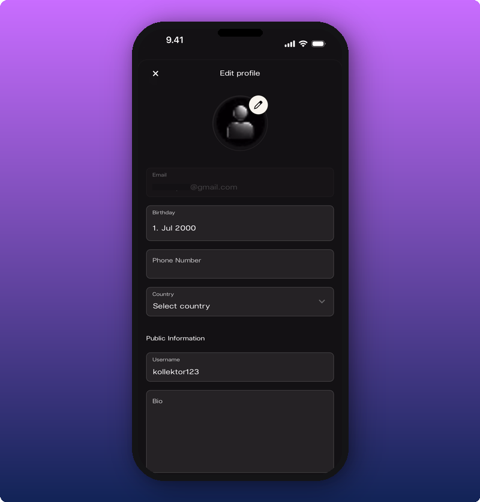
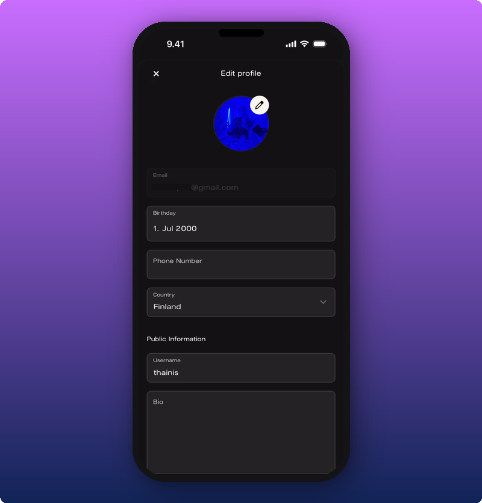
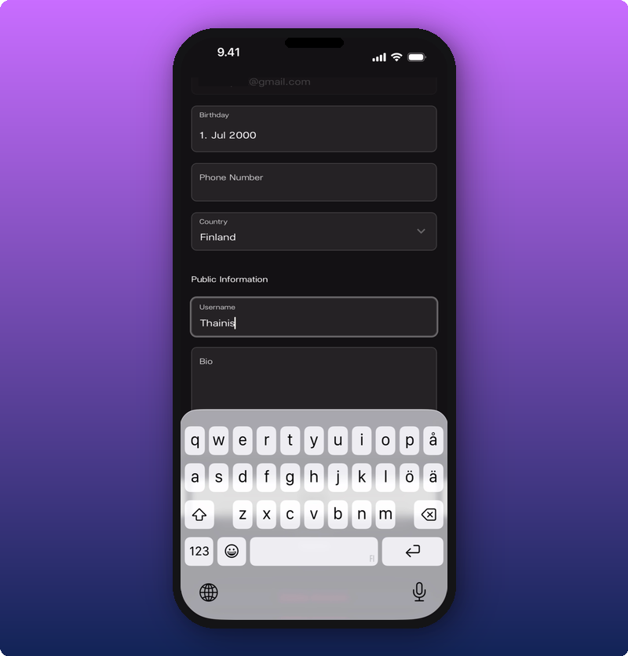
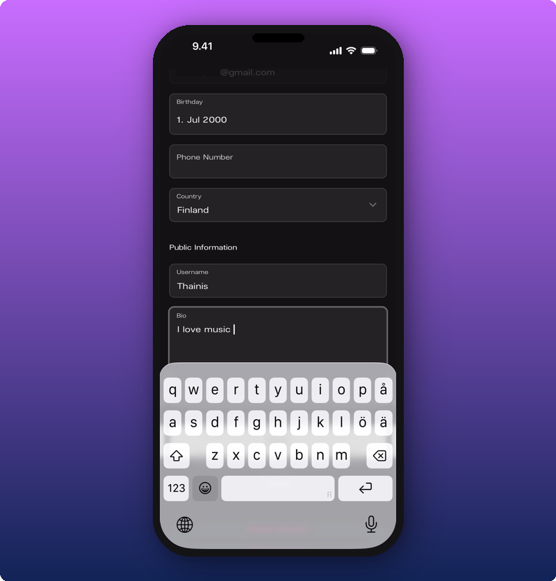
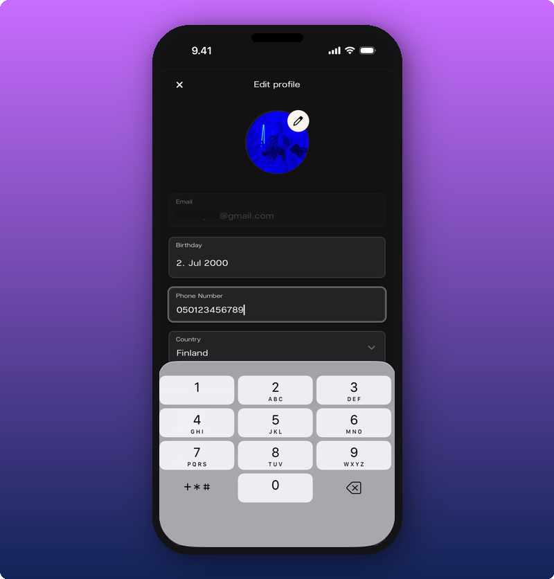
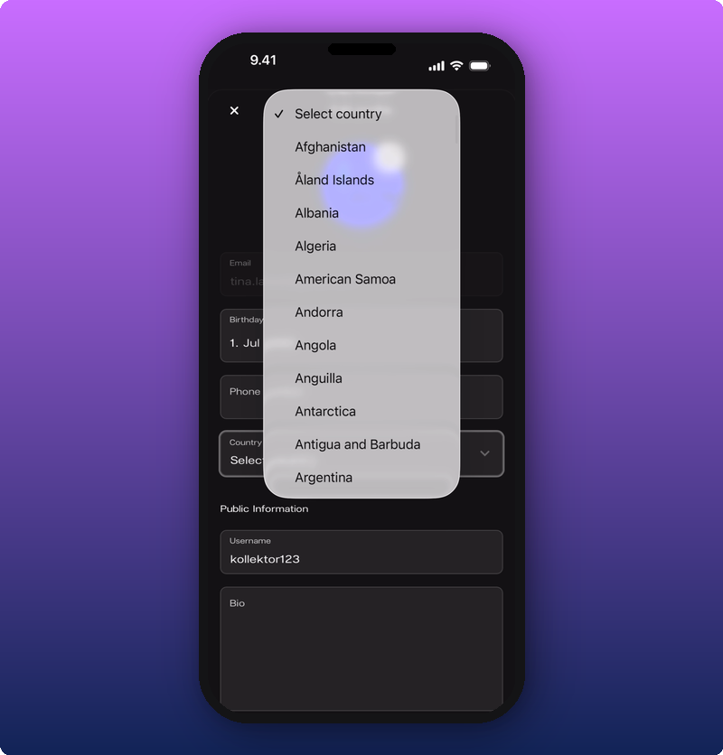
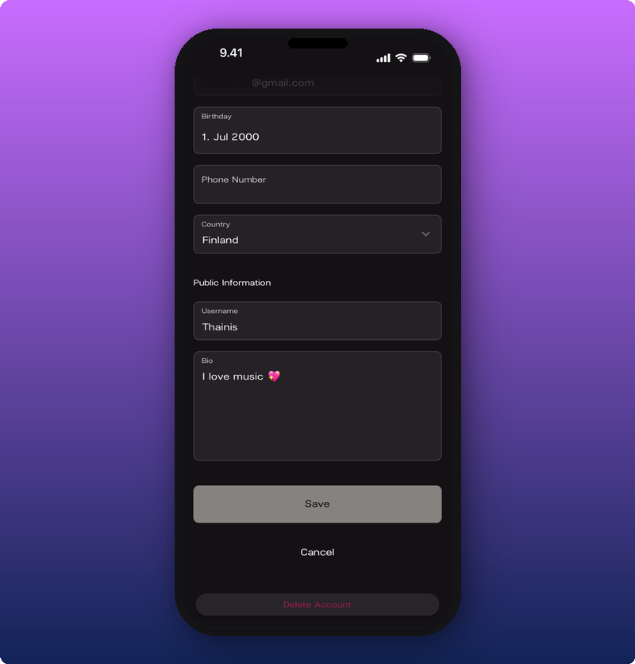

Your fan profile is how you show up inside an artist's space. The name and photo you set here appear on your messages in chat, on your reactions, and on your profile card when another fan taps your name. When you first sign up, Kollekt gives you a placeholder name like "kollektor123". You can change that, your photo, and the rest any time.

## Open your profile

Tap the gear icon next to your profile on the fan home screen. The Edit profile page opens.

The page has two parts:

- **Private.** Email (you can't change this here), Birthday, Phone Number, Country.
- **Public Information.** Username and Bio. These are what other fans and artists see.

## Change your photo

Tap the pencil icon on the photo. A small menu pops up.

You have three options: pick a photo from your library, take a new one with the camera, or choose a file. Your new photo shows up straight away.

## Change your username

Tap the **Username** field under Public Information. Your keyboard opens.

Type the name you want. This is what fans see in chat.

## Add a bio

Tap the **Bio** field. Type something short about yourself, the music you love, or your favourite tour memory.

Your bio shows on your profile card, the one that pops up when another fan taps your name in chat.

## Add your phone number

Tap the **Phone Number** field. The number keyboard opens.

Type your number including the country code.

## Set your birthday

Tap the **Birthday** field. A calendar opens.

Pick the month, then the day. Tap the blue check to save.

## Pick your country

Tap the **Country** field. A list of countries opens.

Scroll or tap to pick yours.

## Save your changes

Scroll to the bottom of the form. Tap **Save**.

A green message appears on your fan home confirming the save.

If you change your mind, tap **Cancel** instead. Nothing gets saved.

## Delete your account

If you want to leave Kollekt for good, scroll to the bottom of the Edit profile page and tap the red **Delete Account** link. There's no undo, so the app asks you to confirm by typing your email.

Type your email, then tap **Delete Account**. The button shows **Deleting...** while it works.

Once it's done, your account is gone. You'll be signed out of any artist's space you were in.

If you only want to take a break instead of deleting, email [support@kollekt.io](mailto:support@kollekt.io) and we'll pause your account. Email us again when you want to come back.

## Related

- [Joining an artist's space](/for-fans/joining/joining-an-artist). How to set up your account in the first place.
- [Look around the artist's page](/for-fans/home/exploring-the-artist-page). Where the gear icon and your profile preview live.
- [Joining the chat](/for-fans/chat/participating-in-chat). Where your name, photo, and bio show up to other fans.
