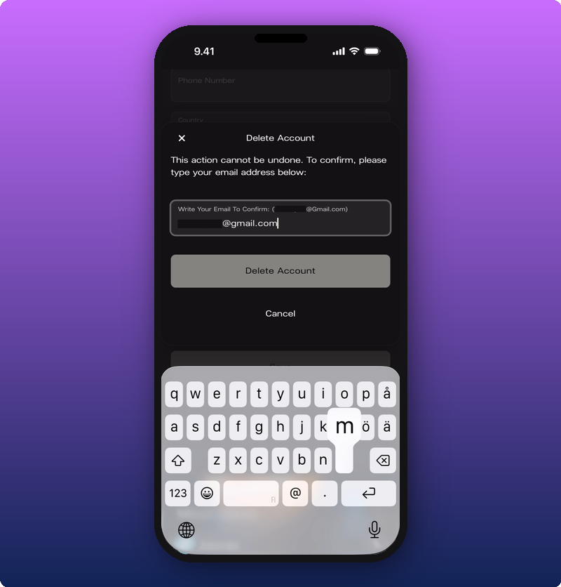
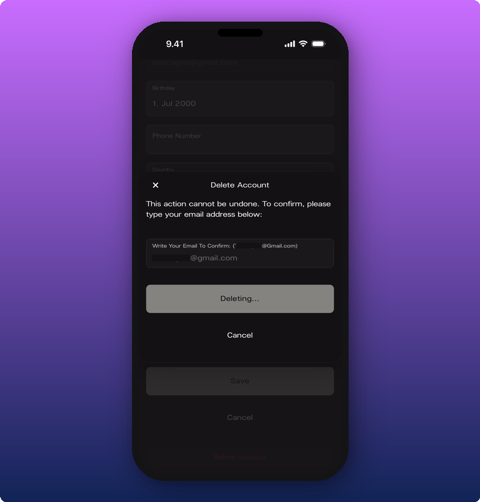

  Are you an artist? <a href="/for-artists/your-account/delete-or-pause-your-account" style={{color: "#c96dff", fontWeight: 500, textDecoration: "underline"}}>See your version.</a>

## Delete your account

1. Tap the gear icon next to your profile on your fan home screen to open the Edit profile page.
2. Scroll to the bottom, past **Save** and **Cancel**.
3. Tap the red **Delete Account** link.
4. In the box that pops up, type your email address to confirm.
5. Tap **Delete Account**.

The button shows **Deleting...** while it works.

What gets removed:

- Your user profile.
- Your membership in every artist space you've joined.
- Any active subscriptions you have.

You'll be signed out of the app once it's done.

## Want to pause instead?

If you want to take a break without losing your data, email [support@kollekt.io](mailto:support@kollekt.io) and we'll handle it. When you're ready to come back, email again and we'll restore your account.

## Related

- [Your user profile](/for-fans/your-account/managing-your-profile). Where the Delete Account link lives.
